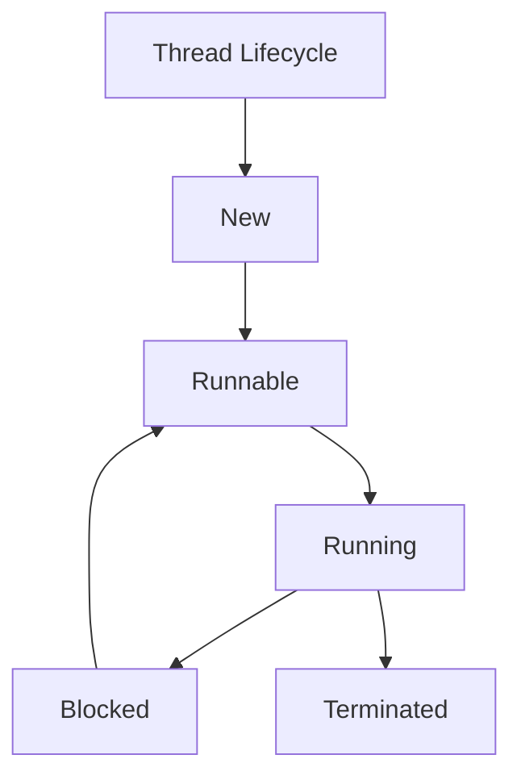

# Multithreading & Concurrency in Java

## Overview

Multithreading allows a program to execute multiple threads concurrently, improving performance and responsiveness. Concurrency in Java is managed through threads, synchronization, and concurrent utilities.

## Detailed Explanation

### Threads

- **Creating Threads**: Using Thread class or Runnable interface.

- **Thread Lifecycle**: New, Runnable, Running, Blocked, Terminated.

### Synchronization

- **Synchronized Blocks/Methods**: Preventing race conditions.

- **Locks**: ReentrantLock, ReadWriteLock.

### Concurrent Collections

- **Thread-Safe Collections**: ConcurrentHashMap, CopyOnWriteArrayList.

### Executors

- **ExecutorService**: Managing thread pools.



## Real-world Examples & Use Cases

- **Web Servers**: Handling multiple client requests.

- **GUI Applications**: Keeping UI responsive.

- **Data Processing**: Parallel computation.

## Code Examples

### Creating Threads

```java
public class ThreadExample {
    public static void main(String[] args) {
        Thread thread = new Thread(() -> {
            System.out.println("Thread running");
        });
        thread.start();
    }
}
```

### Synchronization

```java
public class SynchronizedExample {
    private int count = 0;
    
    public synchronized void increment() {
        count++;
    }
    
    public int getCount() {
        return count;
    }
}
```

### ExecutorService

```java
import java.util.concurrent.ExecutorService;
import java.util.concurrent.Executors;

public class ExecutorExample {
    public static void main(String[] args) {
        ExecutorService executor = Executors.newFixedThreadPool(5);
        for (int i = 0; i < 10; i++) {
            executor.submit(() -> {
                System.out.println("Task executed by " + Thread.currentThread().getName());
            });
        }
        executor.shutdown();
    }
}
```

## References

- [Oracle Concurrency](https://docs.oracle.com/javase/tutorial/essential/concurrency/)
- [Baeldung Multithreading](https://www.baeldung.com/java-multithreading)

## Github-README Links & Related Topics

- [Java Fundamentals](java-fundamentals/)
- [Java ConcurrentHashMap](java-concurrenthashmap/)
- [Java ExecutorService](java-executorservice/)
