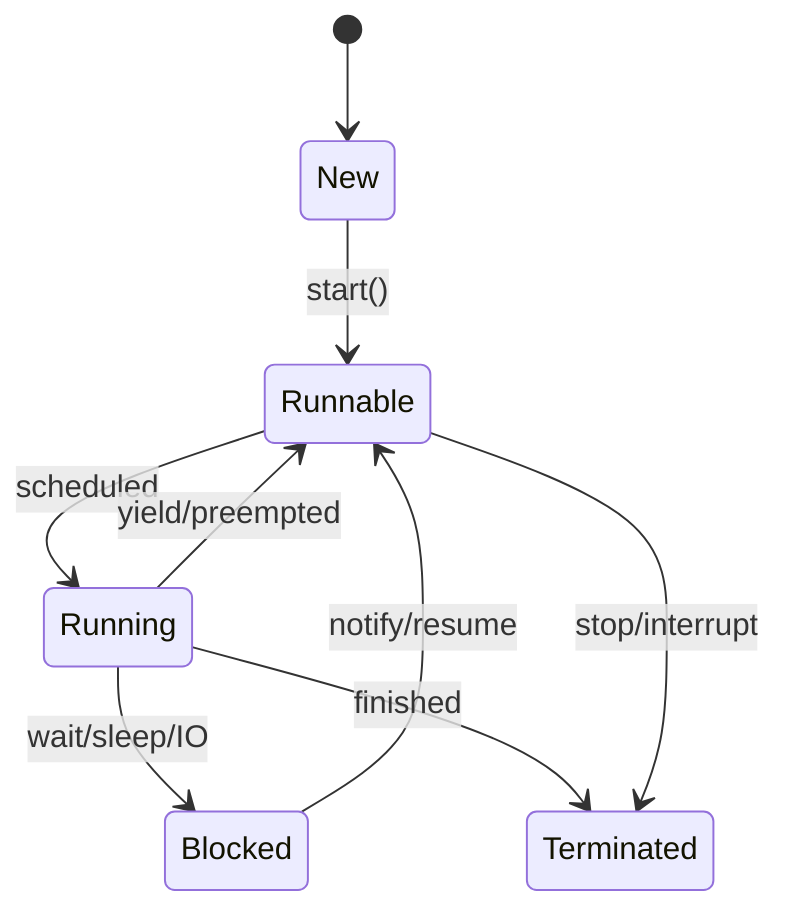

# Multithreading & Concurrency in Java

## Overview

Multithreading and concurrency allow Java programs to perform multiple tasks simultaneously, improving performance and responsiveness. Understanding threads, synchronization, and concurrent utilities is crucial for writing scalable and thread-safe applications.

## Detailed Explanation

### Thread Lifecycle



### Creating Threads

- **Extending Thread**: Override run() method
- **Implementing Runnable**: Pass to Thread constructor
- **ExecutorService**: Preferred for thread management

### Synchronization

- **synchronized** keyword: Locks methods/blocks
- **volatile**: Ensures visibility of changes
- **Atomic Variables**: Lock-free thread-safe operations

### Concurrent Collections

- **ConcurrentHashMap**: Thread-safe hash map
- **CopyOnWriteArrayList**: Thread-safe list for read-heavy operations
- **BlockingQueue**: Producer-consumer pattern

### Executors and Thread Pools

- **ExecutorService**: Manages thread pools
- **Future**: Represents asynchronous computation result
- **CompletableFuture**: Composable asynchronous programming

## Real-world Examples & Use Cases

- **Web Servers**: Handling multiple client requests
- **Data Processing**: Parallel computation on large datasets
- **GUI Applications**: Keeping UI responsive during long operations

## Code Examples

### Creating Threads

```java
// Extending Thread
public class MyThread extends Thread {
    @Override
    public void run() {
        System.out.println("Thread running");
    }
}

// Implementing Runnable
public class MyRunnable implements Runnable {
    @Override
    public void run() {
        System.out.println("Runnable running");
    }
}

// Usage
public class ThreadDemo {
    public static void main(String[] args) {
        Thread t1 = new MyThread();
        Thread t2 = new Thread(new MyRunnable());
        t1.start();
        t2.start();
    }
}
```

### Synchronization Example

```java
public class Counter {
    private int count = 0;
    
    public synchronized void increment() {
        count++;
    }
    
    public synchronized int getCount() {
        return count;
    }
}

public class SyncDemo {
    public static void main(String[] args) throws InterruptedException {
        Counter counter = new Counter();
        
        Runnable task = () -> {
            for (int i = 0; i < 1000; i++) {
                counter.increment();
            }
        };
        
        Thread t1 = new Thread(task);
        Thread t2 = new Thread(task);
        t1.start();
        t2.start();
        t1.join();
        t2.join();
        
        System.out.println("Final count: " + counter.getCount());
    }
}
```

### ExecutorService Example

```java
import java.util.concurrent.ExecutorService;
import java.util.concurrent.Executors;

public class ExecutorDemo {
    public static void main(String[] args) {
        ExecutorService executor = Executors.newFixedThreadPool(3);
        
        for (int i = 0; i < 5; i++) {
            executor.submit(() -> {
                System.out.println("Task executed by " + Thread.currentThread().getName());
            });
        }
        
        executor.shutdown();
    }
}
```

### Producer-Consumer with BlockingQueue

```java
import java.util.concurrent.BlockingQueue;
import java.util.concurrent.LinkedBlockingQueue;

public class ProducerConsumer {
    private static BlockingQueue<Integer> queue = new LinkedBlockingQueue<>(10);
    
    public static void main(String[] args) {
        Thread producer = new Thread(() -> {
            try {
                for (int i = 0; i < 10; i++) {
                    queue.put(i);
                    System.out.println("Produced: " + i);
                }
            } catch (InterruptedException e) {
                Thread.currentThread().interrupt();
            }
        });
        
        Thread consumer = new Thread(() -> {
            try {
                for (int i = 0; i < 10; i++) {
                    int item = queue.take();
                    System.out.println("Consumed: " + item);
                }
            } catch (InterruptedException e) {
                Thread.currentThread().interrupt();
            }
        });
        
        producer.start();
        consumer.start();
    }
}
```

## Common Pitfalls & Edge Cases

- **Race Conditions**: Unprotected shared state access
- **Deadlocks**: Circular wait for resources
- **Starvation**: Thread unable to acquire resources
- **Memory Consistency Issues**: Without proper synchronization

## References

- [Oracle Java Concurrency Tutorial](https://docs.oracle.com/javase/tutorial/essential/concurrency/)
- [Java Thread Documentation](https://docs.oracle.com/en/java/javase/21/docs/api/java.base/java/lang/Thread.html)

## Github-README Links & Related Topics

- [Java Memory Model](../java-memory-model/)
- [Concurrent Collections](../concurrent-collections/)
- [Java Executors](../java-executorservice/)
