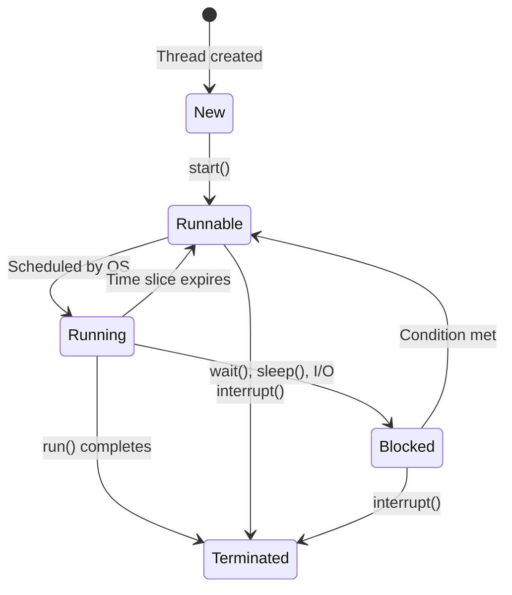

# Overview

Multithreading and concurrency are fundamental concepts in Java that allow programs to perform multiple tasks simultaneously, improving performance and responsiveness. Java provides comprehensive support for concurrent programming through its threading model, synchronization mechanisms, and high-level concurrency utilities. Understanding these concepts is crucial for building scalable, efficient, and thread-safe applications.

# Detailed Explanation

## Processes and Threads

### Processes
- Independent execution units with their own memory space
- Heavyweight - require significant system resources
- Communicate via inter-process communication (IPC)

### Threads
- Lightweight execution units within a process
- Share the same memory space
- Lower overhead than processes
- Communicate directly through shared memory

```java
public class ProcessVsThread {
    public static void main(String[] args) {
        System.out.println("Process: " + ProcessHandle.current().pid());
        System.out.println("Thread: " + Thread.currentThread().getName());
    }
}
```

## Thread Creation and Management

### Extending Thread Class

```java
public class MyThread extends Thread {
    @Override
    public void run() {
        System.out.println("Thread running: " + getName());
    }
    
    public static void main(String[] args) {
        MyThread thread = new MyThread();
        thread.start(); // Don't call run() directly
    }
}
```

### Implementing Runnable Interface

```java
public class MyRunnable implements Runnable {
    @Override
    public void run() {
        System.out.println("Runnable running: " + Thread.currentThread().getName());
    }
    
    public static void main(String[] args) {
        Thread thread = new Thread(new MyRunnable());
        thread.start();
    }
}
```

### Using Lambda Expressions (Java 8+)

```java
public class LambdaThread {
    public static void main(String[] args) {
        Thread thread = new Thread(() -> {
            System.out.println("Lambda thread: " + Thread.currentThread().getName());
        });
        thread.start();
    }
}
```

## Thread Lifecycle



### Thread States

- **NEW**: Thread created but not started
- **RUNNABLE**: Ready to run or running
- **BLOCKED**: Waiting for monitor lock
- **WAITING**: Waiting indefinitely for another thread
- **TIMED_WAITING**: Waiting for specified time
- **TERMINATED**: Execution completed

## Thread Synchronization

### Race Conditions

```java
public class RaceCondition {
    private static int counter = 0;
    
    public static void main(String[] args) throws InterruptedException {
        Runnable increment = () -> {
            for (int i = 0; i < 1000; i++) {
                counter++; // Not atomic - race condition
            }
        };
        
        Thread t1 = new Thread(increment);
        Thread t2 = new Thread(increment);
        
        t1.start();
        t2.start();
        
        t1.join();
        t2.join();
        
        System.out.println("Counter: " + counter); // May not be 2000
    }
}
```

### Synchronized Methods

```java
public class SynchronizedCounter {
    private int counter = 0;
    
    public synchronized void increment() {
        counter++;
    }
    
    public synchronized int getCounter() {
        return counter;
    }
    
    public static void main(String[] args) throws InterruptedException {
        SynchronizedCounter counter = new SynchronizedCounter();
        
        Runnable increment = () -> {
            for (int i = 0; i < 1000; i++) {
                counter.increment();
            }
        };
        
        Thread t1 = new Thread(increment);
        Thread t2 = new Thread(increment);
        
        t1.start();
        t2.start();
        
        t1.join();
        t2.join();
        
        System.out.println("Counter: " + counter.getCounter()); // Always 2000
    }
}
```

### Synchronized Blocks

```java
public class SynchronizedBlock {
    private final Object lock = new Object();
    private int counter = 0;
    
    public void increment() {
        synchronized (lock) {
            counter++;
        }
    }
}
```

## Inter-Thread Communication

### wait(), notify(), notifyAll()

```java
public class ProducerConsumer {
    private final Object lock = new Object();
    private boolean available = false;
    private int data;
    
    public void produce(int value) throws InterruptedException {
        synchronized (lock) {
            while (available) {
                lock.wait();
            }
            data = value;
            available = true;
            lock.notify();
        }
    }
    
    public int consume() throws InterruptedException {
        synchronized (lock) {
            while (!available) {
                lock.wait();
            }
            available = false;
            lock.notify();
            return data;
        }
    }
}
```

### Thread.join()

```java
public class JoinExample {
    public static void main(String[] args) throws InterruptedException {
        Thread worker = new Thread(() -> {
            try {
                Thread.sleep(2000);
                System.out.println("Worker completed");
            } catch (InterruptedException e) {
                Thread.currentThread().interrupt();
            }
        });
        
        worker.start();
        System.out.println("Main waiting for worker...");
        worker.join(); // Wait for worker to complete
        System.out.println("Main continues");
    }
}
```

## Atomic Variables

```java
import java.util.concurrent.atomic.AtomicInteger;

public class AtomicExample {
    private static AtomicInteger counter = new AtomicInteger(0);
    
    public static void main(String[] args) throws InterruptedException {
        Runnable increment = () -> {
            for (int i = 0; i < 1000; i++) {
                counter.incrementAndGet();
            }
        };
        
        Thread t1 = new Thread(increment);
        Thread t2 = new Thread(increment);
        
        t1.start();
        t2.start();
        
        t1.join();
        t2.join();
        
        System.out.println("Counter: " + counter.get()); // Always 2000
    }
}
```

## High-Level Concurrency Objects

### Executor Framework

```java
import java.util.concurrent.ExecutorService;
import java.util.concurrent.Executors;

public class ExecutorExample {
    public static void main(String[] args) {
        ExecutorService executor = Executors.newFixedThreadPool(3);
        
        for (int i = 0; i < 5; i++) {
            final int taskId = i;
            executor.submit(() -> {
                System.out.println("Task " + taskId + " executed by " + Thread.currentThread().getName());
                try {
                    Thread.sleep(1000);
                } catch (InterruptedException e) {
                    Thread.currentThread().interrupt();
                }
            });
        }
        
        executor.shutdown();
    }
}
```

### Thread Pools

```java
import java.util.concurrent.ThreadPoolExecutor;
import java.util.concurrent.TimeUnit;

public class ThreadPoolExample {
    public static void main(String[] args) {
        ThreadPoolExecutor executor = new ThreadPoolExecutor(
            2,      // core pool size
            4,      // maximum pool size
            60,     // keep alive time
            TimeUnit.SECONDS,
            new LinkedBlockingQueue<>(10) // work queue
        );
        
        // Submit tasks
        for (int i = 0; i < 10; i++) {
            executor.execute(() -> {
                System.out.println("Task executed by " + Thread.currentThread().getName());
            });
        }
        
        executor.shutdown();
    }
}
```

### Concurrent Collections

```java
import java.util.concurrent.ConcurrentHashMap;
import java.util.concurrent.CopyOnWriteArrayList;

public class ConcurrentCollections {
    public static void main(String[] args) {
        // Thread-safe HashMap
        ConcurrentHashMap<String, Integer> map = new ConcurrentHashMap<>();
        
        // Thread-safe ArrayList
        CopyOnWriteArrayList<String> list = new CopyOnWriteArrayList<>();
        
        // Safe concurrent operations
        map.put("key", 1);
        list.add("item");
    }
}
```

### Locks and Semaphores

```java
import java.util.concurrent.locks.ReentrantLock;
import java.util.concurrent.Semaphore;

public class LockExample {
    private final ReentrantLock lock = new ReentrantLock();
    private final Semaphore semaphore = new Semaphore(2);
    
    public void doWithLock() {
        lock.lock();
        try {
            // Critical section
            System.out.println("Locked section: " + Thread.currentThread().getName());
            Thread.sleep(1000);
        } catch (InterruptedException e) {
            Thread.currentThread().interrupt();
        } finally {
            lock.unlock();
        }
    }
    
    public void doWithSemaphore() throws InterruptedException {
        semaphore.acquire();
        try {
            // Limited concurrent access
            System.out.println("Semaphore section: " + Thread.currentThread().getName());
            Thread.sleep(1000);
        } finally {
            semaphore.release();
        }
    }
}
```

## Fork/Join Framework

```java
import java.util.concurrent.RecursiveTask;
import java.util.concurrent.ForkJoinPool;

public class ForkJoinExample {
    static class SumTask extends RecursiveTask<Long> {
        private final long[] array;
        private final int start;
        private final int end;
        private static final int THRESHOLD = 1000;
        
        SumTask(long[] array, int start, int end) {
            this.array = array;
            this.start = start;
            this.end = end;
        }
        
        @Override
        protected Long compute() {
            if (end - start <= THRESHOLD) {
                long sum = 0;
                for (int i = start; i < end; i++) {
                    sum += array[i];
                }
                return sum;
            } else {
                int mid = (start + end) / 2;
                SumTask left = new SumTask(array, start, mid);
                SumTask right = new SumTask(array, mid, end);
                
                left.fork();
                long rightResult = right.compute();
                long leftResult = left.join();
                
                return leftResult + rightResult;
            }
        }
    }
    
    public static void main(String[] args) {
        long[] array = new long[10000];
        for (int i = 0; i < array.length; i++) {
            array[i] = i + 1;
        }
        
        ForkJoinPool pool = new ForkJoinPool();
        SumTask task = new SumTask(array, 0, array.length);
        long result = pool.invoke(task);
        
        System.out.println("Sum: " + result);
    }
}
```

# Real-world Examples & Use Cases

## Web Server Request Handling

```java
import java.util.concurrent.ExecutorService;
import java.util.concurrent.Executors;

public class WebServer {
    private final ExecutorService executor = Executors.newCachedThreadPool();
    
    public void handleRequest(Request request) {
        executor.submit(() -> {
            // Process request in separate thread
            processRequest(request);
        });
    }
    
    private void processRequest(Request request) {
        // Simulate request processing
        try {
            Thread.sleep(100);
            System.out.println("Processed request: " + request.getId());
        } catch (InterruptedException e) {
            Thread.currentThread().interrupt();
        }
    }
    
    public void shutdown() {
        executor.shutdown();
    }
}

class Request {
    private final int id;
    public Request(int id) { this.id = id; }
    public int getId() { return id; }
}
```

## Producer-Consumer Pattern

```java
import java.util.concurrent.BlockingQueue;
import java.util.concurrent.LinkedBlockingQueue;

public class ProducerConsumerPattern {
    private final BlockingQueue<Integer> queue = new LinkedBlockingQueue<>(10);
    
    public void produce() throws InterruptedException {
        for (int i = 0; i < 20; i++) {
            queue.put(i);
            System.out.println("Produced: " + i);
            Thread.sleep(100);
        }
    }
    
    public void consume() throws InterruptedException {
        while (true) {
            int item = queue.take();
            System.out.println("Consumed: " + item);
            Thread.sleep(200);
        }
    }
    
    public static void main(String[] args) {
        ProducerConsumerPattern pc = new ProducerConsumerPattern();
        
        Thread producer = new Thread(() -> {
            try {
                pc.produce();
            } catch (InterruptedException e) {
                Thread.currentThread().interrupt();
            }
        });
        
        Thread consumer = new Thread(() -> {
            try {
                pc.consume();
            } catch (InterruptedException e) {
                Thread.currentThread().interrupt();
            }
        });
        
        producer.start();
        consumer.start();
    }
}
```

## Database Connection Pool

```java
import java.util.concurrent.Semaphore;
import java.sql.Connection;
import java.util.ArrayList;
import java.util.List;

public class ConnectionPool {
    private final List<Connection> connections;
    private final Semaphore semaphore;
    
    public ConnectionPool(int poolSize) {
        connections = new ArrayList<>(poolSize);
        semaphore = new Semaphore(poolSize);
        
        // Initialize connections
        for (int i = 0; i < poolSize; i++) {
            connections.add(createConnection());
        }
    }
    
    public Connection getConnection() throws InterruptedException {
        semaphore.acquire();
        synchronized (this) {
            for (Connection conn : connections) {
                if (!isConnectionInUse(conn)) {
                    return conn;
                }
            }
        }
        // This shouldn't happen if semaphore is correct
        semaphore.release();
        throw new RuntimeException("No available connections");
    }
    
    public void releaseConnection(Connection connection) {
        semaphore.release();
    }
    
    private Connection createConnection() {
        // Create actual database connection
        return null; // Placeholder
    }
    
    private boolean isConnectionInUse(Connection conn) {
        // Check if connection is currently in use
        return false; // Placeholder
    }
}
```

# Code Examples

## Thread-Safe Singleton

```java
public class ThreadSafeSingleton {
    private static volatile ThreadSafeSingleton instance;
    
    private ThreadSafeSingleton() {}
    
    public static ThreadSafeSingleton getInstance() {
        if (instance == null) {
            synchronized (ThreadSafeSingleton.class) {
                if (instance == null) {
                    instance = new ThreadSafeSingleton();
                }
            }
        }
        return instance;
    }
}
```

## Deadlock Example and Prevention

```java
public class DeadlockExample {
    private final Object lock1 = new Object();
    private final Object lock2 = new Object();
    
    public void method1() {
        synchronized (lock1) {
            System.out.println("Method1: Holding lock1");
            try {
                Thread.sleep(100);
            } catch (InterruptedException e) {}
            
            synchronized (lock2) {
                System.out.println("Method1: Holding lock2");
            }
        }
    }
    
    public void method2() {
        synchronized (lock2) {  // Different order - deadlock prone
            System.out.println("Method2: Holding lock2");
            try {
                Thread.sleep(100);
            } catch (InterruptedException e) {}
            
            synchronized (lock1) {
                System.out.println("Method2: Holding lock1");
            }
        }
    }
    
    // Prevention: Always acquire locks in the same order
    public void safeMethod1() {
        synchronized (lock1) {
            synchronized (lock2) {
                // Safe operations
            }
        }
    }
    
    public void safeMethod2() {
        synchronized (lock1) {  // Same order as safeMethod1
            synchronized (lock2) {
                // Safe operations
            }
        }
    }
}
```

## ThreadLocal Example

```java
public class ThreadLocalExample {
    private static final ThreadLocal<Integer> threadId = 
        ThreadLocal.withInitial(() -> (int) (Math.random() * 100));
    
    private static final ThreadLocal<DateFormat> dateFormat = 
        ThreadLocal.withInitial(() -> new SimpleDateFormat("yyyy-MM-dd"));
    
    public static void main(String[] args) {
        Runnable task = () -> {
            System.out.println("Thread " + Thread.currentThread().getName() + 
                             " ID: " + threadId.get());
            System.out.println("Formatted date: " + 
                             dateFormat.get().format(new Date()));
        };
        
        Thread t1 = new Thread(task);
        Thread t2 = new Thread(task);
        
        t1.start();
        t2.start();
    }
}
```

# Common Pitfalls & Edge Cases

## Race Conditions in Compound Actions

```java
public class UnsafeCompoundAction {
    private int value = 0;
    
    // Unsafe: check-then-act
    public void unsafeIncrement() {
        if (value < 100) {  // Check
            try {
                Thread.sleep(1);  // Context switch can occur here
            } catch (InterruptedException e) {}
            value++;  // Act - may exceed 100
        }
    }
    
    // Safe: use atomic operations
    private final AtomicInteger safeValue = new AtomicInteger(0);
    
    public void safeIncrement() {
        safeValue.updateAndGet(v -> v < 100 ? v + 1 : v);
    }
}
```

## Memory Visibility Issues

```java
public class VisibilityIssue {
    private static boolean ready = false;
    private static int number = 0;
    
    public static void main(String[] args) throws InterruptedException {
        Thread writer = new Thread(() -> {
            number = 42;
            ready = true;  // May be reordered by compiler/JVM
        });
        
        Thread reader = new Thread(() -> {
            while (!ready) {
                // Busy wait
            }
            System.out.println(number);  // May print 0 instead of 42
        });
        
        reader.start();
        Thread.sleep(100);  // Let reader start waiting
        writer.start();
        
        reader.join();
        writer.join();
    }
    
    // Fix: Use volatile
    private static volatile boolean safeReady = false;
    private static volatile int safeNumber = 0;
}
```

## Thread Starvation

```java
public class StarvationExample {
    private final Object lock = new Object();
    
    public void highPriorityTask() {
        synchronized (lock) {
            System.out.println("High priority task");
            try {
                Thread.sleep(100);
            } catch (InterruptedException e) {}
        }
    }
    
    public void lowPriorityTask() {
        synchronized (lock) {
            System.out.println("Low priority task");
            // Long running task
            for (int i = 0; i < 1000000; i++) {
                Math.sqrt(i);
            }
        }
    }
    
    public static void main(String[] args) {
        StarvationExample example = new StarvationExample();
        
        // High priority thread
        Thread high = new Thread(() -> {
            for (int i = 0; i < 10; i++) {
                example.highPriorityTask();
            }
        });
        
        // Low priority thread
        Thread low = new Thread(() -> {
            example.lowPriorityTask();
        });
        
        high.setPriority(Thread.MAX_PRIORITY);
        low.setPriority(Thread.MIN_PRIORITY);
        
        low.start();
        high.start();
        
        // High priority thread may starve low priority thread
    }
}
```

## Livelock

```java
public class LivelockExample {
    static class Spoon {
        private Diner owner;
        
        public Spoon(Diner owner) {
            this.owner = owner;
        }
        
        public Diner getOwner() {
            return owner;
        }
        
        public void setOwner(Diner owner) {
            this.owner = owner;
        }
    }
    
    static class Diner {
        private final String name;
        private boolean isHungry;
        
        public Diner(String name) {
            this.name = name;
            isHungry = true;
        }
        
        public void eatWith(Spoon spoon, Diner spouse) {
            while (isHungry) {
                if (spoon.getOwner() != this) {
                    try {
                        Thread.sleep(1);
                    } catch (InterruptedException e) {}
                    continue;
                }
                
                if (spouse.isHungry()) {
                    // Politely give spoon to spouse
                    spoon.setOwner(spouse);
                    continue;
                }
                
                // Eat
                spoon.setOwner(this);
                eat();
                isHungry = false;
            }
        }
        
        private void eat() {
            System.out.println(name + " is eating");
        }
        
        public boolean isHungry() {
            return isHungry;
        }
    }
}
```

# Tools & Libraries

## Debugging and Monitoring

- **jstack**: Print stack traces of threads
- **jconsole**: GUI monitoring tool
- **VisualVM**: Advanced profiling
- **Java Mission Control**: Enterprise monitoring

## Profiling Tools

- **YourKit Java Profiler**
- **JProfiler**
- **async-profiler**: Low overhead sampling profiler

## Libraries

- **Guava**: Google utilities including concurrency helpers
- **RxJava**: Reactive programming
- **Akka**: Actor-based concurrency
- **Project Reactor**: Reactive streams

# References

- [Oracle Java Tutorials: Concurrency](https://docs.oracle.com/javase/tutorial/essential/concurrency/index.html)
- [Java Concurrency in Practice](https://jcip.net/)
- [The Java Memory Model](https://docs.oracle.com/javase/specs/jls/se21/html/jls-17.html)

# Github-README Links & Related Topics

- [java-fundamentals](java-fundamentals/)
- [java-stream-api-and-functional-programming](java-stream-api-and-functional-programming/)
- [design-patterns](design-patterns/)
- [system-design-basics](system-design-basics/)
