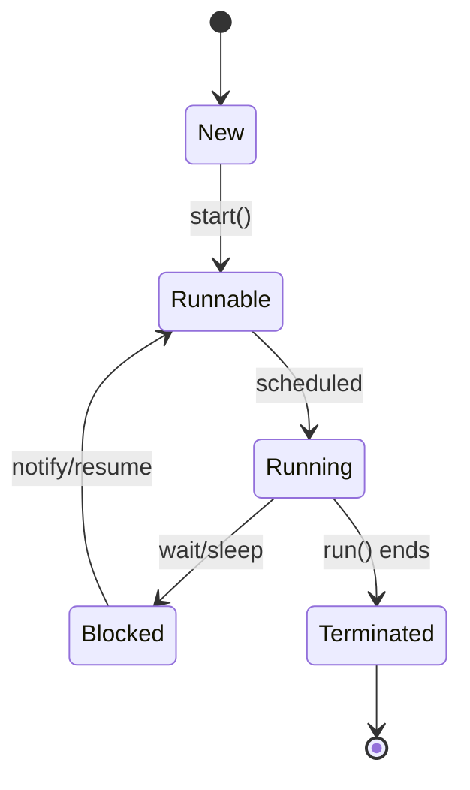

# Multithreading & Concurrency in Java

## Overview

Multithreading allows concurrent execution of threads within a single process, enabling efficient use of multi-core systems. Concurrency manages multiple tasks, handling synchronization, communication, and resource sharing to avoid issues like race conditions and deadlocks.

## Journey / Sequence

Thread lifecycle:

1. **New**: Thread created but not started.

2. **Runnable**: Ready to run.

3. **Running**: Executing.

4. **Blocked/Waiting**: Waiting for resource or I/O.

5. **Terminated**: Completed execution.

## Detailed Explanation

Key concepts:

- **Threads**: Lightweight processes.

- **Synchronization**: Using synchronized blocks/methods.

- **Locks**: ReentrantLock for advanced control.

- **Executors**: Thread pools for management.

- **Concurrency Utils**: Atomic variables, concurrent collections.



## Real-world Examples & Use Cases

- **Web Servers**: Handling multiple client requests concurrently.

- **Games**: Updating UI and processing game logic in parallel.

- **Data Processing**: Parallel streams for big data.

## Code Examples

### Creating Threads
```java
class MyThread extends Thread {
    public void run() {
        System.out.println("Thread running");
    }
}

public class ThreadDemo {
    public static void main(String[] args) {
        MyThread t = new MyThread();
        t.start();
    }
}
```

### Synchronization
```java
public class Counter {
    private int count = 0;

    public synchronized void increment() {
        count++;
    }

    public int getCount() {
        return count;
    }
}
```

### ExecutorService
```java
import java.util.concurrent.ExecutorService;
import java.util.concurrent.Executors;

public class ExecutorDemo {
    public static void main(String[] args) {
        ExecutorService executor = Executors.newFixedThreadPool(5);
        for (int i = 0; i < 10; i++) {
            executor.submit(() -> System.out.println("Task executed"));
        }
        executor.shutdown();
    }
}
```

## Common Pitfalls & Edge Cases

- **Race Conditions**: Access shared data without synchronization.

- **Deadlocks**: Threads waiting for each other indefinitely.

- **Starvation**: Threads unable to access resources.

## References

- [Oracle Concurrency](https://docs.oracle.com/javase/tutorial/essential/concurrency/)
- [Baeldung: Java Concurrency](https://www.baeldung.com/java-concurrency)

## Github-README Links & Related Topics

- [Java Multithreading and Concurrency](java-multithreading-and-concurrency/)
- [Concurrent Collections](concurrent-collections/)
- [Concurrency & Parallelism](concurrency-parallelism/)