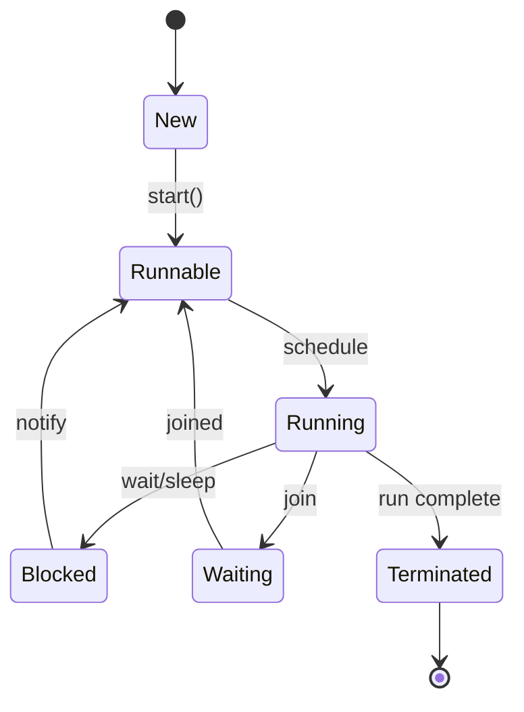

# Multithreading & Concurrency in Java

## Overview

Multithreading allows a program to perform multiple tasks simultaneously. Java provides built-in support for threads, synchronization, and concurrent utilities to manage shared resources safely.

## Detailed Explanation

### Threads

- Creating threads with Thread class or Runnable
- Thread lifecycle: New, Runnable, Blocked, Waiting, Timed Waiting, Terminated

### Synchronization

- Synchronized blocks and methods
- Locks, semaphores, barriers

### Concurrent Collections

- ConcurrentHashMap, CopyOnWriteArrayList



## Real-world Examples & Use Cases

- Web servers handling multiple requests
- GUI applications with responsive interfaces
- Data processing pipelines

## Code Examples

### Creating a Thread

```java
public class MyThread extends Thread {
    public void run() {
        System.out.println("Thread running");
    }
}
public class Main {
    public static void main(String[] args) {
        MyThread t = new MyThread();
        t.start();
    }
}
```

### Synchronization

```java
public class Counter {
    private int count = 0;
    public synchronized void increment() {
        count++;
    }
    public int getCount() {
        return count;
    }
}
```

## References

- [Oracle Concurrency](https://docs.oracle.com/javase/tutorial/essential/concurrency/)

## Github-README Links & Related Topics

- [Java Fundamentals](../java-fundamentals/)
- [Concurrent Collections](../concurrent-collections/)
