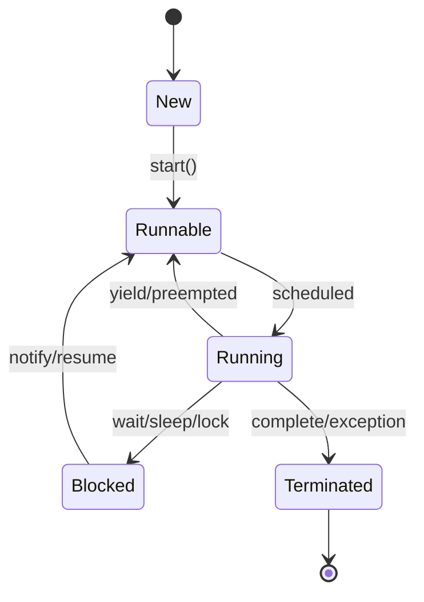

# Multithreading & Concurrency in Java

## Overview

Multithreading and concurrency in Java enable programs to perform multiple tasks simultaneously, improving performance and responsiveness. Java provides built-in support for threads through the `java.lang.Thread` class and higher-level abstractions in `java.util.concurrent`. Key concepts include thread creation, synchronization, locks, and avoiding common issues like race conditions and deadlocks. This topic covers foundational principles, practical applications, and best practices for concurrent programming in Java.

## Detailed Explanation

### Threads and Processes
- **Processes**: Independent execution units with their own memory space.
- **Threads**: Lightweight sub-processes within a process, sharing memory but executing concurrently.
- Java threads are managed by the JVM and OS, supporting preemptive multitasking.

### Thread Lifecycle
Threads transition through states: New, Runnable, Running, Blocked/Waiting, Terminated.



### Synchronization and Locks
- **Synchronization**: Ensures thread-safe access to shared resources using `synchronized` blocks/methods.
- **Intrinsic Locks**: Every object has a monitor lock.
- **Explicit Locks**: `ReentrantLock` from `java.util.concurrent.locks` for more control.
- **Atomic Operations**: Classes like `AtomicInteger` for lock-free updates.

### High-Level Concurrency Utilities
- **Executors**: Manage thread pools via `ExecutorService`.
- **Concurrent Collections**: Thread-safe alternatives like `ConcurrentHashMap`.
- **Futures and Callables**: For asynchronous computation results.

### Memory Model
Java's memory model (JMM) defines how threads interact with memory, ensuring visibility and ordering of operations via `volatile`, `synchronized`, and atomic variables.

## Real-world Examples & Use Cases

| Use Case | Description | Benefits |
|----------|-------------|----------|
| Web Servers | Handling multiple client requests concurrently (e.g., Tomcat, Jetty). | Improved throughput and responsiveness. |
| Data Processing | Parallel processing of large datasets (e.g., Apache Spark jobs). | Faster computation on multi-core systems. |
| GUI Applications | Keeping UI responsive while performing background tasks (e.g., Swing EDT). | Prevents freezing during I/O operations. |
| Game Engines | Simulating physics, AI, and rendering in parallel threads. | Smoother gameplay and real-time performance. |
| Financial Systems | Concurrent transaction processing with ACID properties. | High availability and fault tolerance. |

## Code Examples

### Creating and Starting Threads
```java
public class SimpleThread extends Thread {
    public void run() {
        System.out.println("Thread running");
    }

    public static void main(String[] args) {
        SimpleThread t = new SimpleThread();
        t.start(); // Starts the thread
    }
}
```

### Using Runnable
```java
public class RunnableExample implements Runnable {
    public void run() {
        System.out.println("Runnable executed");
    }

    public static void main(String[] args) {
        Thread t = new Thread(new RunnableExample());
        t.start();
    }
}
```

### Synchronization Example
```java
public class Counter {
    private int count = 0;

    public synchronized void increment() {
        count++;
    }

    public int getCount() {
        return count;
    }
}
```

### ExecutorService for Thread Pools
```java
import java.util.concurrent.ExecutorService;
import java.util.concurrent.Executors;

public class ExecutorExample {
    public static void main(String[] args) {
        ExecutorService executor = Executors.newFixedThreadPool(5);
        for (int i = 0; i < 10; i++) {
            executor.submit(() -> System.out.println("Task executed by " + Thread.currentThread().getName()));
        }
        executor.shutdown();
    }
}
```

### Atomic Variables
```java
import java.util.concurrent.atomic.AtomicInteger;

public class AtomicExample {
    private static AtomicInteger counter = new AtomicInteger(0);

    public static void main(String[] args) {
        counter.incrementAndGet();
        System.out.println("Counter: " + counter.get());
    }
}
```

## Common Pitfalls & Edge Cases

- **Race Conditions**: Unpredictable results from unsynchronized shared data access.
- **Deadlocks**: Threads waiting indefinitely for locks held by each other.
- **Starvation**: Threads unable to proceed due to resource contention.
- **Visibility Issues**: Changes not visible across threads without proper synchronization.
- **Edge Case**: Nested locks can lead to reentrancy issues; use `ReentrantLock` carefully.

## Tools & Libraries

- **java.util.concurrent**: Core package for concurrency utilities.
- **java.util.concurrent.locks**: Advanced locking mechanisms.
- **java.util.concurrent.atomic**: Atomic classes for thread-safe operations.
- **Third-party**: Libraries like Akka for actor-based concurrency or RxJava for reactive programming.

## References

- [Oracle Java Concurrency Tutorial](https://docs.oracle.com/javase/tutorial/essential/concurrency/)
- [Java Memory Model (JSR-133)](https://www.cs.umd.edu/~pugh/java/memoryModel/)
- "Java Concurrency in Practice" by Brian Goetz et al.
- [Dev.java Concurrency Learning Path](https://dev.java/learn/)

## Github-README Links & Related Topics

- [Java Atomic Variables](java-atomic-variables/)
- [Java BlockingQueue](java-blockingqueue/)
- [Java ConcurrentHashMap](java-concurrenthashmap/)
- [Java ExecutorService](java-executorservice/)
- [Java ForkJoinPool](java-forkjoinpool/)
- [Java ReadWriteLock](java-readwritelock/)
- [Java ReentrantLock](java-reentrantlock/)
- [Java Semaphore](java-semaphore/)
- [Java Synchronized Blocks](java-synchronized-blocks/)
- [Java Volatile Keyword](java-volatile-keyword/)
- [Java Wait Notify](java-wait-notify/)