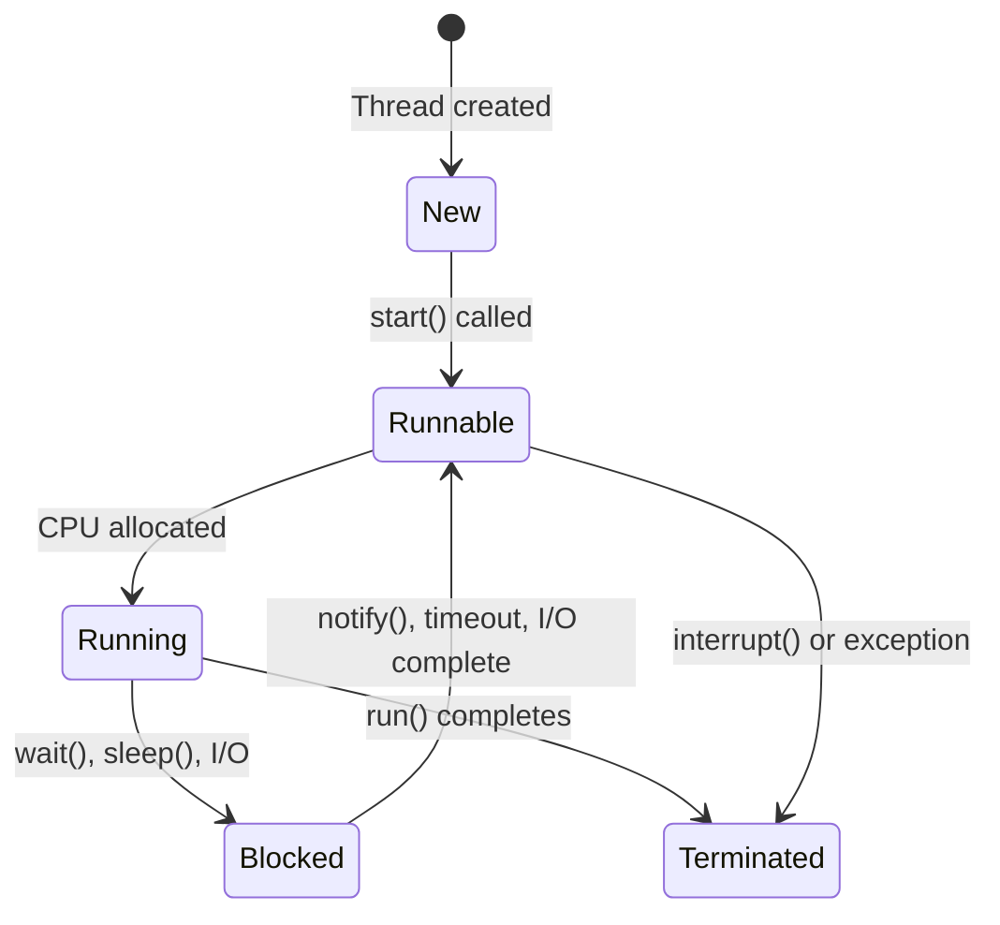

# Multithreading & Concurrency in Java

## Overview

Multithreading and concurrency in Java enable programs to perform multiple tasks simultaneously, enhancing performance, responsiveness, and resource utilization. Java provides robust support through the `java.lang.Thread` class, `Runnable` interface, and the `java.util.concurrent` package for high-level concurrency utilities.

## Detailed Explanation

### Threads and Processes

- **Process**: An independent program execution unit with its own memory space.
- **Thread**: A lightweight unit of execution within a process, sharing the process's memory.

### Creating Threads

- **Extending Thread Class**: Override the `run()` method.
- **Implementing Runnable Interface**: Preferred for better flexibility and resource sharing.

### Thread Lifecycle



### Synchronization Mechanisms

| Mechanism | Description | Use Case |
|-----------|-------------|----------|
| `synchronized` | Intrinsic locks for mutual exclusion | Simple critical sections |
| `ReentrantLock` | Explicit locks with more features | Complex locking scenarios |
| `ReadWriteLock` | Allows multiple readers, single writer | Read-heavy operations |
| Volatile | Ensures visibility of changes | Simple flag variables |

### Concurrency Utilities

- **Executor Framework**: `ExecutorService`, `ThreadPoolExecutor` for managing thread pools.
- **Futures**: `Future`, `CompletableFuture` for asynchronous computation.
- **Atomic Variables**: `AtomicInteger`, `AtomicReference` for lock-free operations.
- **Concurrent Collections**: `ConcurrentHashMap`, `CopyOnWriteArrayList` for thread-safe data structures.
- **Synchronizers**: `CountDownLatch`, `CyclicBarrier`, `Semaphore`, `Phaser`.

## Real-world Examples & Use Cases

- **Web Servers**: Apache Tomcat or Jetty handling multiple HTTP requests concurrently.
- **Data Processing Pipelines**: Apache Spark processing large datasets in parallel.
- **GUI Applications**: Swing or JavaFX keeping UI responsive during background computations.
- **Game Engines**: Managing rendering, physics, and user input in separate threads.
- **Financial Systems**: High-frequency trading platforms processing market data streams.

## Code Examples

### Basic Thread Creation with Runnable

```java
public class HelloRunnable implements Runnable {
    public void run() {
        System.out.println("Hello from " + Thread.currentThread().getName());
    }

    public static void main(String[] args) {
        Thread thread = new Thread(new HelloRunnable());
        thread.start();
    }
}
```

### Using ExecutorService for Thread Pool

```java
import java.util.concurrent.ExecutorService;
import java.util.concurrent.Executors;

public class ExecutorExample {
    public static void main(String[] args) {
        ExecutorService executor = Executors.newFixedThreadPool(3);
        
        for (int i = 0; i < 5; i++) {
            Runnable task = () -> {
                System.out.println("Executing task in " + Thread.currentThread().getName());
                try {
                    Thread.sleep(1000);
                } catch (InterruptedException e) {
                    Thread.currentThread().interrupt();
                }
            };
            executor.execute(task);
        }
        
        executor.shutdown();
    }
}
```

### Synchronization with synchronized

```java
public class SynchronizedCounter {
    private int count = 0;
    
    public synchronized void increment() {
        count++;
    }
    
    public synchronized int getCount() {
        return count;
    }
    
    public static void main(String[] args) throws InterruptedException {
        SynchronizedCounter counter = new SynchronizedCounter();
        
        Runnable task = () -> {
            for (int i = 0; i < 1000; i++) {
                counter.increment();
            }
        };
        
        Thread t1 = new Thread(task);
        Thread t2 = new Thread(task);
        t1.start();
        t2.start();
        t1.join();
        t2.join();
        
        System.out.println("Final count: " + counter.getCount());
    }
}
```

### Using Atomic Variables

```java
import java.util.concurrent.atomic.AtomicInteger;

public class AtomicCounter {
    private AtomicInteger count = new AtomicInteger(0);
    
    public void increment() {
        count.incrementAndGet();
    }
    
    public int getCount() {
        return count.get();
    }
    
    // Usage similar to SynchronizedCounter
}
```

### Producer-Consumer with BlockingQueue

```java
import java.util.concurrent.BlockingQueue;
import java.util.concurrent.LinkedBlockingQueue;

public class ProducerConsumer {
    private static BlockingQueue<Integer> queue = new LinkedBlockingQueue<>(10);
    
    static class Producer implements Runnable {
        public void run() {
            try {
                for (int i = 0; i < 10; i++) {
                    queue.put(i);
                    System.out.println("Produced: " + i);
                    Thread.sleep(100);
                }
            } catch (InterruptedException e) {
                Thread.currentThread().interrupt();
            }
        }
    }
    
    static class Consumer implements Runnable {
        public void run() {
            try {
                for (int i = 0; i < 10; i++) {
                    int item = queue.take();
                    System.out.println("Consumed: " + item);
                    Thread.sleep(200);
                }
            } catch (InterruptedException e) {
                Thread.currentThread().interrupt();
            }
        }
    }
    
    public static void main(String[] args) {
        Thread producer = new Thread(new Producer());
        Thread consumer = new Thread(new Consumer());
        producer.start();
        consumer.start();
    }
}
```

## Common Pitfalls & Edge Cases

- **Race Conditions**: Occur when multiple threads access shared mutable data without proper synchronization.
- **Deadlocks**: Threads waiting indefinitely for locks held by each other. Avoid by acquiring locks in consistent order.
- **Livelocks**: Threads actively trying to resolve a conflict but unable to make progress.
- **Starvation**: A thread unable to access required resources due to scheduling policies.
- **Memory Visibility Issues**: Changes made by one thread not visible to others without proper synchronization or volatile.
- **InterruptedException Handling**: Always properly handle or re-interrupt when catching.

## Tools & Libraries

- **Built-in Java Concurrency**: `java.util.concurrent` package.
- **Virtual Threads (Project Loom)**: Lightweight threads for high concurrency (Java 19+).
- **Third-party Libraries**:
  - **Guava**: Additional concurrent utilities.
  - **Apache Commons Lang**: Concurrency helpers.
  - **RxJava**: Reactive programming for concurrency.
- **Profiling Tools**: VisualVM, JProfiler for analyzing thread behavior.

## References

- [Oracle Java Concurrency Tutorial](https://docs.oracle.com/javase/tutorial/essential/concurrency/)
- [Java Concurrency in Practice](https://jcip.net/) - Book by Brian Goetz et al.
- [JSR 166: Concurrency Utilities](https://jcp.org/en/jsr/detail?id=166)
- [Project Loom Documentation](https://openjdk.org/projects/loom/)
- [Java Memory Model](https://docs.oracle.com/javase/specs/jls/se17/html/jls-17.html#jls-17.4)

## Github-README Links & Related Topics

- [Java Threads, Executors, Futures](../java/threads-executors-futures/)
- [Java Concurrent Programming Patterns](../java/concurrent-programming-patterns/)
- [Java Synchronized Blocks](../java-synchronized-blocks/)
- [Java ReentrantLock](../java-reentrantlock/)
- [Java CompletableFuture](../java-completablefuture/)
- [Java Structured Concurrency](../java-structured-concurrency/)
- [Java Phaser](../java-phaser/)
