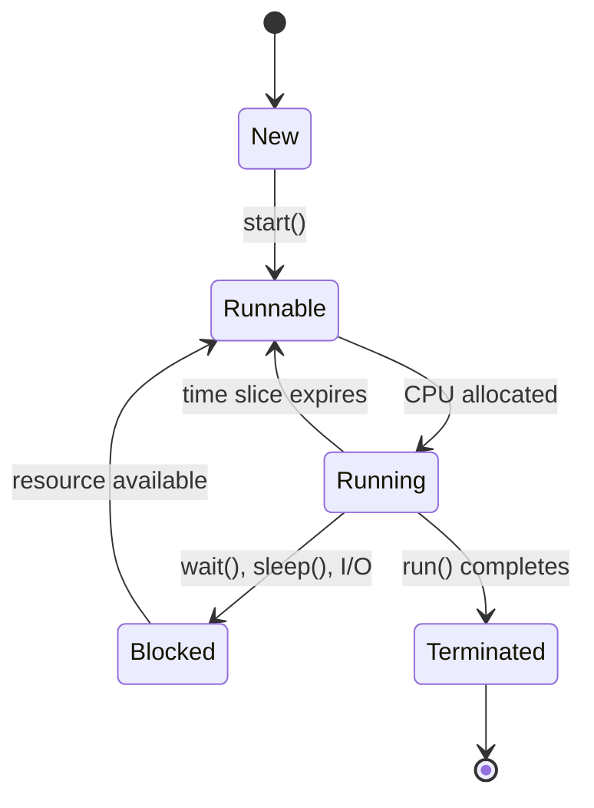

# Multithreading & Concurrency in Java

## Overview

Multithreading and concurrency are fundamental concepts in Java for building responsive and efficient applications. This topic covers thread creation, synchronization, concurrent collections, and best practices for writing thread-safe code. Understanding these concepts is crucial for developing scalable Java applications.

## Detailed Explanation

### What is Multithreading?

Multithreading allows a program to execute multiple threads concurrently, improving performance and responsiveness. Each thread represents a separate path of execution within a process.

### Thread Lifecycle

A thread goes through several states during its lifecycle:

1. **New:** Thread created but not started
2. **Runnable:** Thread ready to run, waiting for CPU time
3. **Running:** Thread currently executing
4. **Blocked:** Thread waiting for a resource or I/O operation
5. **Terminated:** Thread completed execution



### Thread Creation

Java provides two main ways to create threads:

1. **Extending Thread class**
2. **Implementing Runnable interface** (preferred)

### Synchronization

Synchronization ensures that only one thread can access a shared resource at a time, preventing race conditions.

- **Synchronized methods**
- **Synchronized blocks**
- **Locks (java.util.concurrent.locks)**

### Concurrent Collections

Java provides thread-safe collection classes in java.util.concurrent package:

- ConcurrentHashMap
- CopyOnWriteArrayList
- BlockingQueue implementations

### Atomic Variables

Atomic classes provide thread-safe operations on single variables without synchronization.

### Thread Communication

- **wait(), notify(), notifyAll()** methods
- **join()** method
- **Executors and Thread Pools**

## Real-world Examples & Use Cases

- **Web Servers:** Handling multiple client requests concurrently
- **GUI Applications:** Keeping UI responsive while performing background tasks
- **Data Processing:** Parallel processing of large datasets
- **Game Development:** Managing game loops, physics, and rendering in separate threads

## Code Examples

### Creating Threads

```java
// Method 1: Extending Thread class
class MyThread extends Thread {
    @Override
    public void run() {
        System.out.println("Thread running: " + Thread.currentThread().getName());
    }
}

// Method 2: Implementing Runnable interface
class MyRunnable implements Runnable {
    @Override
    public void run() {
        System.out.println("Runnable running: " + Thread.currentThread().getName());
    }
}

public class ThreadCreationDemo {
    public static void main(String[] args) {
        // Using Thread class
        MyThread thread1 = new MyThread();
        thread1.start();
        
        // Using Runnable
        Thread thread2 = new Thread(new MyRunnable());
        thread2.start();
        
        // Using lambda
        Thread thread3 = new Thread(() -> {
            System.out.println("Lambda thread: " + Thread.currentThread().getName());
        });
        thread3.start();
    }
}
```

### Synchronization Example

```java
class Counter {
    private int count = 0;
    
    // Synchronized method
    public synchronized void increment() {
        count++;
    }
    
    // Synchronized block
    public void incrementWithBlock() {
        synchronized (this) {
            count++;
        }
    }
    
    public int getCount() {
        return count;
    }
}

public class SynchronizationDemo {
    public static void main(String[] args) throws InterruptedException {
        Counter counter = new Counter();
        
        Runnable task = () -> {
            for (int i = 0; i < 1000; i++) {
                counter.increment();
            }
        };
        
        Thread t1 = new Thread(task);
        Thread t2 = new Thread(task);
        
        t1.start();
        t2.start();
        
        t1.join();
        t2.join();
        
        System.out.println("Final count: " + counter.getCount()); // Should be 2000
    }
}
```

### Using Concurrent Collections

```java
import java.util.concurrent.ConcurrentHashMap;
import java.util.concurrent.CopyOnWriteArrayList;
import java.util.concurrent.BlockingQueue;
import java.util.concurrent.LinkedBlockingQueue;

public class ConcurrentCollectionsDemo {
    public static void main(String[] args) throws InterruptedException {
        // ConcurrentHashMap
        ConcurrentHashMap<String, Integer> map = new ConcurrentHashMap<>();
        
        // CopyOnWriteArrayList
        CopyOnWriteArrayList<String> list = new CopyOnWriteArrayList<>();
        
        // BlockingQueue
        BlockingQueue<String> queue = new LinkedBlockingQueue<>();
        
        Runnable producer = () -> {
            try {
                queue.put("Item 1");
                queue.put("Item 2");
                System.out.println("Produced items");
            } catch (InterruptedException e) {
                Thread.currentThread().interrupt();
            }
        };
        
        Runnable consumer = () -> {
            try {
                String item = queue.take();
                System.out.println("Consumed: " + item);
            } catch (InterruptedException e) {
                Thread.currentThread().interrupt();
            }
        };
        
        Thread producerThread = new Thread(producer);
        Thread consumerThread = new Thread(consumer);
        
        producerThread.start();
        consumerThread.start();
        
        producerThread.join();
        consumerThread.join();
    }
}
```

### Thread Communication with wait/notify

```java
class SharedResource {
    private boolean available = false;
    
    public synchronized void produce() throws InterruptedException {
        while (available) {
            wait();
        }
        System.out.println("Produced item");
        available = true;
        notify();
    }
    
    public synchronized void consume() throws InterruptedException {
        while (!available) {
            wait();
        }
        System.out.println("Consumed item");
        available = false;
        notify();
    }
}

public class ProducerConsumerDemo {
    public static void main(String[] args) {
        Thread producer = new Thread(() -> {
            try {
                for (int i = 0; i < 5; i++) {
                    resource.produce();
                    Thread.sleep(1000);
                }
            } catch (InterruptedException e) {
                Thread.currentThread().interrupt();
            }
        });
        
        Thread consumer = new Thread(() -> {
            try {
                for (int i = 0; i < 5; i++) {
                    resource.consume();
                    Thread.sleep(1500);
                }
            } catch (InterruptedException e) {
                Thread.currentThread().interrupt();
            }
        });
        
        producer.start();
        consumer.start();
    }
}
```

## Common Pitfalls & Edge Cases

- **Race Conditions:** Multiple threads accessing shared data without proper synchronization
- **Deadlocks:** Threads waiting indefinitely for resources held by each other
- **Starvation:** A thread unable to gain access to shared resources
- **Memory Visibility Issues:** Changes made by one thread not visible to others without proper synchronization
- **Thread Leaks:** Threads not properly terminated, leading to resource leaks

## Tools & Libraries

- **Thread Dump Analysis:** jstack, VisualVM for analyzing thread states
- **Concurrency Testing:** JCStress for testing concurrent code
- **Executors Framework:** For managing thread pools
- **Fork/Join Framework:** For parallel processing
- **CompletableFuture:** For asynchronous programming

## References

- [Oracle Java Concurrency Tutorial](https://docs.oracle.com/javase/tutorial/essential/concurrency/)
- [Java Language Specification - Chapter 17: Threads and Locks](https://docs.oracle.com/javase/specs/jls/se17/html/jls-17.html)
- [Baeldung - Java Concurrency](https://www.baeldung.com/java-concurrency)

## Github-README Links & Related Topics

- [Java Multithreading and Concurrency](../java-multithreading-and-concurrency/README.md)
- [Concurrent Collections](../concurrent-collections/README.md)
- [Java Atomic Variables](../java-atomic-variables/README.md)
- [Java Locks](../java/README.md#locks)
- [Thread Safety](../java/README.md#thread-safety)