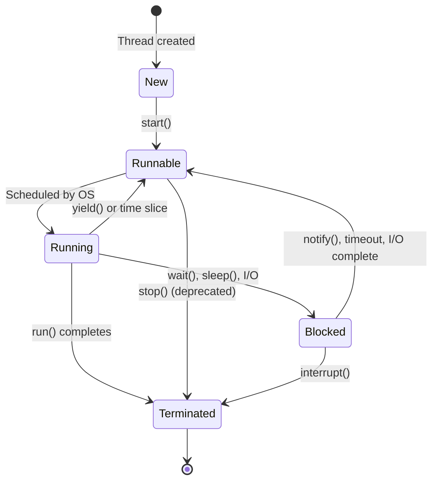
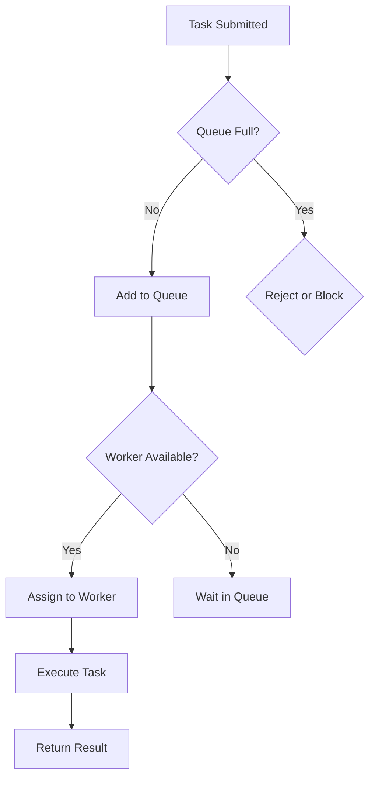

# Overview

Multithreading and concurrency in Java enable programs to perform multiple tasks simultaneously, improving performance and responsiveness. Java provides built-in support for multithreading through the Thread class and concurrency utilities in the java.util.concurrent package, allowing developers to write efficient, thread-safe code that can leverage multi-core processors.

# Detailed Explanation

## Threads in Java

A thread is the smallest unit of execution within a process. Java supports two ways to create threads:

1. **Extending Thread class**
2. **Implementing Runnable interface**

### Thread Lifecycle



### Thread States

- **NEW**: Thread created but not started
- **RUNNABLE**: Ready to run or running
- **BLOCKED**: Waiting for monitor lock
- **WAITING**: Waiting indefinitely for another thread
- **TIMED_WAITING**: Waiting for specified time
- **TERMINATED**: Execution completed

## Synchronization

Synchronization ensures that only one thread can access a shared resource at a time, preventing race conditions and data corruption.

### Synchronized Methods and Blocks

```java
public synchronized void synchronizedMethod() {
    // Only one thread can execute this at a time
}

public void method() {
    synchronized(this) {
        // Synchronized block
    }
}
```

### Locks

Java provides more flexible locking mechanisms through the java.util.concurrent.locks package.

```java
import java.util.concurrent.locks.Lock;
import java.util.concurrent.locks.ReentrantLock;

Lock lock = new ReentrantLock();

public void method() {
    lock.lock();
    try {
        // Critical section
    } finally {
        lock.unlock();
    }
}
```

## Concurrency Utilities

### Executor Framework

The Executor framework provides a higher-level abstraction for managing threads.

```java
import java.util.concurrent.ExecutorService;
import java.util.concurrent.Executors;

ExecutorService executor = Executors.newFixedThreadPool(10);
executor.submit(() -> {
    // Task to execute
});
executor.shutdown();
```

### Atomic Variables

Atomic classes provide thread-safe operations on single variables without synchronization.

```java
import java.util.concurrent.atomic.AtomicInteger;

AtomicInteger counter = new AtomicInteger(0);
int value = counter.incrementAndGet();
```

### Concurrent Collections

Thread-safe collections that can be accessed by multiple threads.

- **ConcurrentHashMap**: Thread-safe HashMap
- **CopyOnWriteArrayList**: Thread-safe ArrayList for read-heavy operations
- **BlockingQueue**: Thread-safe queue with blocking operations

## Thread Communication

### wait(), notify(), notifyAll()

Methods for inter-thread communication.

```java
public synchronized void produce() throws InterruptedException {
    while (buffer.isFull()) {
        wait();
    }
    buffer.add(item);
    notifyAll();
}

public synchronized void consume() throws InterruptedException {
    while (buffer.isEmpty()) {
        wait();
    }
    Item item = buffer.remove();
    notifyAll();
}
```

### Condition Interface

More flexible alternative to wait/notify.

```java
import java.util.concurrent.locks.Condition;

Lock lock = new ReentrantLock();
Condition condition = lock.newCondition();

public void await() throws InterruptedException {
    lock.lock();
    try {
        condition.await();
    } finally {
        lock.unlock();
    }
}

public void signal() {
    lock.lock();
    try {
        condition.signal();
    } finally {
        lock.unlock();
    }
}
```

## Thread Safety Issues

### Race Conditions

When multiple threads access shared data concurrently, leading to unpredictable results.

### Deadlocks

Situation where two or more threads are blocked forever, waiting for each other.

### Livelocks

Threads are not blocked but unable to make progress due to repeated unsuccessful attempts.

# Real-world Examples & Use Cases

- **Web Servers**: Handling multiple client requests simultaneously
- **Database Connections**: Managing connection pools for concurrent access
- **GUI Applications**: Keeping UI responsive while performing background tasks
- **Data Processing**: Parallel processing of large datasets
- **Game Development**: Managing game loops, physics, and rendering in separate threads
- **Financial Systems**: Processing transactions concurrently while maintaining data integrity

# Code Examples

## Example 1: Creating and Starting Threads

```java
// Extending Thread class
class MyThread extends Thread {
    @Override
    public void run() {
        System.out.println("Thread running: " + Thread.currentThread().getName());
    }
}

// Implementing Runnable interface
class MyRunnable implements Runnable {
    @Override
    public void run() {
        System.out.println("Runnable running: " + Thread.currentThread().getName());
    }
}

public class ThreadCreationExample {
    public static void main(String[] args) {
        // Using Thread class
        MyThread thread1 = new MyThread();
        thread1.start();
        
        // Using Runnable
        Thread thread2 = new Thread(new MyRunnable());
        thread2.start();
        
        // Using lambda
        Thread thread3 = new Thread(() -> {
            System.out.println("Lambda thread: " + Thread.currentThread().getName());
        });
        thread3.start();
    }
}
```

## Example 2: Synchronization Example

```java
class Counter {
    private int count = 0;
    
    public synchronized void increment() {
        count++;
    }
    
    public synchronized int getCount() {
        return count;
    }
}

public class SynchronizationExample {
    public static void main(String[] args) throws InterruptedException {
        Counter counter = new Counter();
        
        Runnable task = () -> {
            for (int i = 0; i < 1000; i++) {
                counter.increment();
            }
        };
        
        Thread thread1 = new Thread(task);
        Thread thread2 = new Thread(task);
        
        thread1.start();
        thread2.start();
        
        thread1.join();
        thread2.join();
        
        System.out.println("Final count: " + counter.getCount()); // Should be 2000
    }
}
```

## Example 3: Producer-Consumer Problem

```java
import java.util.LinkedList;
import java.util.Queue;

class BlockingQueue<T> {
    private Queue<T> queue = new LinkedList<>();
    private int capacity;
    
    public BlockingQueue(int capacity) {
        this.capacity = capacity;
    }
    
    public synchronized void put(T item) throws InterruptedException {
        while (queue.size() == capacity) {
            wait();
        }
        queue.add(item);
        notifyAll();
    }
    
    public synchronized T take() throws InterruptedException {
        while (queue.isEmpty()) {
            wait();
        }
        T item = queue.remove();
        notifyAll();
        return item;
    }
}

public class ProducerConsumerExample {
    public static void main(String[] args) {
        BlockingQueue<Integer> queue = new BlockingQueue<>(5);
        
        // Producer
        Thread producer = new Thread(() -> {
            for (int i = 0; i < 10; i++) {
                try {
                    queue.put(i);
                    System.out.println("Produced: " + i);
                    Thread.sleep(100);
                } catch (InterruptedException e) {
                    Thread.currentThread().interrupt();
                }
            }
        });
        
        // Consumer
        Thread consumer = new Thread(() -> {
            for (int i = 0; i < 10; i++) {
                try {
                    int item = queue.take();
                    System.out.println("Consumed: " + item);
                    Thread.sleep(200);
                } catch (InterruptedException e) {
                    Thread.currentThread().interrupt();
                }
            }
        });
        
        producer.start();
        consumer.start();
    }
}
```

## Example 4: Using ExecutorService

```java
import java.util.concurrent.ExecutorService;
import java.util.concurrent.Executors;
import java.util.concurrent.Future;

public class ExecutorExample {
    public static void main(String[] args) {
        ExecutorService executor = Executors.newFixedThreadPool(3);
        
        // Submit tasks
        Future<Integer> future1 = executor.submit(() -> {
            Thread.sleep(1000);
            return 42;
        });
        
        Future<Integer> future2 = executor.submit(() -> {
            Thread.sleep(500);
            return 24;
        });
        
        // Get results
        try {
            System.out.println("Result 1: " + future1.get());
            System.out.println("Result 2: " + future2.get());
        } catch (Exception e) {
            e.printStackTrace();
        }
        
        executor.shutdown();
    }
}
```

## Example 5: Atomic Variables

```java
import java.util.concurrent.atomic.AtomicInteger;
import java.util.concurrent.ExecutorService;
import java.util.concurrent.Executors;

public class AtomicExample {
    private static AtomicInteger counter = new AtomicInteger(0);
    
    public static void main(String[] args) throws InterruptedException {
        ExecutorService executor = Executors.newCachedThreadPool();
        
        Runnable task = () -> {
            for (int i = 0; i < 1000; i++) {
                counter.incrementAndGet();
            }
        };
        
        for (int i = 0; i < 10; i++) {
            executor.submit(task);
        }
        
        executor.shutdown();
        executor.awaitTermination(1, java.util.concurrent.TimeUnit.MINUTES);
        
        System.out.println("Final counter: " + counter.get()); // Should be 10000
    }
}
```

# STAR Summary

- **Situation**: Developing a high-throughput data processing application
- **Task**: Implement concurrent processing to handle multiple data streams
- **Action**: Used ExecutorService with thread pools, synchronized collections, and atomic variables
- **Result**: Achieved 5x performance improvement with proper thread safety

# Journey / Sequence

1. **Identify Concurrency Needs**: Analyze application requirements for parallel processing
2. **Choose Threading Model**: Decide between extending Thread, implementing Runnable, or using Executor
3. **Implement Synchronization**: Use appropriate synchronization mechanisms for shared resources
4. **Handle Thread Communication**: Implement wait/notify or Condition for inter-thread coordination
5. **Test for Thread Safety**: Use tools like Thread Sanitizer or manual testing with high concurrency
6. **Monitor and Tune**: Profile performance and adjust thread pool sizes, lock granularity

# Data Models / Message Formats

### Thread Pool Configuration



# Common Pitfalls & Edge Cases

- **Race Conditions**: Accessing shared variables without proper synchronization
- **Deadlocks**: Circular wait conditions between threads
- **Starvation**: Threads unable to acquire resources due to unfair scheduling
- **Memory Visibility**: Changes not visible across threads without volatile or synchronization
- **Thread Leaks**: Not properly shutting down threads or executor services
- **Over-synchronization**: Using synchronized unnecessarily, reducing performance

# Tools & Libraries

- **Java Concurrency Utilities**: java.util.concurrent package
- **Thread Dump Analysis**: jstack, VisualVM
- **Profiling Tools**: JProfiler, YourKit for thread analysis
- **Testing Frameworks**: JCStress for concurrency testing
- **Virtual Threads (Java 19+)**: Lightweight threads for high concurrency

# References

- [Oracle Java Concurrency Tutorial](https://docs.oracle.com/javase/tutorial/essential/concurrency/)
- [Java Concurrency in Practice](https://www.amazon.com/Java-Concurrency-Practice-Brian-Goetz/dp/0321349601)
- [Baeldung Java Concurrency](https://www.baeldung.com/java-concurrency)
- [Java Memory Model](https://docs.oracle.com/javase/specs/jls/se17/html/jls-17.html#jls-17.4)
- [Executor Framework](https://docs.oracle.com/javase/8/docs/api/java/util/concurrent/Executor.html)

# Github-README Links & Related Topics

- [Java Fundamentals](../java-fundamentals/README.md)
- [Java Volatile Keyword](../java-volatile-keyword/README.md)
- [Java Synchronized Blocks](../java-synchronized-blocks/README.md)
- [Java ThreadLocal](../java-threadlocal/README.md)
- [Concurrent Programming Patterns](../concurrent-programming-patterns/README.md)
- [Java Memory Model](../memory-models/README.md)
