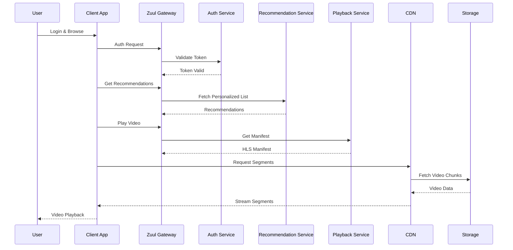

# Netflix System Design

## Overview
Netflix is a subscription-based video streaming service that delivers movies, TV shows, and original content to over 300 million subscribers worldwide. The system design focuses on high scalability, low-latency video delivery, personalized recommendations, and fault-tolerant microservices architecture. Key challenges include handling petabytes of data, adaptive bitrate streaming, global CDN distribution, and real-time analytics for user engagement.

## Detailed Explanation
Netflix's architecture leverages microservices, event-driven systems, and a proprietary CDN called Open Connect. The system is designed for massive scale, with over 700 microservices handling specific functions like user authentication, video playback, recommendations, and billing.

### Core Components
- **Client Applications:** Mobile apps, web players, and smart TV apps that support adaptive bitrate streaming using HLS/DASH protocols.
- **API Gateway (Zuul):** Netflix's Zuul 2 handles asynchronous, non-blocking requests, routing traffic to microservices while providing load balancing and security.
- **Microservices:** Built with Java, Python, and Node.js, using frameworks like Spring Boot. Services include user management, video metadata, recommendations, and payment processing.
- **Content Delivery Network (CDN):** Open Connect deploys servers in ISP data centers globally, caching video content to reduce latency. Supports multiple codecs like H.264, VP9, and AV1.
- **Data Storage:** Cassandra for NoSQL storage of user data and video metadata; Elasticsearch for search; S3 for video assets.
- **Recommendation Engine:** Machine learning models using TensorFlow and PyTorch, analyzing viewing history, ratings, and social data to suggest content.
- **Video Processing Pipeline:** Encodes videos into multiple bitrates for adaptive streaming, using custom x264 optimizations.
- **Event Streaming:** Apache Kafka for real-time data pipelines, enabling analytics and personalization.
- **Monitoring and Observability:** Netflix Atlas for metrics, Hystrix for circuit breakers, and custom tools for chaos engineering.

### High-Level Architecture Diagram
```mermaid
graph TD
    A[User Device] --> B[Zuul API Gateway]
    B --> C[Authentication Microservice]
    B --> D[Recommendation Microservice]
    B --> E[Video Playback Microservice]
    E --> F[Open Connect CDN]
    F --> G[Video Storage (S3/Cassandra)]
    D --> H[ML Recommendation Engine]
    H --> I[Data Lake (Kafka/Spark)]
    I --> J[Analytics & Personalization]
    C --> K[User Database (Cassandra)]
    E --> L[Video Metadata Service]
```

### Key Design Principles
- **Microservices:** Decoupled services for scalability and independent deployments.
- **Event-Driven:** Asynchronous communication via Kafka to handle high throughput.
- **Fault Tolerance:** Circuit breakers, retries, and chaos engineering to ensure uptime.
- **Global Scale:** Edge computing and CDN for low-latency delivery.
- **Personalization:** AI-driven recommendations based on collaborative filtering and deep learning.

## Real-world Examples & Use Cases
- **Adaptive Streaming:** When a user starts watching "Stranger Things" on a mobile device with poor connectivity, Netflix automatically switches to lower bitrate to prevent buffering.
- **Personalized Recommendations:** Based on a user's history of watching sci-fi and thrillers, the system recommends similar titles like "The Matrix" or "Inception."
- **Global Content Delivery:** A user in India streams a 4K movie originally encoded in the US, with Open Connect servers ensuring <1s latency.
- **Offline Viewing:** Users download content on planes or in low-signal areas, with encrypted storage and sync across devices.
- **Live Events:** Streaming NFL games or award shows, handling millions of concurrent viewers with real-time analytics.
- **A/B Testing:** Netflix tests UI changes or recommendation algorithms on subsets of users to optimize engagement.

## Code Examples
### Zuul Filter for Authentication (Java)
```java
@Component
public class AuthFilter extends ZuulFilter {
    @Override
    public String filterType() {
        return "pre";
    }

    @Override
    public int filterOrder() {
        return 1;
    }

    @Override
    public boolean shouldFilter() {
        return true;
    }

    @Override
    public Object run() {
        RequestContext ctx = RequestContext.getCurrentContext();
        HttpServletRequest request = ctx.getRequest();
        String token = request.getHeader("Authorization");
        if (!isValidToken(token)) {
            ctx.setSendZuulResponse(false);
            ctx.setResponseStatusCode(401);
        }
        return null;
    }
}
```

### Collaborative Filtering Recommendation (Python)
```python
import numpy as np
from sklearn.decomposition import TruncatedSVD

def recommend_movies(user_id, user_item_matrix, n_recommendations=5):
    svd = TruncatedSVD(n_components=50)
    matrix_reduced = svd.fit_transform(user_item_matrix)
    user_vector = matrix_reduced[user_id]
    similarities = np.dot(matrix_reduced, user_vector)
    similar_users = np.argsort(similarities)[::-1][1:11]
    recommendations = np.mean(user_item_matrix.iloc[similar_users], axis=0)
    return recommendations.nlargest(n_recommendations).index.tolist()
```

### Video Metadata Service (Node.js)
```javascript
const express = require('express');
const cassandra = require('cassandra-driver');

const app = express();
const client = new cassandra.Client({ contactPoints: ['127.0.0.1'], keyspace: 'netflix' });

app.get('/videos/:id', async (req, res) => {
    const query = 'SELECT * FROM videos WHERE id = ?';
    const result = await client.execute(query, [req.params.id]);
    res.json(result.rows[0]);
});

app.listen(3000, () => console.log('Video service running'));
```

## STAR Summary
- **Situation:** Netflix needed to scale from DVD rentals to global streaming for millions of users.
- **Task:** Design a system for low-latency video delivery, personalization, and high availability.
- **Action:** Adopted microservices, built Open Connect CDN, and implemented ML recommendations.
- **Result:** Achieved 99.99% uptime, personalized experiences, and global reach.

## Journey / Sequence


## Data Models / Message Formats
### Video Metadata Model (Cassandra Table)
```cql
CREATE TABLE videos (
    id text PRIMARY KEY,
    title text,
    genres set<text>,
    duration int,
    bitrates list<int>,
    languages set<text>,
    release_date date
);
```

### User Event (Kafka Avro Schema)
```json
{
  "type": "record",
  "name": "UserEvent",
  "fields": [
    {"name": "userId", "type": "string"},
    {"name": "videoId", "type": "string"},
    {"name": "eventType", "type": {"type": "enum", "symbols": ["play", "pause", "stop"]}},
    {"name": "timestamp", "type": "long"},
    {"name": "position", "type": "int"}
  ]
}
```

## Common Pitfalls & Edge Cases
- **Buffering During Peak Times:** Mitigated by adaptive bitrate and CDN pre-caching.
- **Geo-Restrictions:** Content licensing requires region-specific catalogs.
- **Cold Start Problems:** Pre-warm caches for new releases using predictive analytics.
- **Data Privacy Violations:** Strict compliance with GDPR; anonymize user data for recommendations.
- **Microservice Failures:** Use circuit breakers (Hystrix) to prevent cascading failures.
- **High Concurrent Loads:** Auto-scaling with Kubernetes and chaos testing.
- **Offline Sync Issues:** Handle device storage limits and encryption for downloads.

## Tools & Libraries
- **API Gateway:** Zuul 2 (Netflix open-source) for non-blocking routing.
- **Microservices Framework:** Spring Boot, Eureka for service discovery.
- **Data Processing:** Apache Spark, Flink for real-time analytics.
- **Machine Learning:** TensorFlow, PyTorch for recommendations.
- **Databases:** Cassandra, Elasticsearch, MySQL.
- **Streaming:** Apache Kafka, Netflix Conductor for workflows.
- **Monitoring:** Netflix Atlas, Hystrix, Simian Army for chaos engineering.
- **CDN:** Open Connect, integrated with AWS CloudFront.
- **Testing:** Chaos Monkey for fault injection.

## Github-README Links & Related Topics
- [Microservices Architecture](../microservices-architecture/)
- [Event Streaming with Apache Kafka](../event-streaming-with-apache-kafka/)
- [CDN Architecture](../cdn-architecture/)
- [API Gateway Design](../api-gateway-design/)
- [Distributed Caching with Redis](../distributed-caching-with-redis/)
- [Machine Learning in System Design](../machine-learning-in-system-design/)

## References
- [Netflix Technology Blog - Zuul 2](https://netflixtechblog.com/zuul-2-the-netflix-journey-to-asynchronous-non-blocking-systems-4591c4a3b5c)
- [Wikipedia - Netflix Technology](https://en.wikipedia.org/wiki/Netflix#Technology)
- [GeeksforGeeks - Design Netflix](https://www.geeksforgeeks.org/design-netflix-a-system-design-interview-question/)
- [Educative - Netflix System Design](https://www.educative.io/blog/netflix-system-design)
- [Netflix Open Source](https://netflix.github.io/)
