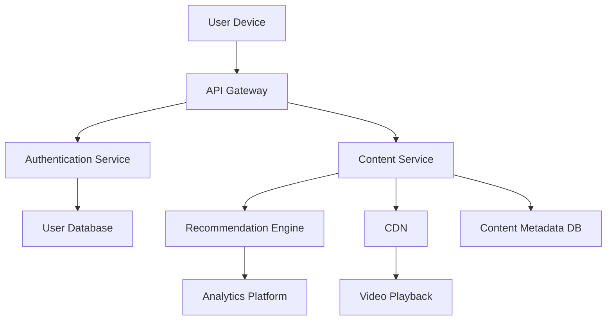

## Overview

Netflix is a leading video streaming platform that provides on-demand entertainment to over 200 million subscribers worldwide. The system design emphasizes scalability, low-latency content delivery, and personalized user experiences through advanced recommendation algorithms.

## Detailed Explanation

Netflix's architecture is built on a microservices-based backend, global content delivery networks (CDNs), and distributed data stores. Key components include:

- **User Interface**: Web applications and mobile apps for various devices.
- **API Gateway**: Handles authentication, routing, and load balancing for incoming requests.
- **Microservices**: Modular services for user management, billing, content catalog, and recommendations.
- **Content Storage**: Distributed object storage for video files, using formats like adaptive bitrate streaming.
- **CDN Network**: Akamai and custom CDNs for efficient global distribution.
- **Recommendation Engine**: Machine learning models for personalized content suggestions.
- **Data Analytics**: Big data processing for user behavior analysis and content optimization.

The system uses event-driven architecture for real-time updates and ensures high availability with multi-region deployments.



## Real-world Examples & Use Cases

- **Global Video Streaming**: Delivering high-quality video to users in different regions with minimal latency.
- **Personalized Recommendations**: Using viewing history to suggest relevant content.
- **Offline Viewing**: Allowing downloads for offline consumption.
- **Live Events**: Streaming live sports or original content.

## Code Examples

Here's a simplified Java example of a basic recommendation algorithm using collaborative filtering:

```java
import java.util.*;

public class RecommendationEngine {
    private Map<String, List<String>> userPreferences; // User -> List of watched movies

    public RecommendationEngine() {
        this.userPreferences = new HashMap<>();
    }

    public List<String> recommendMovies(String userId, int topN) {
        if (!userPreferences.containsKey(userId)) {
            return new ArrayList<>();
        }

        List<String> watched = userPreferences.get(userId);
        Map<String, Integer> scores = new HashMap<>();

        // Simple collaborative filtering: recommend movies watched by similar users
        for (Map.Entry<String, List<String>> entry : userPreferences.entrySet()) {
            if (!entry.getKey().equals(userId)) {
                List<String> otherWatched = entry.getValue();
                for (String movie : otherWatched) {
                    if (!watched.contains(movie)) {
                        scores.put(movie, scores.getOrDefault(movie, 0) + 1);
                    }
                }
            }
        }

        // Sort by score and return top N
        return scores.entrySet().stream()
                .sorted(Map.Entry.<String, Integer>comparingByValue().reversed())
                .limit(topN)
                .map(Map.Entry::getKey)
                .collect(ArrayList::new, (list, item) -> list.add(item), ArrayList::addAll);
    }

    public void addUserPreference(String userId, String movieId) {
        userPreferences.computeIfAbsent(userId, k -> new ArrayList<>()).add(movieId);
    }
}
```

## Journey / Sequence

1. **User Registration/Login**: User creates account or logs in via API Gateway.
2. **Content Discovery**: User browses catalog or receives recommendations.
3. **Video Request**: API routes to content service, which selects optimal CDN.
4. **Streaming**: Video chunks are delivered via CDN with adaptive bitrate.
5. **Analytics**: Viewing data is collected for future recommendations.

## Data Models / Message Formats

- **User Model**: {id, email, subscription_plan, preferences}
- **Movie Model**: {id, title, genre, duration, rating}
- **Viewing Event**: {user_id, movie_id, timestamp, watch_duration}

## Common Pitfalls & Edge Cases

- **Buffering Issues**: Handle network variability with adaptive streaming.
- **Regional Restrictions**: Comply with content licensing laws.
- **Scalability During Peaks**: Use auto-scaling for sudden traffic spikes.
- **Data Privacy**: Secure user viewing data and recommendations.

## Tools & Libraries

- **Backend**: Java/Spring Boot for microservices
- **Storage**: Cassandra for user data, S3 for video storage
- **CDN**: Custom Open Connect appliances
- **Analytics**: Spark for big data processing
- **Orchestration**: Kubernetes for container management

## References

- [Netflix Tech Blog](https://netflixtechblog.com/)
- [Netflix Open Source](https://netflix.github.io/)
- [Adaptive Streaming Overview](https://en.wikipedia.org/wiki/Adaptive_bitrate_streaming)

## Github-README Links & Related Topics

- [CDN Architecture](../cdn-architecture/README.md)
- [Microservices Architecture](../microservices-architecture/README.md)
- [Event-Driven Architecture](../event-driven-architecture/README.md)
- [Distributed Caching with Redis](../distributed-caching-with-redis/README.md)
