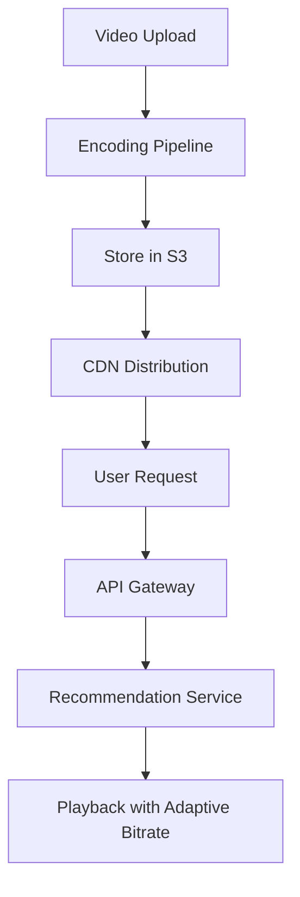

# Overview

Netflix's video streaming architecture delivers high-quality video to millions of users globally, handling encoding, storage, recommendation, and playback with low latency and high availability.

# Detailed Explanation

## Key Components
- **Content Delivery**: Open Connect CDN for video distribution.
- **Microservices**: Zuul for API gateway, Eureka for service discovery.
- **Data Processing**: Kafka for events, Cassandra for metadata.
- **Recommendation Engine**: Machine learning for personalized suggestions.

## Workflow
1. **Ingestion**: Upload and encode videos.
2. **Storage**: Store in S3 and regional caches.
3. **Delivery**: Adaptive bitrate streaming via HLS/DASH.



# Real-world Examples & Use Cases
- **Global Streaming**: Serve content in 190+ countries.
- **Personalization**: AI-driven recommendations.
- **Offline Viewing**: Download for offline playback.

# Code Examples

```java
// Simplified recommendation service
public class RecommendationService {
    public List<String> getRecommendations(String userId) {
        // Query user preferences, history
        return List.of("Movie1", "Movie2");
    }
}
```

# Journey / Sequence

1. **Content Acquisition**: License or produce content.
2. **Encoding**: Transcode to multiple formats/resolutions.
3. **Distribution**: Push to CDN edges.
4. **User Interaction**: Stream with low latency.

# Common Pitfalls & Edge Cases
- **Buffering**: Handle network variability.
- **Scalability**: Manage traffic spikes.
- **DRM**: Secure content with encryption.

# Tools & Libraries
- **Frameworks**: Spring Cloud for microservices.
- **Databases**: Cassandra, Elasticsearch.
- **Monitoring**: Atlas for metrics.

# References
- [Netflix Tech Blog](https://netflixtechblog.com/)
- [Open Connect](https://openconnect.netflix.com/)

# Github-README Links & Related Topics
- [Microservices Architecture](../system-design/microservices-architecture/README.md)
- [Content Delivery Networks](../system-design/caching-strategies/README.md)
- [Event-Driven Architecture](../system-design/event-driven-architecture/README.md)