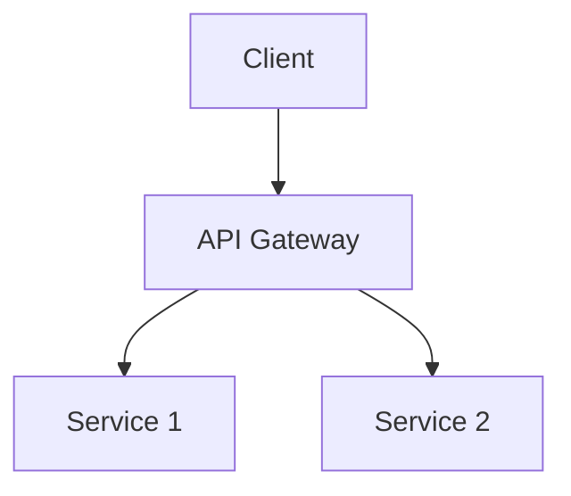

# API Gateway Design

## Overview

An API Gateway is a server that acts as an API front-end, receiving API requests, enforcing throttling and security policies, passing requests to the back-end service, and then passing the response back to the requester.

## Detailed Explanation

### Key Features

- **Routing:** Direct requests to appropriate services.
- **Authentication:** Verify user identity.
- **Rate Limiting:** Control request rates.
- **Logging:** Track API usage.

### Design Patterns

- **Single Entry Point:** All requests go through the gateway.
- **Microservices Integration:** Route to multiple services.

## Real-world Examples & Use Cases

- **Microservices:** Manage APIs for multiple services.
- **Mobile Apps:** Provide unified API for different clients.

## Code Examples

### Kong Configuration

```yaml
services:
  - name: example-service
    url: http://example.com
    routes:
      - name: example-route
        paths:
          - /api
```

## References

- [API Gateway Pattern](https://microservices.io/patterns/apigateway.html)

## Github-README Links & Related Topics

- [API Gateway Implementation](./api-gateway-implementation/)
- [Microservices Architecture](./microservices-architecture/)

## API Gateway Architecture Diagram

