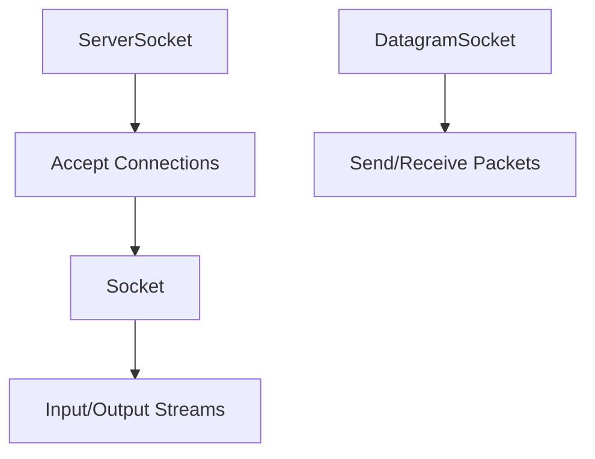

# Overview

Socket programming enables low-level network communication in Java, forming the basis for higher-level protocols. Critical for understanding network internals.

Canonical Interview Prompt: Build a simple TCP echo server and client using Java sockets.

# Detailed Explanation

## High-Level Design

Sockets provide endpoints for communication. TCP for reliable, UDP for fast but unreliable transport.



## Key Classes

- **ServerSocket**: Listens for incoming connections.
- **Socket**: Client-side connection.
- **DatagramSocket**: For UDP communication.

## Capacity and Throughput Targets

- TCP: 1000-10000 connections per server, depending on hardware.
- UDP: Higher throughput but no reliability.

## Tradeoffs

- **TCP vs UDP**: TCP reliable but slower; UDP fast but lossy.
- **Blocking vs Non-blocking**: Blocking simpler but may hang.
- **Resource Management**: Close sockets to avoid leaks.

# Real-world Examples & Use Cases

- **Web Servers**: Underlying HTTP connections.
- **Chat Applications**: Real-time messaging.
- **File Transfer**: FTP-like protocols.

# Code Examples

**TCP Echo Server:**

```java
import java.io.*;
import java.net.*;

public class EchoServer {
    public static void main(String[] args) throws IOException {
        ServerSocket serverSocket = new ServerSocket(8080);
        while (true) {
            Socket clientSocket = serverSocket.accept();
            BufferedReader in = new BufferedReader(new InputStreamReader(clientSocket.getInputStream()));
            PrintWriter out = new PrintWriter(clientSocket.getOutputStream(), true);
            String inputLine;
            while ((inputLine = in.readLine()) != null) {
                out.println(inputLine);
            }
        }
    }
}
```

**TCP Client:**

```java
import java.io.*;
import java.net.*;

public class EchoClient {
    public static void main(String[] args) throws IOException {
        Socket socket = new Socket("localhost", 8080);
        PrintWriter out = new PrintWriter(socket.getOutputStream(), true);
        BufferedReader in = new BufferedReader(new InputStreamReader(socket.getInputStream()));
        out.println("Hello");
        System.out.println(in.readLine());
    }
}
```

**UDP Example:**

```java
import java.net.*;

public class UDPClient {
    public static void main(String[] args) throws Exception {
        DatagramSocket socket = new DatagramSocket();
        byte[] buf = "Hello".getBytes();
        DatagramPacket packet = new DatagramPacket(buf, buf.length, InetAddress.getByName("localhost"), 8080);
        socket.send(packet);
    }
}
```

# Data Models / Message Formats

**TCP Stream:**

Continuous byte stream.

**UDP Packet:**

Datagram with address and data.

# Common Pitfalls & Edge Cases

- **Port Conflicts**: Choose unused ports.
- **Firewall Issues**: Ensure ports are open.
- **Timeouts**: Set read timeouts to avoid hanging.

# Tools & Libraries

- Java Net package
- NIO for non-blocking I/O

# Github-README Links & Related Topics

[networking-tcp-ip-http2-tls](../networking-tcp-ip-http2-tls/README.md), [io-and-nio](../io-and-nio/README.md)

# References

- https://docs.oracle.com/javase/tutorial/networking/sockets/
- https://docs.oracle.com/javase/8/docs/api/java/net/package-summary.html
- https://www.baeldung.com/java-socket-programming