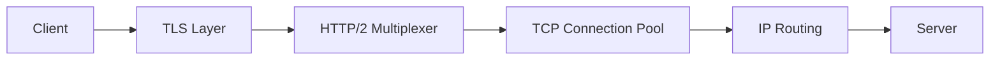
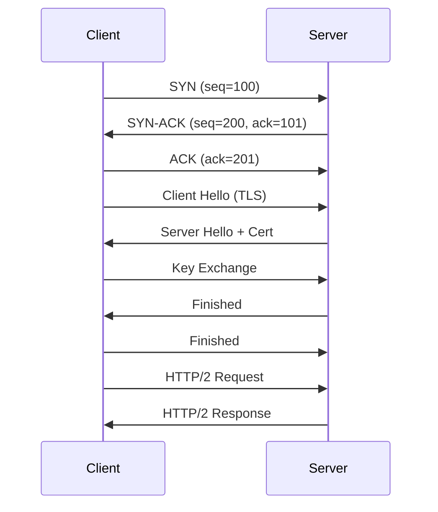

# Networking TCP IP HTTP2 TLS

## Overview

Networking fundamentals are crucial for system design, covering the TCP/IP protocol suite, HTTP/2 advancements, and TLS for secure communication. This topic explains the layers of the network stack, connection establishment, data transfer, and security mechanisms, with practical examples for interviews.

## STAR Summary

**Situation:** A web application suffered from slow page loads due to inefficient HTTP requests.

**Task:** Optimize network performance for a high-traffic site.

**Action:** Migrated from HTTP/1.1 to HTTP/2 for multiplexing, implemented TLS 1.3 for faster handshakes, and used TCP optimizations like window scaling.

**Result:** Reduced page load time by 50%, improved user experience, and handled 2x traffic without additional servers.

## Interview Design Case

**Prompt:** Design a secure and efficient networking stack for a high-throughput API service handling 50,000 RPS.

**High-Level Design (HLD):**



**Capacity Calculations:**
- Connection pool: 10,000 concurrent connections.
- Bandwidth: 50k RPS * 2KB/response = 100MB/s.
- Latency: TLS 1.3 handshake ~1 RTT, HTTP/2 multiplexing reduces head-of-line blocking.

**Tradeoffs:**
- TCP vs UDP: TCP reliability vs UDP speed for real-time.
- TLS overhead: Security vs. performance (use session resumption).
- HTTP/2 vs HTTP/3: HTTP/2 widely supported vs. HTTP/3's QUIC for lower latency.

**STAR Case Study:** (See STAR Summary above for optimization example.)

## Detailed Explanation

### TCP/IP Stack

- **Application Layer:** HTTP, FTP (handles user data).
- **Transport Layer:** TCP (reliable, connection-oriented) vs UDP (unreliable, fast).
- **Internet Layer:** IP (routing, addressing).
- **Network Access Layer:** Ethernet, WiFi (physical transmission).

TCP provides reliability through acknowledgments, retransmissions, and flow control.

### HTTP/2

Improves over HTTP/1.1 with multiplexing (multiple requests over one connection), header compression (HPACK), server push, and binary framing.

### TLS

Provides encryption, authentication, and integrity. Versions: 1.2 (common), 1.3 (faster handshake). Handshake involves certificate exchange, key agreement (ECDHE), and symmetric encryption.

## Real-world Examples & Use Cases

- Web browsing: HTTP/2 for efficient resource loading.
- APIs: REST over HTTPS with TLS.
- Streaming: TCP for reliable video delivery.

## Common Interview Questions

- Explain the TCP three-way handshake.
- How does HTTP/2 improve over HTTP/1.1?
- What are the differences between TLS 1.2 and 1.3?
- How do you handle network congestion in TCP?

## Code Examples

### Java TCP Server with TLS

```java
import javax.net.ssl.SSLServerSocket;
import javax.net.ssl.SSLServerSocketFactory;

public class SecureTCPServer {
    public static void main(String[] args) throws Exception {
        SSLServerSocketFactory factory = (SSLServerSocketFactory) SSLServerSocketFactory.getDefault();
        SSLServerSocket serverSocket = (SSLServerSocket) factory.createServerSocket(8443);
        serverSocket.setEnabledCipherSuites(new String[] {"TLS_AES_128_GCM_SHA256"});
        
        while (true) {
            SSLSocket socket = (SSLSocket) serverSocket.accept();
            // Handle connection
        }
    }
}
```

### HTTP/2 Client

Using OkHttp:

```java
import okhttp3.OkHttpClient;
import okhttp3.Request;

OkHttpClient client = new OkHttpClient.Builder()
    .protocols(Arrays.asList(Protocol.HTTP_2, Protocol.HTTP_1_1))
    .build();

Request request = new Request.Builder()
    .url("https://example.com")
    .build();

Response response = client.newCall(request).execute();
```

Maven:

```xml
<dependency>
    <groupId>com.squareup.okhttp3</groupId>
    <artifactId>okhttp</artifactId>
    <version>4.10.0</version>
</dependency>
```

## Data Models / Message Formats

### TCP Packet

| Field | Size | Description |
|-------|------|-------------|
| Source Port | 16 bits | Sender port |
| Dest Port | 16 bits | Receiver port |
| Sequence Number | 32 bits | Byte sequence |
| Ack Number | 32 bits | Acknowledgment |
| Flags | 6 bits | SYN, ACK, etc. |
| Window Size | 16 bits | Flow control |

### HTTP/2 Frame

Binary format with types: DATA, HEADERS, SETTINGS.

## Journey / Sequence



## Common Pitfalls & Edge Cases

- TCP Slow Start: Initial congestion window is small; optimize with BBR.
- TLS Certificate Pinning: Prevents MITM but complicates updates.
- HTTP/2 Head-of-Line Blocking: Mitigated by multiplexing but can occur in proxies.
- IPv4 Exhaustion: Use IPv6.

## Tools & Libraries

- Wireshark: Packet analyzer.
- curl: Command-line HTTP client.
- OpenSSL: TLS toolkit.
- Netty: Java networking library.

## Github-README Links & Related Topics

[[load-balancing-and-routing]], [[system-design-basics]]

Related: [[caching-strategies]], [[partitioning-and-sharding]]

## References

- https://tools.ietf.org/html/rfc793 (TCP)
- https://tools.ietf.org/html/rfc7540 (HTTP/2)
- https://tools.ietf.org/html/rfc8446 (TLS 1.3)
</content>
</xai:function_call name="write">
<parameter name="filePath">os/operating-systems-concepts/README.md