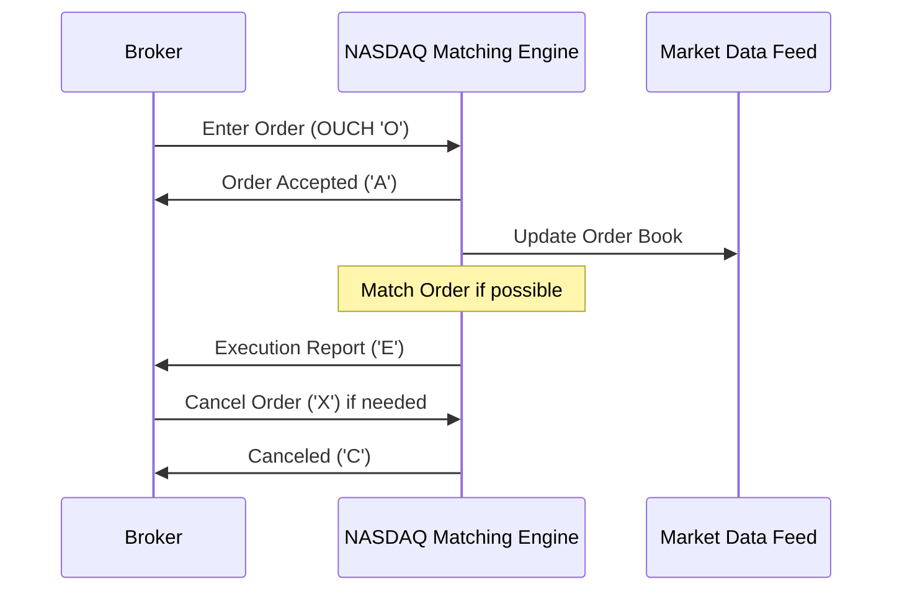

## Overview

The OUCH Protocol is NASDAQ's proprietary binary protocol designed for high-performance order entry into the NASDAQ matching engine. It enables brokers and trading systems to submit, modify, and cancel orders with ultra-low latency, supporting various order types and attributes essential for electronic trading. As a binary protocol, it minimizes parsing overhead compared to text-based alternatives, making it suitable for high-frequency trading environments.

# STAR Summary

**S (Situation):** In the late 1990s, NASDAQ needed a more efficient way to handle increasing order volumes and reduce latency in order entry, as text-based protocols like FIX were becoming bottlenecks for high-speed trading.

**T (Task):** Develop a binary protocol optimized for direct order submission to the matching engine, supporting real-time order management.

**A (Action):** NASDAQ engineered the OUCH Protocol with fixed-length binary messages, incorporating features like order routing, time-in-force options, and acknowledgment mechanisms.

**R (Result):** The protocol achieved sub-millisecond latencies, enabling NASDAQ to process millions of orders per second and support the growth of algorithmic and high-frequency trading.

# Detailed Explanation

The OUCH Protocol operates over TCP/IP connections, using binary-encoded messages to communicate between client systems (brokers) and the NASDAQ matching engine. Each message is a fixed-size structure, typically 50-100 bytes, containing fields like message type, order ID, symbol, quantity, price, and flags.

Key components include:
- **Message Types:** Core messages such as 'O' (Enter Order), 'U' (Replace Order), 'X' (Cancel Order), and 'A' (Order Accepted).
- **Order Attributes:** Supports limit orders, market orders, stop orders, and special instructions like display quantity or routing preferences.
- **Session Management:** Clients establish sessions via login messages, with heartbeat mechanisms to maintain connectivity.
- **Error Handling:** Includes reject messages for invalid orders, with codes indicating reasons like insufficient balance or market closure.

The protocol ensures atomicity in order processing, with acknowledgments sent synchronously to confirm receipt and processing status. It integrates with NASDAQ's risk management systems to enforce pre-trade checks.

# Real-world Examples & Use Cases

In high-frequency trading firms, OUCH is used to route orders directly to NASDAQ's INET system. For instance, a broker might submit a limit order for 100 shares of AAPL at $150.00, receiving an immediate acknowledgment if accepted.

Sample message exchange:
- Client sends Enter Order: Binary payload with symbol 'AAPL', side 'Buy', quantity 100, price 15000 (in cents).
- Server responds: Order Accepted message with assigned order ID.

Use cases include:
- Algorithmic trading strategies requiring rapid order placement.
- Market making operations needing frequent order adjustments.
- Institutional order flow management for large blocks.

## Message Formats / Data Models

Messages are binary, with fields in big-endian format. Example Enter Order message (type 'O'):

| Field | Type | Size | Description |
|-------|------|------|-------------|
| Message Type | char | 1 | 'O' |
| Order Token | uint64 | 8 | Unique order identifier |
| Buy/Sell Indicator | char | 1 | 'B' or 'S' |
| Shares | uint32 | 4 | Quantity |
| Stock | char[8] | 8 | Symbol (padded) |
| Price | uint32 | 4 | Price in cents |
| Time in Force | uint32 | 4 | Duration |
| Firm | char[4] | 4 | Firm ID |
| Display | char | 1 | 'Y' or 'N' |
| Capacity | char | 1 | Order capacity |
| Intermarket Sweep | char | 1 | 'Y' or 'N' |
| Minimum Quantity | uint32 | 4 | Min qty |
| Cross Type | char | 1 | Cross type |
| Customer Type | char | 1 | Customer type |

## Journey of a Trade



## Common Pitfalls & Edge Cases

- **Race Conditions:** Simultaneous order modifications can lead to out-of-sequence processing; use sequence numbers to track.
- **Network Latency:** High latency can cause order rejections; implement retry logic with exponential backoff.
- **Invalid Symbols:** Submitting orders for non-existent symbols results in rejects; validate symbols pre-submission.
- **Market Halts:** Orders during halts are queued; handle 'H' (Halted) messages appropriately.
- **Capacity Limits:** Exceeding session order limits triggers throttling; monitor and adjust.

## Tools & Libraries

Open-source implementations are limited due to proprietary nature, but pseudocode for encoding an Enter Order in Python:

```python
import struct

def encode_enter_order(order_token, side, shares, stock, price, time_in_force, firm, display, capacity, intermarket_sweep, min_qty, cross_type, customer_type):
    msg_type = b'O'
    order_token_bytes = struct.pack('>Q', order_token)  # uint64 big-endian
    side_bytes = side.encode('ascii')
    shares_bytes = struct.pack('>I', shares)  # uint32
    stock_bytes = stock.ljust(8).encode('ascii')[:8]
    price_bytes = struct.pack('>I', price)
    time_in_force_bytes = struct.pack('>I', time_in_force)
    firm_bytes = firm.ljust(4).encode('ascii')[:4]
    display_bytes = display.encode('ascii')
    capacity_bytes = capacity.encode('ascii')
    intermarket_sweep_bytes = intermarket_sweep.encode('ascii')
    min_qty_bytes = struct.pack('>I', min_qty)
    cross_type_bytes = cross_type.encode('ascii')
    customer_type_bytes = customer_type.encode('ascii')
    
    message = msg_type + order_token_bytes + side_bytes + shares_bytes + stock_bytes + price_bytes + time_in_force_bytes + firm_bytes + display_bytes + capacity_bytes + intermarket_sweep_bytes + min_qty_bytes + cross_type_bytes + customer_type_bytes
    return message
```

For Java, similar using ByteBuffer.

# Github-README Links & Related Topics

- [FIX Protocol](../fix-protocol/README.md)
- [API Design Principles](../../../networking/api-design-principles/)
- [High-Frequency Trading](../../../system-design/high-frequency-trading/README.md)
- [Distributed Systems](../../../system-design/distributed-systems/)

# References

- NASDAQ Trading Technology: https://www.nasdaq.com/solutions/nasdaq-trading-technology
- NASDAQ Developer Resources: https://developer.nasdaq.com/ (if accessible)