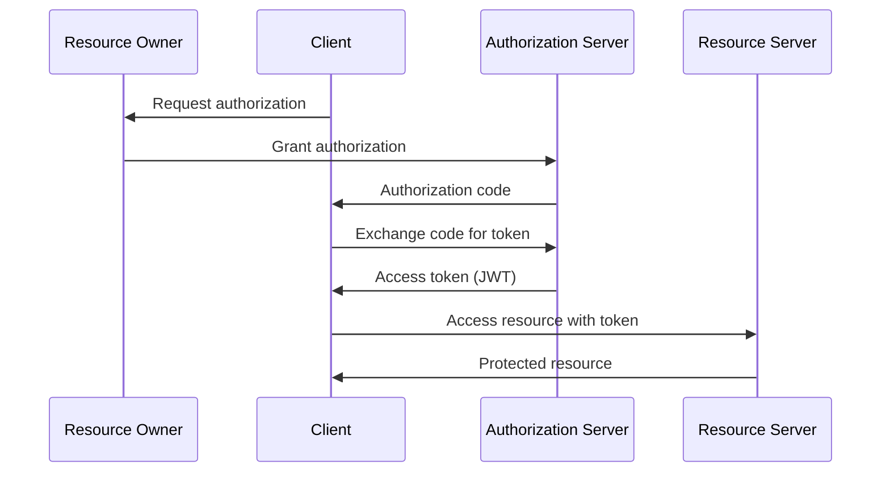

# Overview

OAuth (Open Authorization) is a protocol for secure delegated access, allowing third-party applications to access resources without sharing credentials. JWT (JSON Web Tokens) is a compact, URL-safe token format for securely transmitting information as JSON objects, commonly used for authentication and authorization.

# Detailed Explanation

## OAuth 2.0

OAuth 2.0 defines four roles: Resource Owner, Client, Authorization Server, Resource Server. It supports multiple grant types like Authorization Code, Implicit, Resource Owner Password Credentials, Client Credentials.

### Authorization Code Flow

1. Client requests authorization from Resource Owner.
2. Resource Owner grants authorization, Authorization Server issues code.
3. Client exchanges code for access token.
4. Client uses token to access resources.

## JWT

JWT consists of three parts: Header, Payload, Signature. Encoded as base64url.

- **Header**: Algorithm and token type.
- **Payload**: Claims (user info, expiration).
- **Signature**: Ensures integrity.

## Architecture Diagram



# Real-world Examples & Use Cases

- **Social Login**: "Login with Google/Facebook" using OAuth.
- **API Authentication**: Microservices using JWT for stateless auth.
- **Single Sign-On (SSO)**: Enterprise applications.
- **Mobile Apps**: Secure API access without storing credentials.

# Code Examples

## JWT Generation (Node.js)

```javascript
const jwt = require('jsonwebtoken');

const payload = { userId: 123, role: 'admin' };
const secret = 'your-secret-key';
const token = jwt.sign(payload, secret, { expiresIn: '1h' });

console.log(token);
```

## JWT Verification

```javascript
const decoded = jwt.verify(token, secret);
console.log(decoded);
```

## OAuth Client Example (Python with requests-oauthlib)

```python
from requests_oauthlib import OAuth2Session

client_id = 'your-client-id'
client_secret = 'your-client-secret'
authorization_base_url = 'https://provider.com/oauth/authorize'
token_url = 'https://provider.com/oauth/token'

oauth = OAuth2Session(client_id, redirect_uri='http://localhost/callback')
authorization_url, state = oauth.authorization_url(authorization_base_url)

# Redirect user to authorization_url
# After callback, fetch token
token = oauth.fetch_token(token_url, client_secret=client_secret, authorization_response=request.url)
```

# Journey / Sequence

### OAuth Flow
1. Client initiates authorization request.
2. User authenticates and consents.
3. Authorization server issues code.
4. Client exchanges code for tokens.
5. Tokens used for API access.

### JWT Usage
1. User logs in, server generates JWT.
2. JWT sent in Authorization header.
3. Server verifies JWT on each request.
4. Access granted if valid.

# Common Pitfalls & Edge Cases

- **Token Expiration**: Handle refresh tokens.
- **Security**: Store secrets securely, use HTTPS.
- **Scope Creep**: Limit token scopes.
- **JWT Size**: Keep payloads small.
- **Revocation**: JWTs are stateless, hard to revoke immediately.

# Tools & Libraries

- **OAuth**: OAuth2 Proxy, Keycloak
- **JWT**: jsonwebtoken (Node), PyJWT (Python), JJWT (Java)
- **Frameworks**: Spring Security OAuth, Passport.js

# References

- [OAuth 2.0 Specification](https://tools.ietf.org/html/rfc6749)
- [JWT RFC 7519](https://tools.ietf.org/html/rfc7519)
- [OAuth Security Best Practices](https://tools.ietf.org/html/rfc6819)

# Github-README Links & Related Topics

- [API Security Best Practices](api-security-best-practices/README.md)
- [User Authentication](user-authentication/README.md)
- [OAuth 2.0 Implementation](oauth-2-0-implementation/README.md)
- [Microservices Security](microservices-security/README.md)