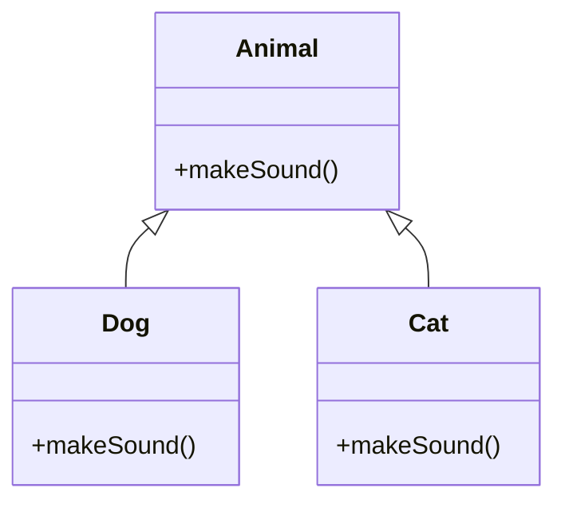

## Overview

Object-Oriented Programming (OOP) is a paradigm centered on objects that encapsulate data and behavior. In Java, OOP is fundamental, with principles like encapsulation, inheritance, polymorphism, and abstraction forming the core. SOLID principles (Single Responsibility, Open-Closed, Liskov Substitution, Interface Segregation, Dependency Inversion) guide design for maintainable, scalable code. For interviews, understanding these is key for designing classes, interfaces, and systems that adhere to best practices, avoiding common pitfalls in large codebases.

## STAR Summary

**Situation:** In a legacy codebase, classes were bloated with multiple responsibilities, leading to frequent bugs.

**Task:** Refactor to follow SOLID principles for better maintainability.

**Action:** Applied Single Responsibility by splitting classes, used interfaces for abstraction, and injected dependencies.

**Result:** Reduced bug rate by 30%, improved testability, and eased future extensions.

## Detailed Explanation

### Core OOP Concepts

- **Encapsulation:** Hiding internal state and requiring interaction through methods. Use private fields and public getters/setters.

- **Inheritance:** Creating subclasses that inherit properties from superclasses. Enables code reuse but can lead to tight coupling.

- **Polymorphism:** Ability of objects to take many forms. Method overriding (runtime) and overloading (compile-time).

- **Abstraction:** Focusing on essential features, hiding complexities. Achieved via abstract classes and interfaces.

### SOLID Principles

- **S - Single Responsibility:** A class should have one reason to change.

- **O - Open-Closed:** Open for extension, closed for modification.

- **L - Liskov Substitution:** Subtypes must be substitutable for their base types.

- **I - Interface Segregation:** Clients should not be forced to depend on interfaces they don't use.

- **D - Dependency Inversion:** Depend on abstractions, not concretions.

## Real-world Examples & Use Cases

- Designing user management systems with User, Admin classes inheriting from Person.
- Payment processing with interfaces for different providers (Stripe, PayPal).
- GUI frameworks where components extend base classes.

## Code Examples

### Encapsulation Example

```java
public class BankAccount {
    private double balance;
    public void deposit(double amount) { balance += amount; }
    public double getBalance() { return balance; }
}
```

### Inheritance and Polymorphism

```java
abstract class Animal {
    abstract void makeSound();
}
class Dog extends Animal {
    void makeSound() { System.out.println("Woof"); }
}
class Cat extends Animal {
    void makeSound() { System.out.println("Meow"); }
}
// Usage: Animal a = new Dog(); a.makeSound();
```

### SOLID: Single Responsibility

```java
class User {
    private String name;
    // getters/setters
}
class UserRepository {
    void save(User user) { /* DB logic */ }
}
```

For Maven: Same as before.

## Data Models / Message Formats

Class diagrams as tables:

| Class | Fields | Methods |
|-------|--------|---------|
| User | name, email | getName(), setEmail() |

## Journey / Sequence



## Common Pitfalls & Edge Cases

- Deep inheritance hierarchies causing fragility.
- Violating Liskov: Subclass not fully substitutable.
- Overusing inheritance instead of composition.
- Tight coupling in inheritance.

## Tools & Libraries

- UML tools for class diagrams.
- Design pattern libraries like Apache Commons.

## Github-README Links & Related Topics

[[java-language-basics]], [[design-patterns]], [[system-design-basics]], [[api-design-rest-grpc-openapi]]

## References

- https://en.wikipedia.org/wiki/SOLID
- https://docs.oracle.com/javase/tutorial/java/concepts/index.html