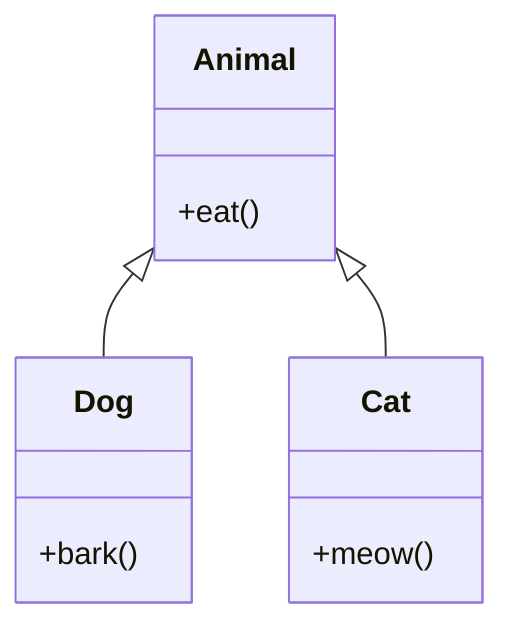

## Overview

Object-Oriented Programming (OOP) principles in Java form the foundation of designing and implementing robust, maintainable, and scalable software. The four main principles are Encapsulation, Inheritance, Polymorphism, and Abstraction. These principles help in organizing code, promoting reusability, and managing complexity.

## Detailed Explanation

## Encapsulation

Encapsulation is the bundling of data and methods that operate on that data within a single unit, typically a class. It restricts direct access to some of an object's components, which can prevent the accidental modification of data.

Key concepts:
- Private fields
- Public getter and setter methods
- Data hiding

## Inheritance

Inheritance allows a class (subclass) to inherit properties and behaviors from another class (superclass). This promotes code reusability and establishes a relationship between classes.

Types of inheritance in Java:
- Single inheritance
- Multilevel inheritance
- Hierarchical inheritance
- Multiple inheritance (through interfaces)

## Polymorphism

Polymorphism allows objects of different classes to be treated as objects of a common superclass. It enables one interface to be used for a general class of actions.

Types:
- Compile-time polymorphism (method overloading)
- Runtime polymorphism (method overriding)

## Abstraction

Abstraction focuses on showing only the necessary information to the outside world while hiding the internal details. It helps in reducing complexity and increasing efficiency.

Achieved through:
- Abstract classes
- Interfaces

### OOP Principles Diagram



## Real-world Examples & Use Cases

1. **Banking System**: Using encapsulation to protect account balances, inheritance for different account types (savings, checking), polymorphism for interest calculations.
2. **Vehicle Management**: Abstraction for a generic Vehicle class, inheritance for Car, Truck, etc., polymorphism for fuel efficiency calculations.
3. **Employee Management System**: Encapsulation for employee data, inheritance for different employee types (manager, developer), abstraction for common behaviors.

## Code Examples

### Encapsulation Example
```java
public class BankAccount {
    private double balance;
    
    public BankAccount(double initialBalance) {
        this.balance = initialBalance;
    }
    
    public void deposit(double amount) {
        if (amount > 0) {
            balance += amount;
        }
    }
    
    public void withdraw(double amount) {
        if (amount > 0 && amount <= balance) {
            balance -= amount;
        }
    }
    
    public double getBalance() {
        return balance;
    }
}
```

### Inheritance Example
```java
public class Animal {
    public void eat() {
        System.out.println("Animal is eating");
    }
}

public class Dog extends Animal {
    public void bark() {
        System.out.println("Dog is barking");
    }
}

public class Cat extends Animal {
    public void meow() {
        System.out.println("Cat is meowing");
    }
}
```

### Polymorphism Example
```java
public class Shape {
    public void draw() {
        System.out.println("Drawing a shape");
    }
}

public class Circle extends Shape {
    @Override
    public void draw() {
        System.out.println("Drawing a circle");
    }
}

public class Rectangle extends Shape {
    @Override
    public void draw() {
        System.out.println("Drawing a rectangle");
    }
}

// Usage
public class Main {
    public static void main(String[] args) {
        Shape shape1 = new Circle();
        Shape shape2 = new Rectangle();
        
        shape1.draw(); // Output: Drawing a circle
        shape2.draw(); // Output: Drawing a rectangle
    }
}
```

### Abstraction Example
```java
public abstract class Vehicle {
    protected String brand;
    
    public Vehicle(String brand) {
        this.brand = brand;
    }
    
    public abstract void start();
    public abstract void stop();
    
    public void honk() {
        System.out.println("Honk honk!");
    }
}

public class Car extends Vehicle {
    public Car(String brand) {
        super(brand);
    }
    
    @Override
    public void start() {
        System.out.println(brand + " car is starting");
    }
    
    @Override
    public void stop() {
        System.out.println(brand + " car is stopping");
    }
}
```

## References

- [Oracle Java Tutorials: Object-Oriented Programming Concepts](https://docs.oracle.com/javase/tutorial/java/concepts/index.html)
- [Encapsulation in Java](https://docs.oracle.com/javase/tutorial/java/javaOO/accesscontrol.html)
- [Inheritance in Java](https://docs.oracle.com/javase/tutorial/java/IandI/subclasses.html)
- [Polymorphism in Java](https://docs.oracle.com/javase/tutorial/java/IandI/polymorphism.html)
- [Abstraction in Java](https://docs.oracle.com/javase/tutorial/java/IandI/abstract.html)

## Github-README Links & Related Topics

- [Java Fundamentals](./java-fundamentals/README.md)
- [Java Design Patterns](./java-design-patterns/README.md)
- [Java Collections](./java-collections/README.md)
- [JVM Internals & Class Loading](./jvm-internals-and-class-loading/README.md)
