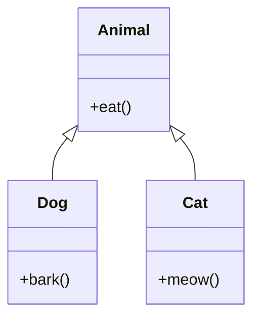

# Overview

Object-Oriented Programming (OOP) principles in Java form the cornerstone of designing modular, maintainable, and scalable software. The four main principles are Encapsulation, Inheritance, Polymorphism, and Abstraction, which help in modeling real-world entities and relationships in code.

## Detailed Explanation

| Principle | Description | Java Keywords/Features |
|-----------|-------------|-------------------------|
| Encapsulation | Bundling data and methods, restricting access | `private`, `public`, `protected`, getters/setters |
| Inheritance | Acquiring properties from parent class | `extends`, `super` |
| Polymorphism | Many forms - method overriding/overloading | `@Override`, method signatures |
| Abstraction | Hiding complexity, showing essentials | `abstract`, `interface`, `implements` |

### Encapsulation

Encapsulation is the bundling of data and methods that operate on that data within a single unit (class). It restricts direct access to some of an object's components, which is a means of preventing accidental interference and misuse.

```java
class BankAccount {
    private double balance;
    
    public void deposit(double amount) {
        if (amount > 0) {
            balance += amount;
        }
    }
    
    public double getBalance() {
        return balance;
    }
}
```

### Inheritance

Inheritance allows a class to inherit properties and methods from another class. It promotes code reusability and establishes a relationship between parent and child classes.

```java
class Animal {
    void eat() {
        System.out.println("Eating");
    }
}

class Dog extends Animal {
    void bark() {
        System.out.println("Barking");
    }
}
```

## Inheritance Hierarchy



### Polymorphism

Polymorphism allows objects of different classes to be treated as objects of a common superclass. It can be achieved through method overriding (runtime polymorphism) and method overloading (compile-time polymorphism).

```java
class Shape {
    void draw() {
        System.out.println("Drawing a shape");
    }
}

class Circle extends Shape {
    @Override
    void draw() {
        System.out.println("Drawing a circle");
    }
}

class Square extends Shape {
    @Override
    void draw() {
        System.out.println("Drawing a square");
    }
}
```

### Abstraction

Abstraction is the process of hiding complex implementation details and showing only the essential features of an object. It can be achieved through abstract classes and interfaces.

```java
abstract class Vehicle {
    abstract void start();
    
    void stop() {
        System.out.println("Vehicle stopped");
    }
}

class Car extends Vehicle {
    @Override
    void start() {
        System.out.println("Car started");
    }
}
```

## Real-world Examples & Use Cases

- **Banking System**: Account classes with encapsulation for security
- **E-commerce Platform**: Product hierarchy using inheritance
- **GUI Frameworks**: Shape classes demonstrating polymorphism
- **Payment Processing**: Abstract payment methods

## Code Examples

### Complete OOP Example: Library Management System

```java
// Abstraction
abstract class LibraryItem {
    protected String title;
    protected String author;
    
    LibraryItem(String title, String author) {
        this.title = title;
        this.author = author;
    }
    
    abstract void displayInfo();
}

// Inheritance and Polymorphism
class Book extends LibraryItem {
    private int pages;
    
    Book(String title, String author, int pages) {
        super(title, author);
        this.pages = pages;
    }
    
    @Override
    void displayInfo() {
        System.out.println("Book: " + title + " by " + author + ", " + pages + " pages");
    }
}

class Magazine extends LibraryItem {
    private String issue;
    
    Magazine(String title, String author, String issue) {
        super(title, author);
        this.issue = issue;
    }
    
    @Override
    void displayInfo() {
        System.out.println("Magazine: " + title + " by " + author + ", Issue: " + issue);
    }
}

// Encapsulation
class Library {
    private List<LibraryItem> items = new ArrayList<>();
    
    public void addItem(LibraryItem item) {
        items.add(item);
    }
    
    public void displayAllItems() {
        for (LibraryItem item : items) {
            item.displayInfo();
        }
    }
}

public class LibraryDemo {
    public static void main(String[] args) {
        Library library = new Library();
        
        Book book = new Book("Java Programming", "John Doe", 500);
        Magazine magazine = new Magazine("Tech Monthly", "Jane Smith", "September 2023");
        
        library.addItem(book);
        library.addItem(magazine);
        
        library.displayAllItems();
    }
}
```

# Journey / Sequence

1. **Analysis**: Identify real-world entities and relationships.
2. **Design**: Create class diagrams, define hierarchies.
3. **Implementation**: Write classes with encapsulation, inheritance, polymorphism, abstraction.
4. **Testing**: Verify behavior through unit tests.
5. **Refactoring**: Improve design using OOP principles.

# Common Pitfalls & Edge Cases

- **Tight Coupling**: Excessive inheritance leading to fragile code.
- **God Object**: Classes doing too much, violating single responsibility.
- **Inheritance vs Composition**: Choosing wrong relationship type.
- **Over-Abstraction**: Making interfaces too generic or abstract.
- **Method Overloading Confusion**: Similar methods with different behaviors.

# Tools & Libraries

- **IDE Support**: IntelliJ IDEA, Eclipse for OOP refactoring.
- **UML Tools**: PlantUML, draw.io for class diagrams.
- **Design Patterns Libraries**: Commons Lang for utility classes.
- **Testing**: JUnit for testing OOP implementations.

# References

- [Oracle Java Tutorials - Object-Oriented Programming Concepts](https://docs.oracle.com/javase/tutorial/java/concepts/index.html)
- [GeeksforGeeks OOP Concepts](https://www.geeksforgeeks.org/object-oriented-programming-oops-concept-in-java/)
- [Baeldung OOP in Java](https://www.baeldung.com/java-oop)

# Github-README Links & Related Topics

- [Java Fundamentals](../java-fundamentals/README.md)
- [Design Patterns in Java](../design-patterns-in-java/README.md)
- [Java Collections Deep Dive](../java-collections-deep-dive/README.md)
