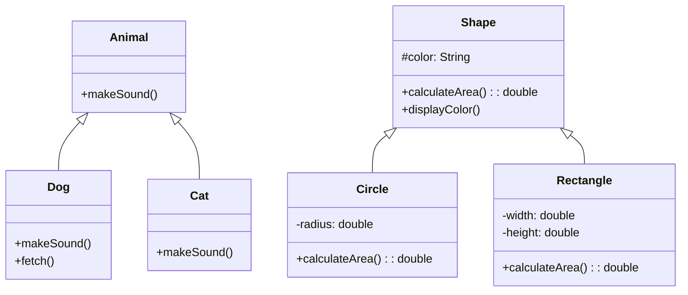

# OOP Principles in Java

## Overview

Object-Oriented Programming (OOP) principles are the foundational concepts of Java that enable developers to create modular, reusable, and maintainable code. The four main principles are Encapsulation, Inheritance, Polymorphism, and Abstraction.

## Detailed Explanation

### Encapsulation

Encapsulation is the mechanism of wrapping data (variables) and code (methods) together as a single unit. It restricts direct access to some of an object's components, which is a means of preventing accidental interference and misuse of the data.

**Key Benefits:**
- Data hiding
- Increased security
- Code maintainability

**Implementation:**
- Use private access modifiers for fields
- Provide public getter and setter methods

### Inheritance

Inheritance allows a class to inherit properties and methods from another class. The class that inherits is called the subclass (child class), and the class being inherited from is called the superclass (parent class).

**Key Benefits:**
- Code reusability
- Method overriding
- Hierarchical classification

**Implementation:**
- Use the `extends` keyword
- Subclasses can override parent methods

### Polymorphism

Polymorphism allows objects of different classes to be treated as objects of a common superclass. It enables one interface to be used for a general class of actions.

**Types:**
- Compile-time polymorphism (Method Overloading)
- Runtime polymorphism (Method Overriding)

**Key Benefits:**
- Flexibility
- Extensibility
- Interface implementation

### Abstraction

Abstraction is the concept of hiding the complex implementation details and showing only the essential features of the object.

**Implementation:**
- Abstract classes (cannot be instantiated)
- Interfaces (contracts for classes)

**Key Benefits:**
- Simplifies complex systems
- Reduces complexity
- Improves maintainability

## Real-world Examples & Use Cases

- **Banking System:** Account classes with different types (Savings, Checking) inheriting from a base Account class.
- **Vehicle Management:** A Vehicle superclass with Car, Truck, Motorcycle subclasses demonstrating inheritance and polymorphism.
- **Employee Management:** Abstract Employee class with concrete implementations for different roles.

## Code Examples

### Encapsulation Example

```java
public class BankAccount {
    private double balance;
    
    public BankAccount(double initialBalance) {
        this.balance = initialBalance;
    }
    
    public double getBalance() {
        return balance;
    }
    
    public void deposit(double amount) {
        if (amount > 0) {
            balance += amount;
        }
    }
    
    public void withdraw(double amount) {
        if (amount > 0 && amount <= balance) {
            balance -= amount;
        }
    }
}
```

### Inheritance and Polymorphism Example

```java
// Superclass
public class Animal {
    public void makeSound() {
        System.out.println("Animal makes a sound");
    }
}

// Subclass
public class Dog extends Animal {
    @Override
    public void makeSound() {
        System.out.println("Dog barks");
    }
    
    public void fetch() {
        System.out.println("Dog fetches the ball");
    }
}

// Subclass
public class Cat extends Animal {
    @Override
    public void makeSound() {
        System.out.println("Cat meows");
    }
}

// Usage
public class Main {
    public static void main(String[] args) {
        Animal myDog = new Dog();
        Animal myCat = new Cat();
        
        myDog.makeSound(); // Output: Dog barks
        myCat.makeSound(); // Output: Cat meows
        
        // Polymorphism - same method call, different behavior
        Animal[] animals = {new Dog(), new Cat()};
        for (Animal animal : animals) {
            animal.makeSound();
        }
    }
}
```

### Abstraction Example

```java
// Abstract class
public abstract class Shape {
    protected String color;
    
    public Shape(String color) {
        this.color = color;
    }
    
    public abstract double calculateArea();
    
    public void displayColor() {
        System.out.println("Color: " + color);
    }
}

// Concrete implementation
public class Circle extends Shape {
    private double radius;
    
    public Circle(String color, double radius) {
        super(color);
        this.radius = radius;
    }
    
    @Override
    public double calculateArea() {
        return Math.PI * radius * radius;
    }
}

// Concrete implementation
public class Rectangle extends Shape {
    private double width;
    private double height;
    
    public Rectangle(String color, double width, double height) {
        super(color);
        this.width = width;
        this.height = height;
    }
    
    @Override
    public double calculateArea() {
        return width * height;
    }
}

// Usage
public class Main {
    public static void main(String[] args) {
        Shape circle = new Circle("Red", 5.0);
        Shape rectangle = new Rectangle("Blue", 4.0, 6.0);
        
        System.out.println("Circle area: " + circle.calculateArea());
        System.out.println("Rectangle area: " + rectangle.calculateArea());
        
        circle.displayColor();
        rectangle.displayColor();
    }
}
```

## Data Models / Message Formats

### Class Hierarchy Diagram



## References

- [Oracle Java Tutorials - Object-Oriented Programming Concepts](https://docs.oracle.com/javase/tutorial/java/concepts/index.html)
- [Encapsulation in Java](https://www.geeksforgeeks.org/encapsulation-in-java/)
- [Inheritance in Java](https://www.geeksforgeeks.org/inheritance-in-java/)
- [Polymorphism in Java](https://www.geeksforgeeks.org/polymorphism-in-java/)
- [Abstraction in Java](https://www.geeksforgeeks.org/abstraction-in-java/)

## Github-README Links & Related Topics

- [Java Fundamentals](./java-fundamentals)
- [JVM Internals & Class Loading](./jvm-internals-and-class-loading)
- [Design Patterns in Java](../java/design-patterns)
