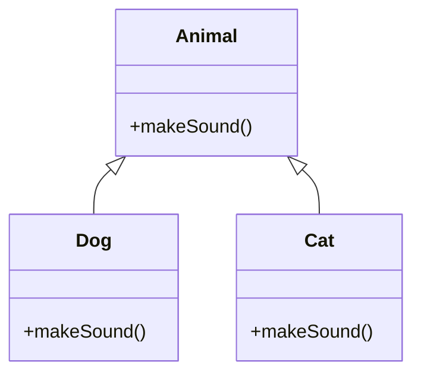

# OOP Principles in Java

## Overview

Object-Oriented Programming (OOP) is a paradigm that organizes code around objects, which are instances of classes. Java is fundamentally object-oriented, supporting four main principles: Encapsulation, Inheritance, Polymorphism, and Abstraction. These principles promote code reusability, modularity, and maintainability.

## Detailed Explanation

### Encapsulation

- Bundles data and methods into a single unit (class).
- Uses access modifiers (private, protected, public) to control access.
- Provides getters/setters for controlled access.

### Inheritance

- Allows a class to inherit properties and methods from another class.
- Promotes code reuse and hierarchical relationships.
- Uses 'extends' keyword.

### Polymorphism

- Ability of objects to take many forms.
- Method overloading (same name, different parameters) and overriding (subclass redefines superclass method).
- Runtime polymorphism via dynamic method dispatch.

### Abstraction

- Hides implementation details, showing only essential features.
- Achieved through abstract classes and interfaces.
- Interfaces define contracts; abstract classes provide partial implementation.



## Real-world Examples & Use Cases

- **Banking System**: Account classes with inheritance for different account types.
- **Game Development**: Characters with polymorphism for different behaviors.
- **E-commerce**: Product catalog with abstraction for various product types.
- **GUI Frameworks**: Components inheriting from base classes.

## Code Examples

### Encapsulation

```java
public class Person {
    private String name;
    private int age;
    public String getName() {
        return name;
    }
    public void setName(String name) {
        this.name = name;
    }
    public int getAge() {
        return age;
    }
    public void setAge(int age) {
        this.age = age;
    }
}
```

### Inheritance

```java
public class Animal {
    public void eat() {
        System.out.println("Eating");
    }
}
public class Dog extends Animal {
    public void bark() {
        System.out.println("Barking");
    }
}
public class Main {
    public static void main(String[] args) {
        Dog dog = new Dog();
        dog.eat();
        dog.bark();
    }
}
```

### Polymorphism

```java
public class Animal {
    public void makeSound() {
        System.out.println("Some sound");
    }
}
public class Dog extends Animal {
    @Override
    public void makeSound() {
        System.out.println("Woof");
    }
}
public class Cat extends Animal {
    @Override
    public void makeSound() {
        System.out.println("Meow");
    }
}
public class Main {
    public static void main(String[] args) {
        Animal animal1 = new Dog();
        Animal animal2 = new Cat();
        animal1.makeSound(); // Woof
        animal2.makeSound(); // Meow
    }
}
```

### Abstraction

```java
abstract class Shape {
    abstract double area();
}
class Circle extends Shape {
    private double radius;
    public Circle(double radius) {
        this.radius = radius;
    }
    @Override
    double area() {
        return Math.PI * radius * radius;
    }
}
public class Main {
    public static void main(String[] args) {
        Shape shape = new Circle(5);
        System.out.println("Area: " + shape.area());
    }
}
```

## References

- [Oracle OOP in Java](https://docs.oracle.com/javase/tutorial/java/concepts/)
- [GeeksforGeeks OOP](https://www.geeksforgeeks.org/object-oriented-programming-oops-concept-in-java/)
- [Tutorialspoint OOP](https://www.tutorialspoint.com/java/java_object_oriented.htm)

## Github-README Links & Related Topics

- [java-fundamentals](../java-fundamentals/)
- [inheritance-in-java](../inheritance-in-java/)
- [polymorphism-in-java](../polymorphism-in-java/)
- [encapsulation-in-java](../encapsulation-in-java/)
- [abstraction-in-java](../abstraction-in-java/)
