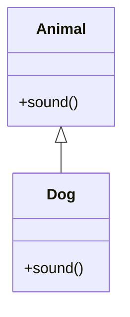

# OOP Principles in Java

## Overview

Object-Oriented Programming (OOP) principles in Java include encapsulation, inheritance, polymorphism, and abstraction, forming the foundation for modular and reusable code.

## Detailed Explanation

## Encapsulation

Hiding internal state and requiring all interaction to be performed through an object's methods.

## Inheritance

Creating new classes based on existing ones, inheriting properties and behaviors.

## Polymorphism

Ability of objects to take on many forms, through method overriding and overloading.

## Abstraction

Focusing on essential qualities rather than specific characteristics.



## Real-world Examples & Use Cases

- Designing software systems like banking applications where accounts can be savings or checking (inheritance and polymorphism).
- GUI frameworks where components share common behaviors.

## Code Examples

```java
class Animal {
    void sound() {
        System.out.println("Animal sound");
    }
}

class Dog extends Animal {
    @Override
    void sound() {
        System.out.println("Bark");
    }
}

public class Main {
    public static void main(String[] args) {
        Animal a = new Dog();
        a.sound(); // Polymorphism
    }
}
```

## References

- [Oracle OOP Tutorial](https://docs.oracle.com/javase/tutorial/java/concepts/)

## Github-README Links & Related Topics

- [Java Fundamentals](../java-fundamentals/README.md)
- [Design Patterns in Java](../design-patterns-in-java/README.md)