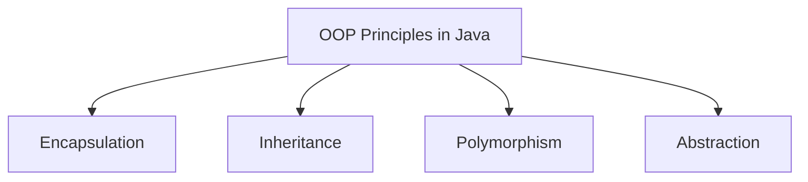

## Overview

Object-Oriented Programming (OOP) in Java is built around four fundamental principles: Encapsulation, Inheritance, Polymorphism, and Abstraction. These principles guide the design of classes and objects, enabling developers to create robust, modular, and maintainable software systems.



## Detailed Explanation

| Principle | Description | Key Benefit |
|-----------|-------------|-------------|
| Encapsulation | Bundling data and methods within a class, restricting access to internal state | Data protection and reduced coupling |
| Inheritance | Allowing classes to inherit properties and behaviors from parent classes | Code reusability and hierarchical relationships |
| Polymorphism | Enabling objects to take multiple forms through method overriding and overloading | Flexibility and extensibility |
| Abstraction | Hiding complex implementation details while exposing essential features | Simplified interfaces and reduced complexity |

### Encapsulation

Encapsulation combines data (fields) and the methods that manipulate that data into a single unit (class). Access to the data is controlled through public methods, preventing unauthorized modifications.

### Inheritance

Inheritance establishes an "is-a" relationship between classes, where a subclass inherits attributes and methods from a superclass. This promotes code reuse but should be used judiciously to avoid tight coupling.

### Polymorphism

Polymorphism allows methods to behave differently based on the object calling them. In Java, this is achieved through method overriding (runtime) and method overloading (compile-time), enabling dynamic behavior.

### Abstraction

Abstraction focuses on what an object does rather than how it does it. Abstract classes and interfaces define contracts that concrete classes must fulfill, separating interface from implementation.

## Real-world Examples & Use Cases

### Encapsulation
- **Banking System**: Account balances are encapsulated within the `Account` class, accessible only through deposit and withdrawal methods to ensure data integrity.
- **Car Dashboard**: Internal engine parameters are hidden; users interact via public controls like accelerate and brake.

### Inheritance
- **Employee Management**: A `Manager` class inherits from `Employee`, gaining base attributes like salary while adding management-specific features.
- **GUI Components**: `Button` extends `Component`, inheriting positioning and rendering logic.

### Polymorphism
- **Payment Gateway**: Different payment types (CreditCard, PayPal) implement the same `processPayment()` method with varying logic.
- **Media Players**: `play()` method works for Audio, Video, and Streaming objects with different implementations.

### Abstraction
- **Database Layer**: An abstract `DatabaseConnection` class defines `connect()` and `query()`, with concrete implementations for MySQL, PostgreSQL, etc.
- **Notification Service**: Abstract `Notifier` interface with `send()` method, implemented by EmailNotifier, SMSNotifier, etc.

## Code Examples

### Encapsulation Example

```java
public class BankAccount {
    private double balance;

    public BankAccount(double initialBalance) {
        this.balance = initialBalance;
    }

    public void deposit(double amount) {
        if (amount > 0) {
            balance += amount;
        }
    }

    public double getBalance() {
        return balance;
    }

    // Withdraw method with validation
    public boolean withdraw(double amount) {
        if (amount > 0 && amount <= balance) {
            balance -= amount;
            return true;
        }
        return false;
    }
}
```

### Inheritance Example

```java
public class Vehicle {
    protected String brand;
    protected int speed;

    public Vehicle(String brand) {
        this.brand = brand;
        this.speed = 0;
    }

    public void accelerate(int increment) {
        speed += increment;
    }

    public void displayInfo() {
        System.out.println("Brand: " + brand + ", Speed: " + speed);
    }
}

public class Car extends Vehicle {
    private int doors;

    public Car(String brand, int doors) {
        super(brand);
        this.doors = doors;
    }

    @Override
    public void displayInfo() {
        super.displayInfo();
        System.out.println("Doors: " + doors);
    }
}
```

### Polymorphism Example

```java
public abstract class Animal {
    public abstract void makeSound();
}

public class Dog extends Animal {
    @Override
    public void makeSound() {
        System.out.println("Woof!");
    }
}

public class Cat extends Animal {
    @Override
    public void makeSound() {
        System.out.println("Meow!");
    }
}

// Usage
public class AnimalDemo {
    public static void main(String[] args) {
        Animal[] animals = {new Dog(), new Cat()};
        for (Animal animal : animals) {
            animal.makeSound(); // Polymorphic call
        }
    }
}
```

### Abstraction Example

```java
public interface Shape {
    double calculateArea();
    double calculatePerimeter();
}

public class Circle implements Shape {
    private double radius;

    public Circle(double radius) {
        this.radius = radius;
    }

    @Override
    public double calculateArea() {
        return Math.PI * radius * radius;
    }

    @Override
    public double calculatePerimeter() {
        return 2 * Math.PI * radius;
    }
}

public class Rectangle implements Shape {
    private double width, height;

    public Rectangle(double width, double height) {
        this.width = width;
        this.height = height;
    }

    @Override
    public double calculateArea() {
        return width * height;
    }

    @Override
    public double calculatePerimeter() {
        return 2 * (width + height);
    }
}
```

## Common Pitfalls & Edge Cases

- **Inheritance Overuse**: Deep inheritance chains can lead to the "fragile base class" problem. Consider composition as an alternative.
- **Polymorphism Confusion**: Method overloading vs. overriding can cause unexpected behavior if not carefully managed.
- **Abstraction Leaks**: Exposing implementation details through public methods breaks abstraction.
- **Encapsulation Violations**: Using reflection to access private fields bypasses encapsulation safeguards.
- **Multiple Inheritance Limitation**: Java doesn't support multiple inheritance for classes, leading to complex interface hierarchies.

## References

- [Oracle Java Tutorials: Object-Oriented Programming Concepts](https://docs.oracle.com/javase/tutorial/java/concepts/)
- [GeeksforGeeks: OOPs Concepts in Java](https://www.geeksforgeeks.org/object-oriented-programming-oops-concept-in-java/)
- [Baeldung: Object-Oriented Programming in Java](https://www.baeldung.com/java-oop)
- [JavaPoint: OOPs Concepts](https://www.javatpoint.com/java-oops-concepts)

## Github-README Links & Related Topics

- [Encapsulation in Java](./encapsulation-in-java/README.md)
- [Inheritance in Java](./inheritance-in-java/README.md)
- [Polymorphism in Java](./polymorphism-in-java/README.md)
- [Abstraction in Java](./abstraction-in-java/README.md)
- [Design Patterns in Java](./java-design-patterns/README.md)
- [Java OOP Design and Principles](./java/oop-design-and-principles/README.md)