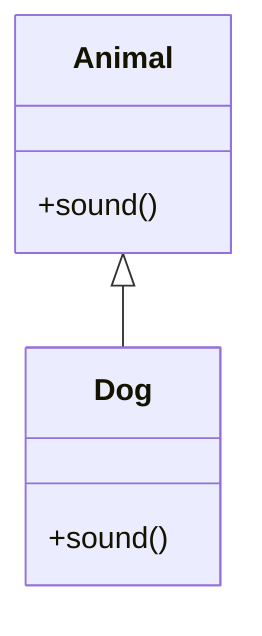

# OOP Principles in Java

## Overview

Object-Oriented Programming (OOP) principles in Java include encapsulation, inheritance, polymorphism, and abstraction, forming the foundation for modular and reusable code.

## Detailed Explanation

OOP principles help in organizing code into reusable and maintainable components.

| Principle     | Description                                                                 | Benefits                          |
|---------------|-----------------------------------------------------------------------------|-----------------------------------|
| Encapsulation | Bundling data and methods that operate on that data within a single unit (class), restricting access to internal state. | Data hiding, modularity, security |
| Inheritance   | Mechanism where one class acquires the properties and behaviors of another class. | Code reusability, hierarchy       |
| Polymorphism  | Ability to present the same interface for different underlying forms (data types). | Flexibility, extensibility        |
| Abstraction   | Hiding complex implementation details and showing only essential features. | Simplification, focus on essentials |

### Encapsulation

Encapsulation is the bundling of data (fields) and methods (functions) that operate on that data into a single unit called a class. It restricts direct access to some of an object's components, which is a means of preventing accidental interference and misuse of the data.

Key concepts:
- **Access Modifiers**: `private`, `protected`, `public`, `default` to control visibility.
- **Getters and Setters**: Methods to access and modify private fields safely.
- **Data Hiding**: Internal representation is hidden from outside classes.

Example: A `BankAccount` class encapsulates balance and provides methods like `deposit()` and `withdraw()`.

### Inheritance

Inheritance allows a class (subclass or derived class) to inherit properties and methods from another class (superclass or base class). This promotes code reusability and establishes a relationship between classes.

Types of inheritance in Java:
- **Single Inheritance**: One class extends another.
- **Multilevel Inheritance**: A class extends a class that extends another.
- **Hierarchical Inheritance**: Multiple classes extend the same base class.
- **Multiple Inheritance**: Not directly supported in Java for classes, but through interfaces.

Key features:
- `extends` keyword for classes.
- `super` keyword to access superclass members.
- Method overriding to provide specific implementation in subclass.

### Polymorphism

Polymorphism allows objects of different classes to be treated as objects of a common superclass. It enables one interface to be used for a general class of actions.

Types:
- **Compile-time Polymorphism (Static)**: Method overloading - same method name with different parameters.
- **Runtime Polymorphism (Dynamic)**: Method overriding - subclass provides specific implementation of a method declared in superclass.

Benefits: Increases code readability and reusability.

### Abstraction

Abstraction is the concept of hiding the complex implementation details and showing only the essential features of the object. It helps in reducing programming complexity and effort.

Ways to achieve abstraction in Java:
- **Abstract Classes**: Cannot be instantiated, can have abstract methods (without body) and concrete methods.
- **Interfaces**: Blueprint of a class, can have abstract methods, default methods, static methods.

Example: `Shape` abstract class with `draw()` method implemented differently by `Circle` and `Rectangle`.



## Real-world Examples & Use Cases

- Designing software systems like banking applications where accounts can be savings or checking (inheritance and polymorphism).
- GUI frameworks where components share common behaviors.

## Code Examples

```java
// Encapsulation Example
class BankAccount {
    private double balance;

    public BankAccount(double initialBalance) {
        this.balance = initialBalance;
    }

    public void deposit(double amount) {
        if (amount > 0) {
            balance += amount;
        }
    }

    public double getBalance() {
        return balance;
    }
}

// Inheritance and Polymorphism Example
class Animal {
    void sound() {
        System.out.println("Animal sound");
    }
}

class Dog extends Animal {
    @Override
    void sound() {
        System.out.println("Bark");
    }
}

class Cat extends Animal {
    @Override
    void sound() {
        System.out.println("Meow");
    }
}

public class Main {
    public static void main(String[] args) {
        BankAccount account = new BankAccount(1000);
        account.deposit(500);
        System.out.println("Balance: " + account.getBalance()); // Encapsulation

        Animal a = new Dog();
        a.sound(); // Polymorphism

        Animal b = new Cat();
        b.sound(); // Polymorphism
    }
}
```

```java
// Abstraction Example
abstract class Shape {
    abstract void draw();
}

class Circle extends Shape {
    @Override
    void draw() {
        System.out.println("Drawing Circle");
    }
}

class Rectangle extends Shape {
    @Override
    void draw() {
        System.out.println("Drawing Rectangle");
    }
}
```

## References

- [Oracle OOP Tutorial](https://docs.oracle.com/javase/tutorial/java/concepts/)
- [GeeksforGeeks OOP Concepts](https://www.geeksforgeeks.org/object-oriented-programming-oops-concept-in-java/)
- [Head First Java](https://www.amazon.com/Head-First-Java-Kathy-Sierra/dp/0596009208)

## Github-README Links & Related Topics

- [Java Fundamentals](../java-fundamentals/README.md)
- [Design Patterns in Java](../design-patterns-in-java/README.md)