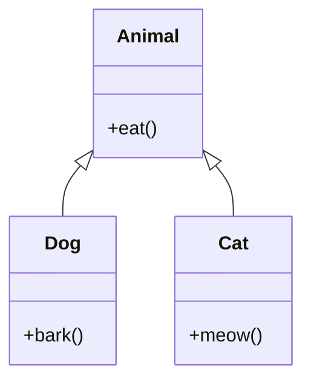

# OOP Principles in Java

## Overview

Object-Oriented Programming (OOP) principles in Java provide a structured approach to software development. The four main principles are Encapsulation, Inheritance, Polymorphism, and Abstraction. These principles help create modular, reusable, and maintainable code.

## Detailed Explanation

### Encapsulation

Encapsulation binds data and methods that operate on that data within a single unit (class). It restricts direct access to some components and protects the integrity of the data.

```java
public class BankAccount {
    private double balance;
    
    public void deposit(double amount) {
        if (amount > 0) {
            balance += amount;
        }
    }
    
    public double getBalance() {
        return balance;
    }
}
```

### Inheritance

Inheritance allows a class to inherit properties and methods from another class. It promotes code reusability and establishes a relationship between parent and child classes.

```java
public class Animal {
    public void eat() {
        System.out.println("Eating...");
    }
}

public class Dog extends Animal {
    public void bark() {
        System.out.println("Woof!");
    }
}
```

### Polymorphism

Polymorphism allows objects to be treated as instances of their parent class, enabling method overriding and overloading. It provides flexibility in method implementation.

**Method Overriding:**
```java
public class Shape {
    public double area() {
        return 0;
    }
}

public class Circle extends Shape {
    private double radius;
    
    public Circle(double radius) {
        this.radius = radius;
    }
    
    @Override
    public double area() {
        return Math.PI * radius * radius;
    }
}
```

**Method Overloading:**
```java
public class Calculator {
    public int add(int a, int b) {
        return a + b;
    }
    
    public double add(double a, double b) {
        return a + b;
    }
}
```

### Abstraction

Abstraction hides complex implementation details and shows only essential features. It can be achieved through abstract classes and interfaces.

```java
public abstract class Vehicle {
    public abstract void start();
    
    public void stop() {
        System.out.println("Vehicle stopped");
    }
}

public class Car extends Vehicle {
    @Override
    public void start() {
        System.out.println("Car started");
    }
}
```



## Real-world Examples & Use Cases

1. **Banking System**: Encapsulation for account security, inheritance for different account types.

2. **Game Development**: Polymorphism for different character behaviors, abstraction for game engines.

3. **E-commerce Platform**: Inheritance for product categories, encapsulation for user data protection.

4. **GUI Frameworks**: Abstraction for UI components, polymorphism for event handling.

5. **Database ORM**: Inheritance for entity relationships, encapsulation for data access.

## Code Examples

### Complete OOP Example: Library Management System

```java
// Abstraction
public abstract class LibraryItem {
    protected String title;
    protected String author;
    
    public LibraryItem(String title, String author) {
        this.title = title;
        this.author = author;
    }
    
    public abstract void displayInfo();
}

// Inheritance and Polymorphism
public class Book extends LibraryItem {
    private int pageCount;
    
    public Book(String title, String author, int pageCount) {
        super(title, author);
        this.pageCount = pageCount;
    }
    
    @Override
    public void displayInfo() {
        System.out.println("Book: " + title + " by " + author + ", " + pageCount + " pages");
    }
}

public class Magazine extends LibraryItem {
    private String issue;
    
    public Magazine(String title, String author, String issue) {
        super(title, author);
        this.issue = issue;
    }
    
    @Override
    public void displayInfo() {
        System.out.println("Magazine: " + title + " by " + author + ", Issue: " + issue);
    }
}

// Encapsulation
public class Library {
    private List<LibraryItem> items = new ArrayList<>();
    
    public void addItem(LibraryItem item) {
        items.add(item);
    }
    
    public void displayAllItems() {
        for (LibraryItem item : items) {
            item.displayInfo();
        }
    }
}

public class Main {
    public static void main(String[] args) {
        Library library = new Library();
        
        Book book = new Book("Java Programming", "John Doe", 500);
        Magazine magazine = new Magazine("Tech Monthly", "Jane Smith", "September 2023");
        
        library.addItem(book);
        library.addItem(magazine);
        
        library.displayAllItems();
    }
}
```

## References

- [Oracle Java Tutorials - Object-Oriented Programming Concepts](https://docs.oracle.com/javase/tutorial/java/concepts/index.html)
- [GeeksforGeeks OOP Concepts](https://www.geeksforgeeks.org/object-oriented-programming-oops-concept-in-java/)
- [Java OOP Principles](https://www.javatpoint.com/java-oops-concepts)

## Github-README Links & Related Topics

- [java-fundamentals/README.md](../java-fundamentals/README.md)
- [java/README.md](../java/README.md)
- [design-patterns/README.md](../java/design-patterns/README.md)
