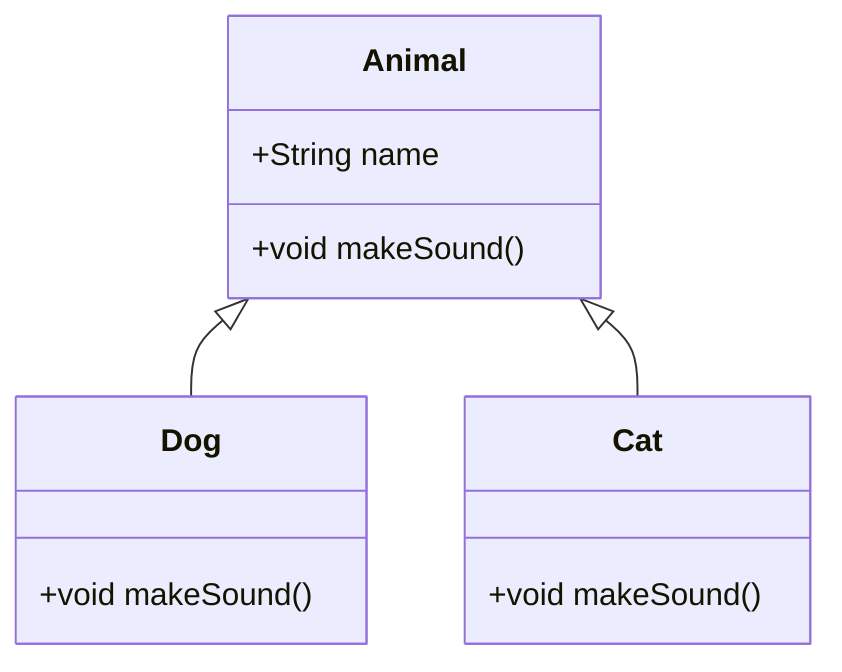

# OOP Principles in Java

## Overview

Object-Oriented Programming (OOP) is a programming paradigm based on the concept of "objects", which can contain data and code. Java implements OOP through classes and objects, supporting principles like encapsulation, inheritance, polymorphism, and abstraction.

## Detailed Explanation

### Encapsulation

Bundling data and methods that operate on the data within a single unit (class).

### Inheritance

Creating new classes from existing ones, inheriting properties and behaviors.

### Polymorphism

Ability of objects to take on many forms, through method overriding and overloading.

### Abstraction

Hiding complex implementation details and showing only essential features.



## Real-world Examples & Use Cases

- Modeling real-world entities in applications, like User, Product in e-commerce
- GUI frameworks where components inherit from base classes
- Game development with character hierarchies

## Code Examples

### Encapsulation

```java
public class Person {
    private String name;
    private int age;
    public String getName() {
        return name;
    }
    public void setName(String name) {
        this.name = name;
    }
    public int getAge() {
        return age;
    }
    public void setAge(int age) {
        this.age = age;
    }
}
```

### Inheritance

```java
public class Animal {
    public void makeSound() {
        System.out.println("Animal sound");
    }
}
public class Dog extends Animal {
    @Override
    public void makeSound() {
        System.out.println("Woof");
    }
}
```

### Polymorphism

```java
public class Main {
    public static void main(String[] args) {
        Animal myDog = new Dog();
        myDog.makeSound(); // Outputs: Woof
    }
}
```

## References

- [Oracle OOP in Java](https://docs.oracle.com/javase/tutorial/java/concepts/)

## Github-README Links & Related Topics

- [Java Fundamentals](../java-fundamentals/)
- [Design Patterns in Java](../java-design-patterns/)
