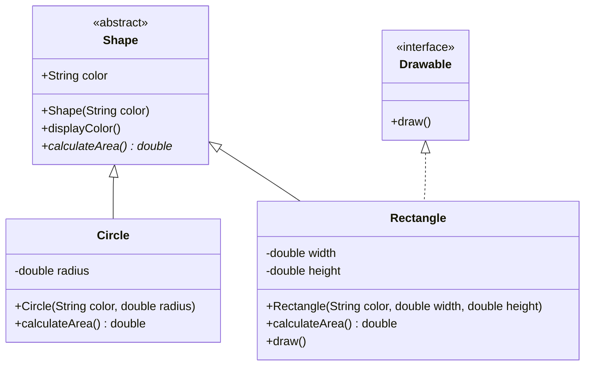

# OOP Principles in Java

## Overview

Object-Oriented Programming (OOP) is a programming paradigm that uses objects and classes to structure software. In Java, OOP is implemented through four core principles: Encapsulation, Inheritance, Polymorphism, and Abstraction. These principles help in creating modular, reusable, and maintainable code by modeling real-world entities and their interactions.

## Detailed Explanation

### Encapsulation

Encapsulation is the bundling of data (fields) and methods (functions) that operate on the data into a single unit called a class. It restricts direct access to some of the object's components, which is achieved using access modifiers like `private`, `protected`, and `public`. This promotes data hiding and protects the integrity of the data.

```java
public class BankAccount {
    private double balance;
    
    public BankAccount(double initialBalance) {
        this.balance = initialBalance;
    }
    
    public void deposit(double amount) {
        if (amount > 0) {
            balance += amount;
        }
    }
    
    public double getBalance() {
        return balance;
    }
}
```

### Inheritance

Inheritance allows a class (subclass) to inherit properties and behaviors from another class (superclass). This promotes code reuse and establishes a hierarchical relationship between classes. In Java, inheritance is implemented using the `extends` keyword.

```java
class Vehicle {
    protected String brand;
    
    public Vehicle(String brand) {
        this.brand = brand;
    }
    
    public void honk() {
        System.out.println("Honk honk!");
    }
}

class Car extends Vehicle {
    private int numberOfDoors;
    
    public Car(String brand, int doors) {
        super(brand);
        this.numberOfDoors = doors;
    }
    
    public void displayInfo() {
        System.out.println("Brand: " + brand + ", Doors: " + numberOfDoors);
    }
}
```

### Polymorphism

Polymorphism allows objects of different classes to be treated as objects of a common superclass. It enables methods to behave differently based on the object that is calling them. There are two types: compile-time (method overloading) and runtime (method overriding).

```java
class Animal {
    public void makeSound() {
        System.out.println("Some sound");
    }
}

class Dog extends Animal {
    @Override
    public void makeSound() {
        System.out.println("Woof!");
    }
}

class Cat extends Animal {
    @Override
    public void makeSound() {
        System.out.println("Meow!");
    }
}

// Usage
public class Main {
    public static void main(String[] args) {
        Animal myDog = new Dog();
        Animal myCat = new Cat();
        myDog.makeSound(); // Woof!
        myCat.makeSound(); // Meow!
    }
}
```

### Abstraction

Abstraction focuses on showing only the essential features of an object while hiding the implementation details. In Java, abstraction is achieved through abstract classes and interfaces. Abstract classes can have abstract methods (without implementation) and concrete methods, while interfaces define contracts that implementing classes must fulfill.

```java
abstract class Shape {
    protected String color;
    
    public Shape(String color) {
        this.color = color;
    }
    
    public abstract double calculateArea();
    
    public void displayColor() {
        System.out.println("Color: " + color);
    }
}

class Circle extends Shape {
    private double radius;
    
    public Circle(String color, double radius) {
        super(color);
        this.radius = radius;
    }
    
    @Override
    public double calculateArea() {
        return Math.PI * radius * radius;
    }
}

interface Drawable {
    void draw();
}

class Rectangle extends Shape implements Drawable {
    private double width;
    private double height;
    
    public Rectangle(String color, double width, double height) {
        super(color);
        this.width = width;
        this.height = height;
    }
    
    @Override
    public double calculateArea() {
        return width * height;
    }
    
    @Override
    public void draw() {
        System.out.println("Drawing a rectangle");
    }
}
```



## Real-world Examples & Use Cases

- **Banking System**: `Account` classes use encapsulation to protect sensitive data like balances and transaction histories.
- **E-commerce Platform**: Product hierarchies use inheritance (e.g., `Electronics` extends `Product`), and polymorphism allows different payment methods to process transactions uniformly.
- **Game Development**: Character classes inherit from a base `Entity` class, with abstraction for different AI behaviors.
- **GUI Frameworks**: Components like buttons and text fields implement common interfaces for event handling.
- **Vehicle Management System**: Different vehicle types (car, truck, motorcycle) inherit from a base `Vehicle` class with polymorphic behavior for fuel efficiency calculations.

## Code Examples

### Method Overloading (Compile-time Polymorphism)

```java
public class Calculator {
    public int add(int a, int b) {
        return a + b;
    }
    
    public double add(double a, double b) {
        return a + b;
    }
    
    public int add(int a, int b, int c) {
        return a + b + c;
    }
}
```

### Interface Implementation

```java
interface PaymentProcessor {
    boolean processPayment(double amount);
}

class CreditCardProcessor implements PaymentProcessor {
    @Override
    public boolean processPayment(double amount) {
        // Implementation for credit card processing
        System.out.println("Processing credit card payment of $" + amount);
        return true;
    }
}

class PayPalProcessor implements PaymentProcessor {
    @Override
    public boolean processPayment(double amount) {
        // Implementation for PayPal processing
        System.out.println("Processing PayPal payment of $" + amount);
        return true;
    }
}
```

### Abstract Class with Concrete and Abstract Methods

```java
abstract class Employee {
    protected String name;
    protected double baseSalary;
    
    public Employee(String name, double baseSalary) {
        this.name = name;
        this.baseSalary = baseSalary;
    }
    
    public abstract double calculateSalary();
    
    public void displayInfo() {
        System.out.println("Name: " + name + ", Base Salary: $" + baseSalary);
    }
}

class FullTimeEmployee extends Employee {
    private double bonus;
    
    public FullTimeEmployee(String name, double baseSalary, double bonus) {
        super(name, baseSalary);
        this.bonus = bonus;
    }
    
    @Override
    public double calculateSalary() {
        return baseSalary + bonus;
    }
}

class PartTimeEmployee extends Employee {
    private int hoursWorked;
    private double hourlyRate;
    
    public PartTimeEmployee(String name, double baseSalary, int hours, double rate) {
        super(name, baseSalary);
        this.hoursWorked = hours;
        this.hourlyRate = rate;
    }
    
    @Override
    public double calculateSalary() {
        return baseSalary + (hoursWorked * hourlyRate);
    }
}
```

## Common Pitfalls & Edge Cases

- **Tight Coupling**: Over-reliance on inheritance can lead to tightly coupled classes that are hard to modify.
- **Fragile Base Class Problem**: Changes to a superclass can unexpectedly break subclasses.
- **Multiple Inheritance Issues**: Java doesn't support multiple inheritance with classes, but interfaces can be used to achieve similar functionality.
- **Over-abstraction**: Too much abstraction can make code harder to understand and maintain.
- **Improper Access Modifiers**: Using `public` for fields that should be `private` breaks encapsulation.
- **Diamond Problem**: Not directly applicable in Java due to single inheritance, but can occur with interfaces if not handled carefully.

## Tools & Libraries

- **Java Standard Library**: Provides built-in support for OOP concepts through classes like `Object`, collections, etc.
- **JUnit**: For testing OOP implementations.
- **Mockito**: For mocking objects in unit tests.
- **IDEs**: IntelliJ IDEA, Eclipse with OOP visualization tools.

## References

- [Oracle Java Tutorials - Object-Oriented Programming Concepts](https://docs.oracle.com/javase/tutorial/java/concepts/index.html)
- [Oracle Java Tutorials - Classes and Objects](https://docs.oracle.com/javase/tutorial/java/javaOO/index.html)
- [Oracle Java Tutorials - Interfaces and Inheritance](https://docs.oracle.com/javase/tutorial/java/IandI/index.html)
- [GeeksforGeeks - OOP Concepts in Java](https://www.geeksforgeeks.org/object-oriented-programming-oops-concept-in-java/)
- [Java OOP Principles - Javatpoint](https://www.javatpoint.com/java-oop-concepts)

## Github-README Links & Related Topics

- [Java Fundamentals](java-fundamentals/README.md)
- [Design Patterns in Java](design-patterns-in-java/README.md)
- [Java Inheritance](inheritance-in-java/README.md)
- [Java Abstraction](abstraction-in-java/README.md)
- [Java Encapsulation](encapsulation-in-java/README.md)
