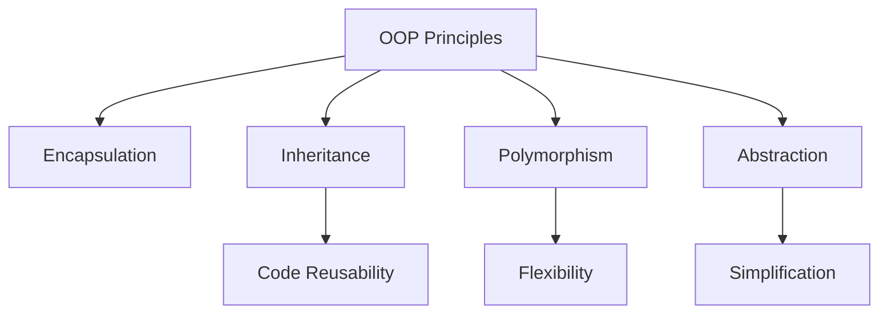

# OOP Principles in Java

## Overview

Object-Oriented Programming (OOP) principles in Java provide a structured approach to software development by organizing code around objects that represent real-world entities. The four main principles are Encapsulation, Inheritance, Polymorphism, and Abstraction, which help create maintainable, reusable, and scalable code.

## Detailed Explanation

### Encapsulation

Encapsulation is the bundling of data and methods that operate on that data within a single unit (class). It restricts direct access to some of an object's components, which is a means of preventing accidental interference and misuse of the data.

Key concepts:
- Private fields
- Public getter/setter methods
- Data hiding

### Inheritance

Inheritance allows a class (subclass) to inherit properties and behaviors from another class (superclass). It promotes code reusability and establishes a relationship between classes.

Types of inheritance in Java:
- Single inheritance
- Multilevel inheritance
- Hierarchical inheritance
- Multiple inheritance (through interfaces)

### Polymorphism

Polymorphism allows objects of different classes to be treated as objects of a common superclass. It enables one interface to be used for a general class of actions.

Types:
- Compile-time polymorphism (method overloading)
- Runtime polymorphism (method overriding)

### Abstraction

Abstraction is the process of hiding implementation details and showing only the essential features of an object. It helps in reducing complexity and allows focusing on what an object does rather than how it does it.

Achieved through:
- Abstract classes
- Interfaces

#### OOP Principles Relationship Diagram



## Real-world Examples & Use Cases

1. **Banking System**: Account classes with encapsulation for balance, inheritance for different account types (Savings, Checking), polymorphism for interest calculation.
2. **Vehicle Management**: Base Vehicle class with inheritance for Car, Bike, Truck; abstraction for engine types.
3. **Employee Management**: Employee hierarchy with different roles, using inheritance and polymorphism for salary calculations.
4. **Shape Drawing Application**: Shape interface with concrete implementations for Circle, Rectangle, Triangle using polymorphism.
5. **E-commerce Platform**: Product catalog with inheritance for different product types, encapsulation for pricing logic.

## Code Examples

### Encapsulation Example

```java
public class BankAccount {
    private String accountNumber;
    private double balance;
    
    public BankAccount(String accountNumber, double initialBalance) {
        this.accountNumber = accountNumber;
        this.balance = initialBalance;
    }
    
    public void deposit(double amount) {
        if (amount > 0) {
            balance += amount;
        }
    }
    
    public void withdraw(double amount) {
        if (amount > 0 && amount <= balance) {
            balance -= amount;
        }
    }
    
    public double getBalance() {
        return balance;
    }
    
    public String getAccountNumber() {
        return accountNumber;
    }
}
```

### Inheritance Example

```java
public class Animal {
    protected String name;
    
    public Animal(String name) {
        this.name = name;
    }
    
    public void eat() {
        System.out.println(name + " is eating");
    }
    
    public void sleep() {
        System.out.println(name + " is sleeping");
    }
}

public class Dog extends Animal {
    public Dog(String name) {
        super(name);
    }
    
    public void bark() {
        System.out.println(name + " is barking");
    }
    
    @Override
    public void eat() {
        System.out.println(name + " is eating dog food");
    }
}

public class Cat extends Animal {
    public Cat(String name) {
        super(name);
    }
    
    public void meow() {
        System.out.println(name + " is meowing");
    }
}
```

### Polymorphism Example

```java
public class Shape {
    public void draw() {
        System.out.println("Drawing a shape");
    }
}

public class Circle extends Shape {
    @Override
    public void draw() {
        System.out.println("Drawing a circle");
    }
}

public class Rectangle extends Shape {
    @Override
    public void draw() {
        System.out.println("Drawing a rectangle");
    }
}

public class Main {
    public static void main(String[] args) {
        Shape[] shapes = {new Circle(), new Rectangle(), new Shape()};
        
        for (Shape shape : shapes) {
            shape.draw();  // Polymorphic behavior
        }
    }
}
```

### Abstraction Example

```java
public abstract class Vehicle {
    protected String brand;
    
    public Vehicle(String brand) {
        this.brand = brand;
    }
    
    public abstract void start();
    public abstract void stop();
    
    public void honk() {
        System.out.println("Honk! Honk!");
    }
}

public class Car extends Vehicle {
    public Car(String brand) {
        super(brand);
    }
    
    @Override
    public void start() {
        System.out.println(brand + " car is starting");
    }
    
    @Override
    public void stop() {
        System.out.println(brand + " car is stopping");
    }
}

public class Bike extends Vehicle {
    public Bike(String brand) {
        super(brand);
    }
    
    @Override
    public void start() {
        System.out.println(brand + " bike is starting");
    }
    
    @Override
    public void stop() {
        System.out.println(brand + " bike is stopping");
    }
}
```

## Common Pitfalls & Edge Cases

1. **Tight Coupling**: Overusing inheritance can lead to tight coupling; prefer composition over inheritance.
2. **Method Overriding Issues**: Forgetting to use @Override annotation or not calling super() when needed.
3. **Access Modifier Confusion**: Misusing public, private, protected can break encapsulation.
4. **Multiple Inheritance Problem**: Java doesn't support multiple inheritance with classes; use interfaces instead.
5. **Abstract Class vs Interface**: Choosing wrong abstraction mechanism can limit flexibility.

## References

- [Oracle Java OOP Tutorial](https://docs.oracle.com/javase/tutorial/java/concepts/)
- [Head First Java by Kathy Sierra and Bert Bates](https://www.amazon.com/Head-First-Java-Kathy-Sierra/dp/0596009208)
- [Design Patterns: Elements of Reusable Object-Oriented Software](https://www.amazon.com/Design-Patterns-Elements-Reusable-Object-Oriented/dp/0201633612)

## Github-README Links & Related Topics

- [Java Fundamentals](../java-fundamentals/README.md)
- [Design Patterns](../design-patterns/README.md)
- [Java Annotations](../java-annotations/README.md)
- [JVM Internals & Class Loading](../jvm-internals-and-class-loading/README.md)
