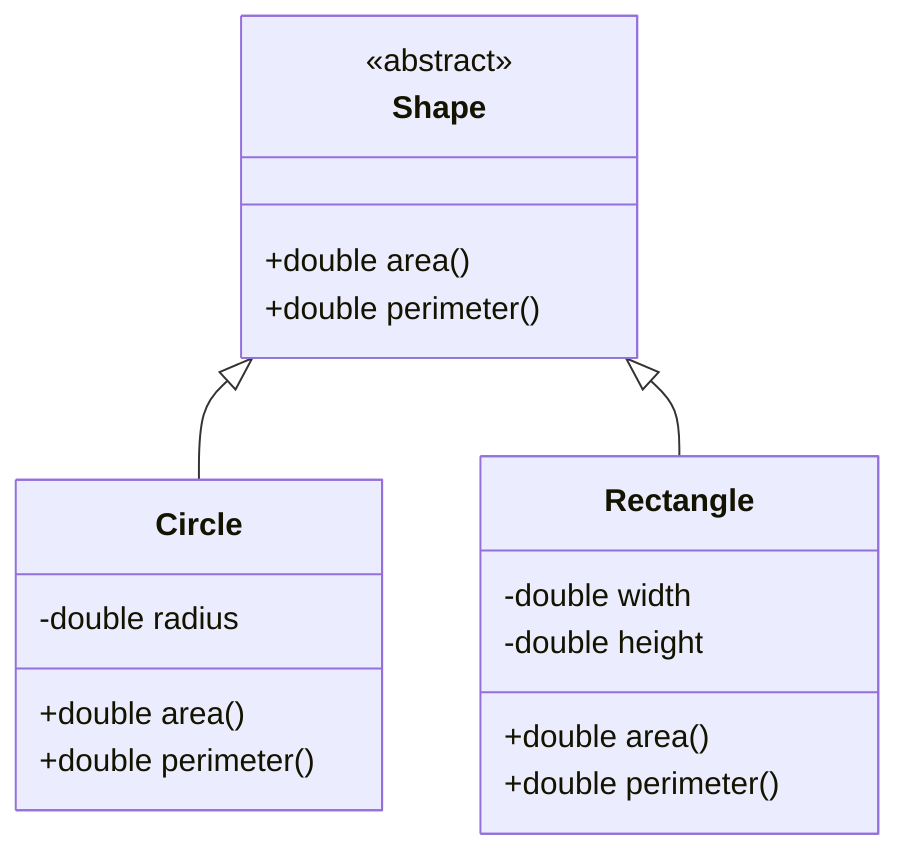

# Overview

Object-Oriented Programming (OOP) Principles in Java provide the foundation for designing modular, reusable, and maintainable software. The four core principles—Encapsulation, Inheritance, Polymorphism, and Abstraction—enable developers to model real-world entities as objects, promoting code organization, scalability, and ease of debugging in Java applications.

# Detailed Explanation

## Encapsulation

Encapsulation binds data (fields) and methods that operate on that data into a single unit (class), restricting direct access to some components. This is achieved using access modifiers like `private`, `protected`, and `public`, with getter and setter methods for controlled access.

## Inheritance

Inheritance allows a class (subclass) to inherit properties and behaviors from another class (superclass), fostering code reuse. In Java, use the `extends` keyword for class inheritance and `implements` for interfaces. Multiple inheritance is not supported for classes but can be simulated with interfaces.

## Polymorphism

Polymorphism enables objects to be treated as instances of their parent class or interface, with behavior determined at runtime. It includes compile-time (method overloading) and runtime (method overriding) polymorphism, allowing flexible and extensible code.

## Abstraction

Abstraction hides complex implementation details, exposing only essential features. In Java, abstract classes (using `abstract` keyword) and interfaces define contracts that concrete classes must fulfill, promoting loose coupling and high-level design.

| Principle      | Key Concept                  | Java Mechanism              | Benefit                          |
|----------------|------------------------------|-----------------------------|----------------------------------|
| Encapsulation | Data Hiding                  | Access Modifiers           | Security, Modularity             |
| Inheritance   | Code Reuse                   | `extends`, `implements`    | Hierarchy, Extensibility         |
| Polymorphism  | Many Forms                   | Overloading, Overriding    | Flexibility, Dynamic Behavior    |
| Abstraction   | Hide Complexity             | Abstract Classes, Interfaces| Simplicity, Maintainability      |



This diagram shows abstraction with an abstract `Shape` class and concrete implementations `Circle` and `Rectangle`, demonstrating inheritance and polymorphism.

# Real-world Examples & Use Cases

- **Banking System**: Encapsulate account details in a `BankAccount` class with private fields; inherit from a base `Account` class for different types like `SavingsAccount` and `CheckingAccount`; use polymorphism for interest calculation methods; abstract common behaviors into interfaces like `Withdrawable`.
- **E-commerce Platform**: Model products with inheritance (e.g., `Electronics` extends `Product`); encapsulate pricing logic; polymorphically handle discounts; abstract payment processing into interfaces.
- **Game Development**: Abstract game entities into a base `Entity` class; inherit for `Player`, `Enemy`; encapsulate health and position; polymorphically update behaviors.
- **Library Management**: Encapsulate book data; inherit for different media types; use abstraction for search interfaces; polymorphically sort collections.

# Code Examples

## Encapsulation Example
```java
public class BankAccount {
    private double balance;
    
    public BankAccount(double initialBalance) {
        this.balance = initialBalance;
    }
    
    public void deposit(double amount) {
        if (amount > 0) {
            balance += amount;
        }
    }
    
    public double getBalance() {
        return balance;
    }
}
```

## Inheritance and Polymorphism
```java
abstract class Animal {
    abstract void makeSound();
}

class Dog extends Animal {
    @Override
    void makeSound() {
        System.out.println("Woof!");
    }
}

class Cat extends Animal {
    @Override
    void makeSound() {
        System.out.println("Meow!");
    }
}

public class Main {
    public static void main(String[] args) {
        Animal[] animals = {new Dog(), new Cat()};
        for (Animal animal : animals) {
            animal.makeSound(); // Polymorphism
        }
    }
}
```

## Abstraction with Interfaces
```java
interface Drawable {
    void draw();
}

class Circle implements Drawable {
    @Override
    public void draw() {
        System.out.println("Drawing a circle");
    }
}

class Square implements Drawable {
    @Override
    public void draw() {
        System.out.println("Drawing a square");
    }
}
```

# Common Pitfalls & Edge Cases

- **Tight Coupling in Inheritance**: Deep hierarchies can lead to tight coupling; prefer composition over inheritance.
- **Multiple Inheritance Issues**: Java doesn't support multiple class inheritance to avoid the diamond problem; use interfaces to avoid.
- **Overusing Polymorphism**: Excessive overriding can confuse behavior; ensure clear contracts.
- **Incomplete Abstraction**: Abstract classes with too many concrete methods reduce flexibility; use interfaces for pure abstraction.
- **Access Modifier Errors**: Incorrect modifiers can expose sensitive data; review encapsulation regularly.
- **Method Overloading vs. Overriding Confusion**: Overloading is compile-time polymorphism, overriding is runtime; mixing them inappropriately can lead to unexpected behavior.

# References

- [Object-Oriented Programming Concepts](https://docs.oracle.com/javase/tutorial/java/concepts/index.html)
- [Inheritance](https://docs.oracle.com/javase/tutorial/java/IandI/subclasses.html)
- [Polymorphism](https://docs.oracle.com/javase/tutorial/java/IandI/polymorphism.html)
- [Abstract Classes and Methods](https://docs.oracle.com/javase/tutorial/java/IandI/abstract.html)
- [Interfaces](https://docs.oracle.com/javase/tutorial/java/IandI/createinterface.html)

# Github-README Links & Related Topics

- [Java Fundamentals](./java-fundamentals/README.md)
- [Java Design Patterns](./java-design-patterns/README.md)
- [Java Generics](./java-generics/README.md)
- [Java Annotations](./java-annotations/README.md)
- [Java Reflection](./java-reflection/README.md)