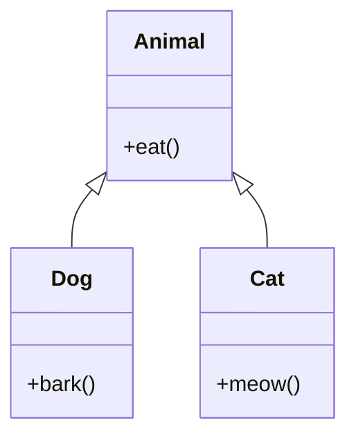

# Overview

Object-Oriented Programming (OOP) principles in Java revolve around four core concepts: Encapsulation, Inheritance, Polymorphism, and Abstraction. These principles enable modular, reusable, and maintainable code.

# Detailed Explanation

OOP is a programming paradigm that uses objects and classes to structure software. In Java:

- **Encapsulation**: Bundling data and methods into classes, controlling access via modifiers (private, public).
- **Inheritance**: Creating new classes from existing ones, promoting code reuse.
- **Polymorphism**: Ability of objects to take multiple forms, achieved through method overriding and overloading.
- **Abstraction**: Hiding complex implementation details, focusing on essential features.

### Access Modifiers

| Modifier | Class | Package | Subclass | World |
|----------|-------|---------|----------|-------|
| public | Y | Y | Y | Y |
| protected | Y | Y | Y | N |
| default | Y | Y | N | N |
| private | Y | N | N | N |

Java supports these through classes, interfaces, and abstract classes.



# Real-world Examples & Use Cases

- **Banking System**: Account classes with encapsulated balance and transaction methods.
- **Game Development**: Character classes inheriting from base entities with polymorphic behaviors.
- **E-commerce**: Product hierarchies using inheritance and abstraction for different item types.

Example: A vehicle rental system with base Vehicle class and derived Car and Bike classes.

# Code Examples

Encapsulation example:

```java
public class BankAccount {
    private double balance;
    
    public BankAccount(double initialBalance) {
        this.balance = initialBalance;
    }
    
    public void deposit(double amount) {
        if (amount > 0) {
            balance += amount;
        }
    }
    
    public double getBalance() {
        return balance;
    }
}
```

Inheritance example:

```java
public class Animal {
    public void eat() {
        System.out.println("Animal eats");
    }
}

public class Dog extends Animal {
    public void bark() {
        System.out.println("Dog barks");
    }
}
```

Polymorphism example:

```java
public class Shape {
    public void draw() {
        System.out.println("Drawing shape");
    }
}

public class Circle extends Shape {
    @Override
    public void draw() {
        System.out.println("Drawing circle");
    }
}
```

Abstraction example:

```java
interface Vehicle {
    void start();
}

public class Car implements Vehicle {
    @Override
    public void start() {
        System.out.println("Car starts");
    }
}

public class Bike implements Vehicle {
    @Override
    public void start() {
        System.out.println("Bike starts");
    }
}
```

# References

- [Oracle OOP Concepts](https://docs.oracle.com/javase/tutorial/java/concepts/)
- [GeeksforGeeks OOP in Java](https://www.geeksforgeeks.org/object-oriented-programming-oops-concept-in-java/)
- [Design Patterns: Elements of Reusable Object-Oriented Software](https://www.amazon.com/Design-Patterns-Elements-Reusable-Object-Oriented/dp/0201633612)

# Common Pitfalls & Edge Cases

- **Deep Inheritance Hierarchies**: Can lead to tight coupling and maintenance issues.
- **Breaking Encapsulation**: Exposing internal state through public getters/setters without validation.
- **Improper Polymorphism**: Forgetting @Override annotation or not handling method signatures correctly.
- **Abstract Classes vs Interfaces**: Choosing wrong abstraction mechanism for the use case.

# Tools & Libraries

- **UML Tools**: PlantUML, StarUML for visualizing class hierarchies and relationships.
- **IDEs**: IntelliJ IDEA, Eclipse with built-in refactoring tools for OOP code.

# Github-README Links & Related Topics

- [Java Fundamentals](../java-fundamentals/)
- [Design Patterns in Java](../design-patterns-in-java/)