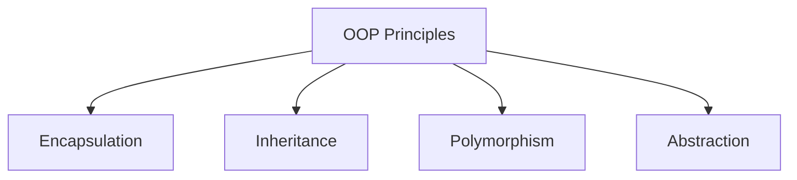

# OOP Principles in Java

## Overview

Object-Oriented Programming (OOP) is a programming paradigm based on the concept of "objects", which can contain data and code. Java supports four fundamental OOP principles: Encapsulation, Inheritance, Polymorphism, and Abstraction.

## Detailed Explanation

### Encapsulation

Encapsulation is the bundling of data and methods that operate on that data within a single unit, restricting access to some of the object's components.

### Inheritance

Inheritance allows a class to inherit properties and methods from another class, promoting code reusability.

### Polymorphism

Polymorphism allows objects of different classes to be treated as objects of a common superclass, enabling method overriding and overloading.

### Abstraction

Abstraction is the process of hiding complex implementation details and showing only the necessary features of an object.



## Real-world Examples & Use Cases

- **Banking System**: Using encapsulation to protect account balances.

- **Game Development**: Inheritance for character classes.

- **GUI Frameworks**: Polymorphism for event handling.

- **API Design**: Abstraction for complex operations.

## Code Examples

### Encapsulation

```java
public class BankAccount {
    private double balance;
    
    public double getBalance() {
        return balance;
    }
    
    public void deposit(double amount) {
        if (amount > 0) {
            balance += amount;
        }
    }
}
```

### Inheritance

```java
public class Animal {
    public void eat() {
        System.out.println("Eating");
    }
}

public class Dog extends Animal {
    public void bark() {
        System.out.println("Barking");
    }
}
```

### Polymorphism

```java
public class Shape {
    public void draw() {
        System.out.println("Drawing shape");
    }
}

public class Circle extends Shape {
    @Override
    public void draw() {
        System.out.println("Drawing circle");
    }
}
```

### Abstraction

```java
abstract class Vehicle {
    abstract void start();
    
    public void stop() {
        System.out.println("Stopping");
    }
}

public class Car extends Vehicle {
    @Override
    void start() {
        System.out.println("Starting car");
    }
}
```

## References

- [Oracle OOP in Java](https://docs.oracle.com/javase/tutorial/java/concepts/)
- [Baeldung OOP](https://www.baeldung.com/java-oop)

## Github-README Links & Related Topics

- [Java Fundamentals](java-fundamentals/)
- [Inheritance in Java](inheritance-in-java/)
- [Polymorphism in Java](polymorphism-in-java/)
- [Abstraction in Java](abstraction-in-java/)
