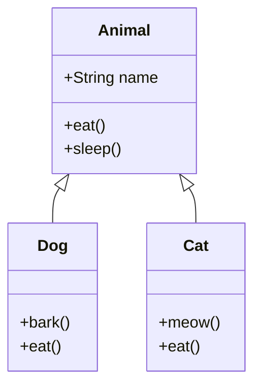

# Overview

Object-Oriented Programming (OOP) is a programming paradigm that organizes software design around data, or objects, rather than functions and logic. Java is fundamentally an object-oriented language that implements OOP principles including encapsulation, inheritance, polymorphism, and abstraction. These principles help create modular, maintainable, and reusable code.

# Detailed Explanation

## What Is an Object?

An object is a software bundle of related state and behavior. Software objects are often used to model real-world objects. Objects have:

- **State**: Represented by fields (variables)
- **Behavior**: Represented by methods (functions)

```java
public class Car {
    // State (fields)
    private String color;
    private String model;
    private int year;
    
    // Behavior (methods)
    public void start() {
        System.out.println("Car started");
    }
    
    public void stop() {
        System.out.println("Car stopped");
    }
}
```

## What Is a Class?

A class is a blueprint or prototype from which objects are created. It defines the structure and behavior that objects of that class will have.

```java
public class Person {
    // Fields
    private String name;
    private int age;
    
    // Constructor
    public Person(String name, int age) {
        this.name = name;
        this.age = age;
    }
    
    // Methods
    public String getName() {
        return name;
    }
    
    public void setName(String name) {
        this.name = name;
    }
    
    public int getAge() {
        return age;
    }
    
    public void setAge(int age) {
        this.age = age;
    }
}
```

## What Is Inheritance?

Inheritance provides a powerful mechanism for organizing and structuring software. It allows one class to inherit the fields and methods of another class.

```java
// Parent class (superclass)
public class Animal {
    protected String name;
    
    public Animal(String name) {
        this.name = name;
    }
    
    public void eat() {
        System.out.println(name + " is eating");
    }
    
    public void sleep() {
        System.out.println(name + " is sleeping");
    }
}

// Child class (subclass)
public class Dog extends Animal {
    public Dog(String name) {
        super(name);
    }
    
    public void bark() {
        System.out.println(name + " is barking");
    }
    
    // Override parent method
    @Override
    public void eat() {
        System.out.println(name + " is eating dog food");
    }
}
```

## What Is an Interface?

An interface is a contract between a class and the outside world. When a class implements an interface, it promises to provide the behavior published by that interface.

```java
// Interface definition
public interface Drawable {
    void draw();
    double getArea();
}

// Class implementing interface
public class Circle implements Drawable {
    private double radius;
    
    public Circle(double radius) {
        this.radius = radius;
    }
    
    @Override
    public void draw() {
        System.out.println("Drawing a circle");
    }
    
    @Override
    public double getArea() {
        return Math.PI * radius * radius;
    }
}

// Another class implementing the same interface
public class Rectangle implements Drawable {
    private double width;
    private double height;
    
    public Rectangle(double width, double height) {
        this.width = width;
        this.height = height;
    }
    
    @Override
    public void draw() {
        System.out.println("Drawing a rectangle");
    }
    
    @Override
    public double getArea() {
        return width * height;
    }
}
```

## What Is a Package?

A package is a namespace for organizing classes and interfaces in a logical manner. Placing code into packages makes large software projects easier to manage.

```java
// File: com/example/model/Person.java
package com.example.model;

public class Person {
    // class implementation
}

// File: com/example/service/PersonService.java
package com.example.service;

import com.example.model.Person;

public class PersonService {
    public void savePerson(Person person) {
        // implementation
    }
}
```

## Encapsulation

Encapsulation is the bundling of data and methods that operate on that data within a single unit (class). It restricts direct access to some of an object's components.

```java
public class BankAccount {
    private double balance;
    
    public BankAccount(double initialBalance) {
        this.balance = initialBalance;
    }
    
    public void deposit(double amount) {
        if (amount > 0) {
            balance += amount;
        }
    }
    
    public void withdraw(double amount) {
        if (amount > 0 && amount <= balance) {
            balance -= amount;
        }
    }
    
    public double getBalance() {
        return balance;
    }
    
    // Private method - internal implementation detail
    private void logTransaction(String type, double amount) {
        System.out.println("Transaction: " + type + " $" + amount);
    }
}
```

## Polymorphism

Polymorphism allows objects of different classes to be treated as objects of a common superclass. It enables method overriding and method overloading.

### Method Overriding

```java
public class Animal {
    public void makeSound() {
        System.out.println("Animal makes a sound");
    }
}

public class Cat extends Animal {
    @Override
    public void makeSound() {
        System.out.println("Meow");
    }
}

public class Dog extends Animal {
    @Override
    public void makeSound() {
        System.out.println("Woof");
    }
}

// Usage
public class AnimalSounds {
    public static void main(String[] args) {
        Animal myCat = new Cat();
        Animal myDog = new Dog();
        
        myCat.makeSound();  // Output: Meow
        myDog.makeSound();  // Output: Woof
    }
}
```

### Method Overloading

```java
public class Calculator {
    public int add(int a, int b) {
        return a + b;
    }
    
    public double add(double a, double b) {
        return a + b;
    }
    
    public int add(int a, int b, int c) {
        return a + b + c;
    }
}
```

## Abstraction

Abstraction is the concept of hiding the complex implementation details and showing only the necessary features of an object.

```java
// Abstract class
public abstract class Shape {
    protected String color;
    
    public Shape(String color) {
        this.color = color;
    }
    
    // Abstract method - must be implemented by subclasses
    public abstract double getArea();
    
    // Concrete method
    public void displayColor() {
        System.out.println("Color: " + color);
    }
}

// Concrete subclass
public class Circle extends Shape {
    private double radius;
    
    public Circle(String color, double radius) {
        super(color);
        this.radius = radius;
    }
    
    @Override
    public double getArea() {
        return Math.PI * radius * radius;
    }
}
```

# Real-world Examples & Use Cases

## Banking System

```java
// Abstract Account class
public abstract class Account {
    protected String accountNumber;
    protected String accountHolder;
    protected double balance;
    
    public Account(String accountNumber, String accountHolder, double initialBalance) {
        this.accountNumber = accountNumber;
        this.accountHolder = accountHolder;
        this.balance = initialBalance;
    }
    
    public abstract void deposit(double amount);
    public abstract void withdraw(double amount);
    public abstract double calculateInterest();
    
    public double getBalance() {
        return balance;
    }
    
    public String getAccountInfo() {
        return "Account: " + accountNumber + ", Holder: " + accountHolder + ", Balance: $" + balance;
    }
}

// Savings Account
public class SavingsAccount extends Account {
    private double interestRate;
    
    public SavingsAccount(String accountNumber, String accountHolder, double initialBalance, double interestRate) {
        super(accountNumber, accountHolder, initialBalance);
        this.interestRate = interestRate;
    }
    
    @Override
    public void deposit(double amount) {
        if (amount > 0) {
            balance += amount;
            System.out.println("Deposited $" + amount + " to savings account");
        }
    }
    
    @Override
    public void withdraw(double amount) {
        if (amount > 0 && amount <= balance) {
            balance -= amount;
            System.out.println("Withdrew $" + amount + " from savings account");
        } else {
            System.out.println("Insufficient funds");
        }
    }
    
    @Override
    public double calculateInterest() {
        return balance * interestRate / 100;
    }
}

// Checking Account
public class CheckingAccount extends Account {
    private double overdraftLimit;
    
    public CheckingAccount(String accountNumber, String accountHolder, double initialBalance, double overdraftLimit) {
        super(accountNumber, accountHolder, initialBalance);
        this.overdraftLimit = overdraftLimit;
    }
    
    @Override
    public void deposit(double amount) {
        if (amount > 0) {
            balance += amount;
            System.out.println("Deposited $" + amount + " to checking account");
        }
    }
    
    @Override
    public void withdraw(double amount) {
        if (amount > 0 && (balance - amount) >= -overdraftLimit) {
            balance -= amount;
            System.out.println("Withdrew $" + amount + " from checking account");
        } else {
            System.out.println("Withdrawal exceeds overdraft limit");
        }
    }
    
    @Override
    public double calculateInterest() {
        return 0; // Checking accounts typically don't earn interest
    }
}
```

## Vehicle Management System

```java
// Interface for vehicles
public interface Vehicle {
    void start();
    void stop();
    void accelerate();
    void brake();
    String getInfo();
}

// Abstract Vehicle class
public abstract class AbstractVehicle implements Vehicle {
    protected String make;
    protected String model;
    protected int year;
    protected boolean isRunning;
    
    public AbstractVehicle(String make, String model, int year) {
        this.make = make;
        this.model = model;
        this.year = year;
        this.isRunning = false;
    }
    
    @Override
    public void start() {
        isRunning = true;
        System.out.println(make + " " + model + " started");
    }
    
    @Override
    public void stop() {
        isRunning = false;
        System.out.println(make + " " + model + " stopped");
    }
    
    @Override
    public String getInfo() {
        return year + " " + make + " " + model;
    }
}

// Car class
public class Car extends AbstractVehicle {
    private int numDoors;
    
    public Car(String make, String model, int year, int numDoors) {
        super(make, model, year);
        this.numDoors = numDoors;
    }
    
    @Override
    public void accelerate() {
        if (isRunning) {
            System.out.println("Car accelerating smoothly");
        } else {
            System.out.println("Start the car first");
        }
    }
    
    @Override
    public void brake() {
        System.out.println("Car braking with ABS");
    }
    
    @Override
    public String getInfo() {
        return super.getInfo() + " - " + numDoors + " door sedan";
    }
}

// Motorcycle class
public class Motorcycle extends AbstractVehicle {
    private boolean hasSidecar;
    
    public Motorcycle(String make, String model, int year, boolean hasSidecar) {
        super(make, model, year);
        this.hasSidecar = hasSidecar;
    }
    
    @Override
    public void accelerate() {
        if (isRunning) {
            System.out.println("Motorcycle accelerating quickly");
        } else {
            System.out.println("Start the motorcycle first");
        }
    }
    
    @Override
    public void brake() {
        System.out.println("Motorcycle braking with quick stop");
    }
    
    @Override
    public String getInfo() {
        return super.getInfo() + (hasSidecar ? " with sidecar" : " without sidecar");
    }
}
```

# Code Examples

## Inheritance Hierarchy Diagram



## Polymorphism Example

```java
public class ShapeDemo {
    public static void main(String[] args) {
        // Polymorphism in action
        Drawable[] shapes = new Drawable[3];
        shapes[0] = new Circle(5.0);
        shapes[1] = new Rectangle(4.0, 6.0);
        shapes[2] = new Circle(3.0);
        
        for (Drawable shape : shapes) {
            shape.draw();
            System.out.println("Area: " + shape.getArea());
            System.out.println("---");
        }
    }
}
```

## Abstract Factory Pattern Example

```java
// Abstract factory for creating UI components
public abstract class GUIFactory {
    public abstract Button createButton();
    public abstract Checkbox createCheckbox();
}

// Windows factory
public class WindowsFactory extends GUIFactory {
    @Override
    public Button createButton() {
        return new WindowsButton();
    }
    
    @Override
    public Checkbox createCheckbox() {
        return new WindowsCheckbox();
    }
}

// Mac factory
public class MacFactory extends GUIFactory {
    @Override
    public Button createButton() {
        return new MacButton();
    }
    
    @Override
    public Checkbox createCheckbox() {
        return new MacCheckbox();
    }
}

// Abstract products
public interface Button {
    void paint();
}

public interface Checkbox {
    void paint();
}

// Concrete products
public class WindowsButton implements Button {
    @Override
    public void paint() {
        System.out.println("Rendering a Windows button");
    }
}

public class MacButton implements Button {
    @Override
    public void paint() {
        System.out.println("Rendering a Mac button");
    }
}

public class WindowsCheckbox implements Checkbox {
    @Override
    public void paint() {
        System.out.println("Rendering a Windows checkbox");
    }
}

public class MacCheckbox implements Checkbox {
    @Override
    public void paint() {
        System.out.println("Rendering a Mac checkbox");
    }
}
```

# Common Pitfalls & Edge Cases

## Fragile Base Class Problem

```java
public class BaseClass {
    public void method1() {
        System.out.println("Base method1");
    }
    
    public void method2() {
        System.out.println("Base method2");
    }
}

public class DerivedClass extends BaseClass {
    @Override
    public void method1() {
        super.method1();
        System.out.println("Derived method1");
    }
}

// If BaseClass changes method2 to call method1:
public class BaseClass {
    public void method1() {
        System.out.println("Base method1");
    }
    
    public void method2() {
        method1();  // This will now call DerivedClass.method1()
        System.out.println("Base method2");
    }
}
// This can break the behavior unexpectedly
```

## Diamond Problem (Multiple Inheritance Issue)

Java avoids the diamond problem by not supporting multiple inheritance of classes, but interfaces can be multiply inherited.

```java
public interface InterfaceA {
    default void method() {
        System.out.println("InterfaceA method");
    }
}

public interface InterfaceB {
    default void method() {
        System.out.println("InterfaceB method");
    }
}

// This would cause a compilation error
// public class MultipleInheritance implements InterfaceA, InterfaceB {
// }

public class ResolvedMultipleInheritance implements InterfaceA, InterfaceB {
    @Override
    public void method() {
        // Must explicitly resolve the conflict
        InterfaceA.super.method();  // or InterfaceB.super.method()
    }
}
```

## Constructor Chaining

```java
public class Parent {
    private int value;
    
    public Parent(int value) {
        this.value = value;
    }
}

public class Child extends Parent {
    private String name;
    
    public Child(int value, String name) {
        super(value);  // Must call parent constructor first
        this.name = name;
    }
    
    // Compilation error - no default constructor in Parent
    // public Child(String name) {
    //     this.name = name;
    // }
}
```

# References

- [Oracle Java Tutorials: Object-Oriented Programming Concepts](https://docs.oracle.com/javase/tutorial/java/concepts/index.html)
- [Oracle Java Tutorials: What Is an Object?](https://docs.oracle.com/javase/tutorial/java/concepts/object.html)
- [Oracle Java Tutorials: What Is a Class?](https://docs.oracle.com/javase/tutorial/java/concepts/class.html)
- [Oracle Java Tutorials: What Is Inheritance?](https://docs.oracle.com/javase/tutorial/java/concepts/inheritance.html)
- [Oracle Java Tutorials: What Is an Interface?](https://docs.oracle.com/javase/tutorial/java/concepts/interface.html)
- [Oracle Java Tutorials: What Is a Package?](https://docs.oracle.com/javase/tutorial/java/concepts/package.html)

# Github-README Links & Related Topics

- [java-fundamentals](java-fundamentals/)
- [java-classes-and-objects](java-classes-and-objects/)
- [java-inheritance](java-inheritance/)
- [java-interfaces](java-interfaces/)
- [java-polymorphism](java-polymorphism/)
- [design-patterns](design-patterns/)
