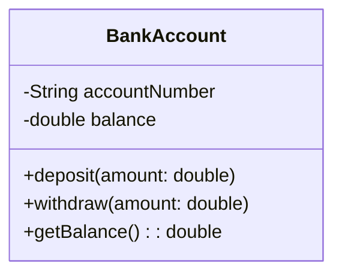
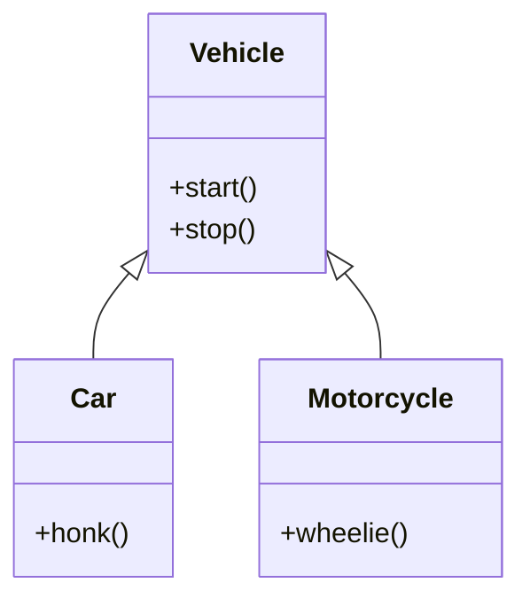
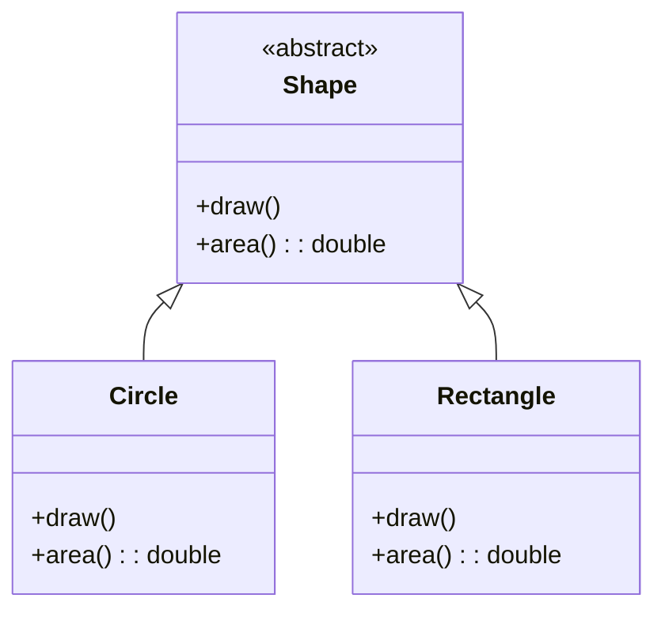

# Overview

Object-Oriented Programming (OOP) is a programming paradigm based on the concept of "objects", which can contain data and code. Java implements four fundamental OOP principles: Encapsulation, Inheritance, Polymorphism, and Abstraction. These principles help create modular, maintainable, and reusable code.

# Detailed Explanation

### Encapsulation

Encapsulation is the bundling of data (fields) and methods (functions) that operate on the data into a single unit called a class. It restricts direct access to some of an object's components.

**Key Concepts:**
- Access modifiers: `public`, `private`, `protected`, `default`
- Data hiding
- Getter and setter methods



### Inheritance

Inheritance allows a class (subclass) to inherit properties and methods from another class (superclass). It promotes code reusability and establishes a relationship between classes.

**Key Concepts:**
- `extends` keyword
- `super` keyword
- Method overriding
- `final` classes/methods



### Polymorphism

Polymorphism allows objects of different classes to be treated as objects of a common superclass. It enables one interface to be used for a general class of actions.

**Types:**
- **Compile-time Polymorphism (Method Overloading)**: Multiple methods with same name but different parameters
- **Runtime Polymorphism (Method Overriding)**: Subclass provides specific implementation of a method declared in superclass

### Abstraction

Abstraction is the process of hiding implementation details and showing only the essential features of an object. It helps manage complexity by focusing on what an object does rather than how it does it.

**Implementation:**
- Abstract classes
- Interfaces
- Abstract methods



# Real-world Examples & Use Cases

1. **Banking System**: Account classes with encapsulation for security
2. **Vehicle Management**: Inheritance hierarchy for different vehicle types
3. **GUI Frameworks**: Polymorphism for different UI components
4. **Payment Processing**: Abstraction for different payment methods
5. **Game Development**: Character classes with inheritance and polymorphism
6. **E-commerce**: Product catalog with abstraction for different product types

# Code Examples

### Encapsulation Example

```java
public class Employee {
    private String name;
    private double salary;
    private String department;
    
    public Employee(String name, double salary, String department) {
        this.name = name;
        this.salary = salary;
        this.department = department;
    }
    
    // Getter methods
    public String getName() {
        return name;
    }
    
    public double getSalary() {
        return salary;
    }
    
    public String getDepartment() {
        return department;
    }
    
    // Setter methods with validation
    public void setSalary(double salary) {
        if (salary >= 0) {
            this.salary = salary;
        }
    }
    
    public void setDepartment(String department) {
        this.department = department;
    }
    
    // Business method
    public void giveRaise(double percentage) {
        if (percentage > 0) {
            salary += salary * (percentage / 100);
        }
    }
}
```

### Inheritance Example

```java
// Base class
public class Animal {
    protected String name;
    protected int age;
    
    public Animal(String name, int age) {
        this.name = name;
        this.age = age;
    }
    
    public void eat() {
        System.out.println(name + " is eating");
    }
    
    public void sleep() {
        System.out.println(name + " is sleeping");
    }
    
    public String getInfo() {
        return "Name: " + name + ", Age: " + age;
    }
}

// Derived class
public class Dog extends Animal {
    private String breed;
    
    public Dog(String name, int age, String breed) {
        super(name, age);
        this.breed = breed;
    }
    
    @Override
    public void eat() {
        System.out.println(name + " is eating dog food");
    }
    
    public void bark() {
        System.out.println("Woof! Woof!");
    }
    
    @Override
    public String getInfo() {
        return super.getInfo() + ", Breed: " + breed;
    }
}

// Another derived class
public class Cat extends Animal {
    private String color;
    
    public Cat(String name, int age, String color) {
        super(name, age);
        this.color = color;
    }
    
    @Override
    public void eat() {
        System.out.println(name + " is eating cat food");
    }
    
    public void meow() {
        System.out.println("Meow!");
    }
    
    @Override
    public String getInfo() {
        return super.getInfo() + ", Color: " + color;
    }
}
```

### Polymorphism Example

```java
// Interface for polymorphism
public interface PaymentMethod {
    boolean processPayment(double amount);
    String getPaymentType();
}

// Credit card implementation
public class CreditCard implements PaymentMethod {
    private String cardNumber;
    private String expiryDate;
    
    public CreditCard(String cardNumber, String expiryDate) {
        this.cardNumber = cardNumber;
        this.expiryDate = expiryDate;
    }
    
    @Override
    public boolean processPayment(double amount) {
        // Simulate payment processing
        System.out.println("Processing credit card payment of $" + amount);
        return true; // Assume success
    }
    
    @Override
    public String getPaymentType() {
        return "Credit Card";
    }
}

// PayPal implementation
public class PayPal implements PaymentMethod {
    private String email;
    
    public PayPal(String email) {
        this.email = email;
    }
    
    @Override
    public boolean processPayment(double amount) {
        // Simulate PayPal payment
        System.out.println("Processing PayPal payment of $" + amount + " for " + email);
        return true; // Assume success
    }
    
    @Override
    public String getPaymentType() {
        return "PayPal";
    }
}

// Usage demonstrating polymorphism
public class ShoppingCart {
    private List<PaymentMethod> paymentMethods;
    
    public ShoppingCart() {
        paymentMethods = new ArrayList<>();
        paymentMethods.add(new CreditCard("1234-5678-9012-3456", "12/25"));
        paymentMethods.add(new PayPal("user@example.com"));
    }
    
    public void checkout(double totalAmount) {
        for (PaymentMethod method : paymentMethods) {
            if (method.processPayment(totalAmount)) {
                System.out.println("Payment successful using " + method.getPaymentType());
                break;
            }
        }
    }
}
```

### Abstraction Example

```java
// Abstract class
public abstract class Vehicle {
    protected String brand;
    protected String model;
    protected int year;
    
    public Vehicle(String brand, String model, int year) {
        this.brand = brand;
        this.model = model;
        this.year = year;
    }
    
    // Abstract methods - must be implemented by subclasses
    public abstract void start();
    public abstract void stop();
    public abstract void accelerate();
    public abstract double getFuelEfficiency();
    
    // Concrete method
    public String getDescription() {
        return year + " " + brand + " " + model;
    }
}

// Concrete implementation
public class Car extends Vehicle {
    private int doors;
    private String fuelType;
    
    public Car(String brand, String model, int year, int doors, String fuelType) {
        super(brand, model, year);
        this.doors = doors;
        this.fuelType = fuelType;
    }
    
    @Override
    public void start() {
        System.out.println("Starting " + getDescription() + " car");
    }
    
    @Override
    public void stop() {
        System.out.println("Stopping " + getDescription() + " car");
    }
    
    @Override
    public void accelerate() {
        System.out.println("Accelerating " + getDescription() + " car");
    }
    
    @Override
    public double getFuelEfficiency() {
        return fuelType.equals("Electric") ? 100.0 : 25.0; // MPG or MPGe
    }
}

// Another implementation
public class Motorcycle extends Vehicle {
    private boolean hasSidecar;
    
    public Motorcycle(String brand, String model, int year, boolean hasSidecar) {
        super(brand, model, year);
        this.hasSidecar = hasSidecar;
    }
    
    @Override
    public void start() {
        System.out.println("Starting " + getDescription() + " motorcycle");
    }
    
    @Override
    public void stop() {
        System.out.println("Stopping " + getDescription() + " motorcycle");
    }
    
    @Override
    public void accelerate() {
        System.out.println("Accelerating " + getDescription() + " motorcycle");
    }
    
    @Override
    public double getFuelEfficiency() {
        return hasSidecar ? 35.0 : 45.0; // MPG
    }
}
```

# References

- [Oracle OOP Concepts](https://docs.oracle.com/javase/tutorial/java/concepts/)
- [Baeldung OOP in Java](https://www.baeldung.com/java-oop)
- [GeeksforGeeks OOP Principles](https://www.geeksforgeeks.org/object-oriented-programming-oops-concept-in-java/)

# Github-README Links & Related Topics

- [java-fundamentals/README.md](../java-fundamentals/README.md)
- [design-patterns/README.md](../java/design-patterns/README.md)
- [java-annotations/README.md](../java-annotations/README.md)
