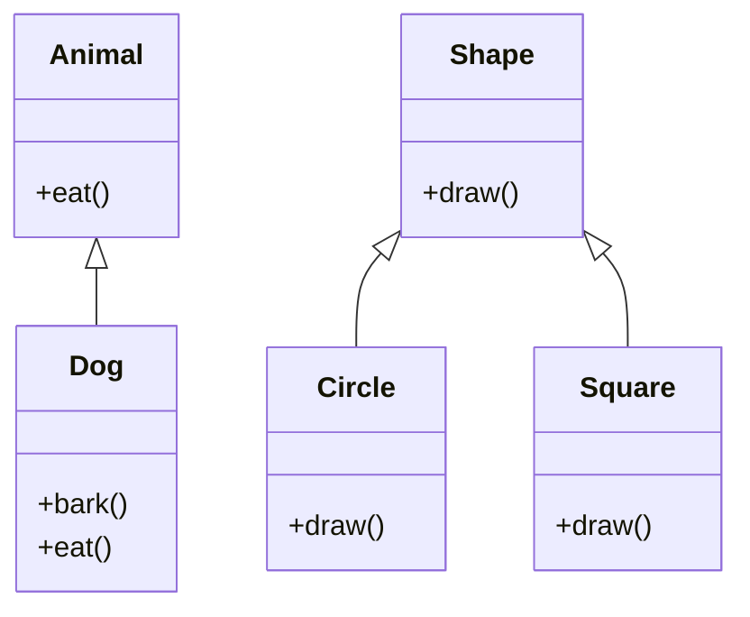

## Overview

OOP Principles in Java covers the four fundamental principles of Object-Oriented Programming: Encapsulation, Inheritance, Polymorphism, and Abstraction. These principles guide the design of modular, maintainable, and reusable code.

## Detailed Explanation

## Encapsulation

Encapsulation involves bundling data and methods that operate on that data within a single unit (class). It restricts direct access to some of an object's components.

- **Access Modifiers**: public, private, protected.
- **Getters and Setters**: Controlled access to private fields.

## Inheritance

Inheritance allows a class to inherit properties and methods from another class. It promotes code reuse and establishes a relationship between classes.

- **Superclass and Subclass**: Parent and child classes.
- **Method Overriding**: Subclass provides specific implementation.

## Polymorphism

Polymorphism allows objects of different classes to be treated as objects of a common superclass. It enables dynamic method dispatch.

- **Compile-time Polymorphism**: Method overloading.
- **Runtime Polymorphism**: Method overriding.

## Abstraction

Abstraction focuses on exposing only essential features while hiding implementation details.

- **Abstract Classes**: Cannot be instantiated, can have abstract methods.
- **Interfaces**: Contract for classes to implement.



## Real-world Examples & Use Cases

- **Banking System**: Account classes with inheritance (SavingsAccount, CheckingAccount).
- **Vehicle Rental**: Polymorphism for different vehicle types.
- **Employee Management**: Encapsulation for employee data, abstraction for roles.

## Code Examples

## Encapsulation

```java
public class Person {
    private String name;
    private int age;

    public String getName() {
        return name;
    }

    public void setName(String name) {
        this.name = name;
    }

    public int getAge() {
        return age;
    }

    public void setAge(int age) {
        if (age > 0) {
            this.age = age;
        }
    }
}
```

## Inheritance

```java
public class Animal {
    public void eat() {
        System.out.println("Eating...");
    }
}

public class Dog extends Animal {
    public void bark() {
        System.out.println("Woof!");
    }

    @Override
    public void eat() {
        System.out.println("Dog is eating...");
    }
}
```

## Polymorphism

```java
public class Shape {
    public void draw() {
        System.out.println("Drawing shape");
    }
}

public class Circle extends Shape {
    @Override
    public void draw() {
        System.out.println("Drawing circle");
    }
}

public class Square extends Shape {
    @Override
    public void draw() {
        System.out.println("Drawing square");
    }
}

public class Main {
    public static void main(String[] args) {
        Shape s1 = new Circle();
        Shape s2 = new Square();
        s1.draw(); // Drawing circle
        s2.draw(); // Drawing square
    }
}
```

## Abstraction

```java
public abstract class Vehicle {
    public abstract void start();
    public void stop() {
        System.out.println("Vehicle stopped");
    }
}

public class Car extends Vehicle {
    @Override
    public void start() {
        System.out.println("Car started");
    }
}

public interface Drivable {
    void drive();
}

public class Truck implements Drivable {
    @Override
    public void drive() {
        System.out.println("Truck driving");
    }
}
```

## Common Pitfalls & Edge Cases

- Deep inheritance hierarchies leading to complexity.
- Incorrect use of access modifiers.
- Forgetting to override methods properly.
- Multiple inheritance issues with interfaces.

## Tools & Libraries

- **Java Standard Library**: Built-in support for OOP.
- **Design Patterns Libraries**: For advanced OOP implementations.

## References

- [Oracle OOP Concepts](https://docs.oracle.com/javase/tutorial/java/concepts/)
- [Gang of Four Design Patterns](https://en.wikipedia.org/wiki/Design_Patterns)

## Github-README Links & Related Topics

- [Java Fundamentals](java-fundamentals/README.md)
- [Design Patterns](java/design-patterns/README.md)
- [Java Reflection](java-reflection/README.md)