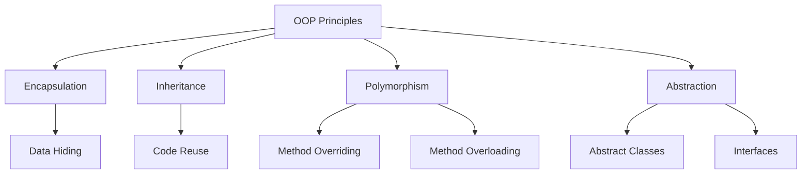

# OOP Principles in Java

## Overview

Object-Oriented Programming (OOP) in Java is based on four fundamental principles: Encapsulation, Inheritance, Polymorphism, and Abstraction. These principles enable developers to create modular, reusable, and maintainable code by modeling real-world entities and their interactions.

## Detailed Explanation

### Encapsulation

Encapsulation is the bundling of data (fields) and methods (functions) that operate on that data into a single unit called a class. It restricts direct access to some of an object's components, which is achieved through access modifiers like `private`, `protected`, `public`, and default (package-private). This promotes data hiding and protects the integrity of the data.

**Benefits:**
- Data protection
- Improved maintainability
- Flexibility in implementation changes

### Inheritance

Inheritance allows a new class (subclass or derived class) to inherit properties and behaviors from an existing class (superclass or base class) using the `extends` keyword. This promotes code reuse and establishes a hierarchical relationship between classes.

**Types of Inheritance in Java:**
- Single inheritance (one subclass from one superclass)
- Multilevel inheritance (subclass inherits from another subclass)
- Hierarchical inheritance (multiple subclasses from one superclass)

**Note:** Java does not support multiple inheritance for classes but allows it through interfaces.

### Polymorphism

Polymorphism, meaning "many forms," allows objects of different classes to be treated as objects of a common superclass. It enables methods to behave differently based on the object that invokes them.

**Types:**
- **Compile-time Polymorphism (Method Overloading):** Multiple methods with the same name but different parameters in the same class.
- **Runtime Polymorphism (Method Overriding):** A subclass provides a specific implementation of a method already defined in its superclass.

### Abstraction

Abstraction focuses on showing only essential features of an object while hiding unnecessary details. It is implemented using abstract classes and interfaces.

- **Abstract Classes:** Cannot be instantiated and may contain abstract methods (without implementation) and concrete methods.
- **Interfaces:** Define a contract for classes to implement, containing abstract methods, default methods, static methods, and constants.

Abstraction helps in reducing complexity and increasing efficiency.



## Real-world Examples & Use Cases

- **Banking System:** Encapsulation for account details, inheritance for different account types (savings, checking), polymorphism for interest calculation methods.
- **E-commerce Platform:** Abstraction for payment processors, inheritance for product categories, polymorphism for discount calculations.
- **Game Development:** Inheritance for character classes, polymorphism for different attack behaviors, encapsulation for player stats.
- **Employee Management System:** Abstraction for employee roles, inheritance for manager/employee hierarchy, encapsulation for salary information.

## Code Examples

### Encapsulation Example

```java
public class BankAccount {
    private String accountNumber;
    private double balance;

    public BankAccount(String accountNumber, double initialBalance) {
        this.accountNumber = accountNumber;
        this.balance = initialBalance;
    }

    public String getAccountNumber() {
        return accountNumber;
    }

    public double getBalance() {
        return balance;
    }

    public void deposit(double amount) {
        if (amount > 0) {
            balance += amount;
        }
    }

    public void withdraw(double amount) {
        if (amount > 0 && amount <= balance) {
            balance -= amount;
        }
    }
}

// Usage
BankAccount account = new BankAccount("123456", 1000.0);
account.deposit(500);
System.out.println("Balance: " + account.getBalance());
```

### Inheritance Example

```java
class Vehicle {
    protected String brand;
    protected int year;

    public Vehicle(String brand, int year) {
        this.brand = brand;
        this.year = year;
    }

    public void start() {
        System.out.println("Vehicle started");
    }

    public void displayInfo() {
        System.out.println("Brand: " + brand + ", Year: " + year);
    }
}

class Car extends Vehicle {
    private int numberOfDoors;

    public Car(String brand, int year, int doors) {
        super(brand, year);
        this.numberOfDoors = doors;
    }

    @Override
    public void start() {
        System.out.println("Car engine started");
    }

    public void displayInfo() {
        super.displayInfo();
        System.out.println("Doors: " + numberOfDoors);
    }
}

// Usage
Car car = new Car("Toyota", 2020, 4);
car.start();
car.displayInfo();
```

### Polymorphism Example

```java
// Method Overloading (Compile-time)
class Calculator {
    public int add(int a, int b) {
        return a + b;
    }

    public double add(double a, double b) {
        return a + b;
    }

    public int add(int a, int b, int c) {
        return a + b + c;
    }
}

// Method Overriding (Runtime)
class Animal {
    public void makeSound() {
        System.out.println("Animal makes a sound");
    }
}

class Dog extends Animal {
    @Override
    public void makeSound() {
        System.out.println("Dog barks");
    }
}

class Cat extends Animal {
    @Override
    public void makeSound() {
        System.out.println("Cat meows");
    }
}

// Usage
Calculator calc = new Calculator();
System.out.println(calc.add(5, 10)); // 15
System.out.println(calc.add(5.5, 10.5)); // 16.0

Animal dog = new Dog();
Animal cat = new Cat();
dog.makeSound(); // Dog barks
cat.makeSound(); // Cat meows
```

### Abstraction Example

```java
abstract class Employee {
    protected String name;
    protected double salary;

    public Employee(String name, double salary) {
        this.name = name;
        this.salary = salary;
    }

    public abstract double calculateBonus();

    public void displayInfo() {
        System.out.println("Name: " + name + ", Salary: " + salary);
    }
}

class Manager extends Employee {
    private double bonusPercentage;

    public Manager(String name, double salary, double bonusPercentage) {
        super(name, salary);
        this.bonusPercentage = bonusPercentage;
    }

    @Override
    public double calculateBonus() {
        return salary * bonusPercentage / 100;
    }
}

class Developer extends Employee {
    private int projectsCompleted;

    public Developer(String name, double salary, int projects) {
        super(name, salary);
        this.projectsCompleted = projects;
    }

    @Override
    public double calculateBonus() {
        return projectsCompleted * 1000; // $1000 per project
    }
}

// Usage
Employee manager = new Manager("Alice", 80000, 10);
Employee developer = new Developer("Bob", 70000, 5);

System.out.println("Manager Bonus: " + manager.calculateBonus());
System.out.println("Developer Bonus: " + developer.calculateBonus());
```

## References

- [Oracle Java Tutorials - Object-Oriented Programming Concepts](https://docs.oracle.com/javase/tutorial/java/concepts/index.html)
- [GeeksforGeeks - OOPs Concepts in Java](https://www.geeksforgeeks.org/object-oriented-programming-oops-concept-in-java/)
- [Baeldung - OOP in Java](https://www.baeldung.com/java-oop)
- [Java OOP Principles - Tutorialspoint](https://www.tutorialspoint.com/java/java_object_classes.htm)

## Github-README Links & Related Topics

- [Java Fundamentals](../java-fundamentals/)
- [Design Patterns in Java](../design-patterns-in-java/)
- [Abstraction in Java](../abstraction-in-java/)
- [Inheritance in Java](../inheritance-in-java/)
- [Encapsulation in Java](../encapsulation-in-java/)