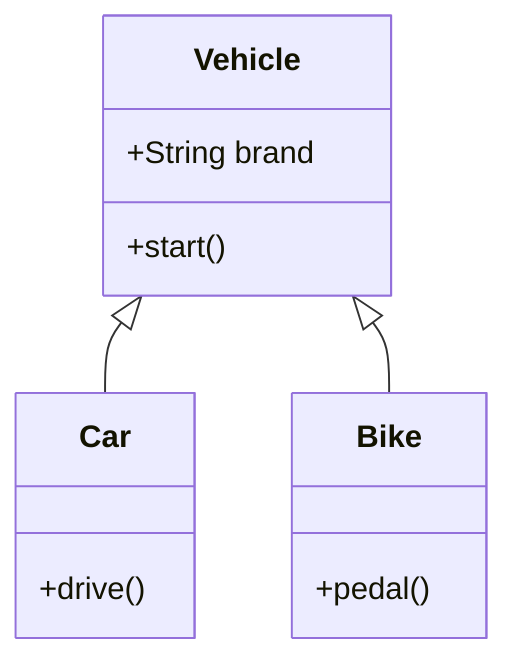

# OOP Principles in Java

## Overview

Object-Oriented Programming (OOP) is a programming paradigm that uses objects and classes to structure software. In Java, OOP is fundamental, built around four core principles: Encapsulation, Inheritance, Polymorphism, and Abstraction. These principles promote code reusability, maintainability, and scalability.

| Principle       | Purpose                  | Key Mechanism          |
|-----------------|--------------------------|------------------------|
| Encapsulation  | Data Hiding             | Access Modifiers      |
| Inheritance    | Code Reuse              | `extends`             |
| Polymorphism   | Flexibility             | Overriding/Overloading |
| Abstraction    | Simplification          | `abstract`, `interface` |

## Detailed Explanation

### Encapsulation

Encapsulation bundles data and methods into a class, restricting access to internal state via access modifiers (`private`, `protected`, `public`). It protects data integrity and promotes modular design.

### Inheritance

Inheritance allows subclasses to inherit properties and behaviors from a superclass using `extends`. It establishes an "is-a" relationship, enabling hierarchical code reuse.

### Polymorphism

Polymorphism enables objects to take multiple forms. Runtime polymorphism uses method overriding (`@Override`), while compile-time uses method overloading. It allows flexible method calls based on object type.

### Abstraction

Abstraction hides implementation details, exposing only essential features. Achieved via abstract classes (cannot be instantiated) and interfaces (contracts for implementation).

## Real-world Examples & Use Cases

- **Encapsulation**: Banking apps use encapsulated account classes to secure balance data, allowing controlled access via methods.
- **Inheritance**: GUI frameworks like Swing have base `Component` classes inherited by `Button` or `TextField` for shared behaviors.
- **Polymorphism**: Payment systems process different payment types (credit card, PayPal) uniformly through a common interface.
- **Abstraction**: Database drivers abstract connection details, allowing code to work with various databases via interfaces.

## Code Examples

### Encapsulation

```java
public class BankAccount {
    private double balance;

    public BankAccount(double initialBalance) {
        this.balance = initialBalance;
    }

    public void deposit(double amount) {
        if (amount > 0) balance += amount;
    }

    public double getBalance() {
        return balance;
    }
}
```

### Inheritance

```java
public class Vehicle {
    protected String brand;

    public Vehicle(String brand) {
        this.brand = brand;
    }

    public void start() {
        System.out.println(brand + " starting...");
    }
}

public class Car extends Vehicle {
    public Car(String brand) {
        super(brand);
    }

    public void drive() {
        System.out.println("Driving " + brand);
    }
}
```



### Polymorphism

```java
interface Payment {
    void process(double amount);
}

class CreditCard implements Payment {
    @Override
    public void process(double amount) {
        System.out.println("Processing credit card payment: $" + amount);
    }
}

class PayPal implements Payment {
    @Override
    public void process(double amount) {
        System.out.println("Processing PayPal payment: $" + amount);
    }
}

// Usage
Payment payment = new CreditCard();
payment.process(100.0); // Processing credit card payment: $100.0
```

### Abstraction

```java
abstract class Shape {
    abstract double area();

    public void display() {
        System.out.println("Shape area: " + area());
    }
}

class Circle extends Shape {
    private double radius;

    public Circle(double radius) {
        this.radius = radius;
    }

    @Override
    double area() {
        return Math.PI * radius * radius;
    }
}
```

## Common Pitfalls & Edge Cases

- **Fragile Base Class Problem**: Changes in superclass can break subclasses; use composition.
- **Multiple Inheritance Dilemma**: Java avoids it with interfaces; design carefully to prevent diamond problem.
- **Over-Abstraction**: Too much abstraction can complicate code; balance with concrete implementations.
- **Access Modifier Misuse**: Overusing `public` defeats encapsulation; prefer `private` with getters/setters.

## References

- [Oracle: Object-Oriented Programming Concepts](https://docs.oracle.com/javase/tutorial/java/concepts/)
- [GeeksforGeeks: OOPs Concepts in Java](https://www.geeksforgeeks.org/object-oriented-programming-oops-concept-in-java/)
- [Baeldung: Object-Oriented Programming in Java](https://www.baeldung.com/java-oop)

## Github-README Links & Related Topics

- [Java Fundamentals](../java/)
- [Java Design Patterns](../java-design-patterns/)
- [SOLID Principles](../solid-principles/)
- [Design Patterns](../design-patterns/)