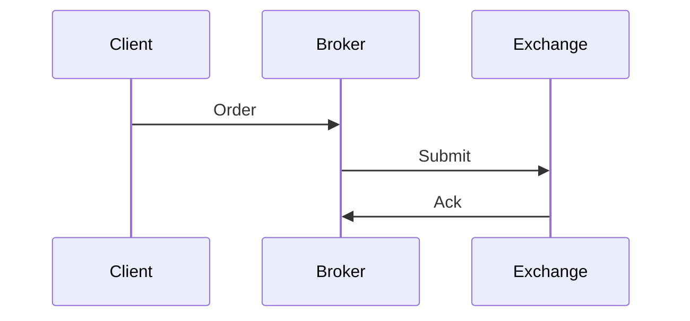

# Overview

Order entry protocols enable the submission, modification, and cancellation of orders to exchanges. They ensure secure, low-latency communication, supporting various order types and routing strategies.

# STAR Summary

**SITUATION:** Manual order entry was slow; electronic systems needed standardized protocols.

**TASK:** Develop protocols for electronic order submission.

**ACTION:** Created FIX for global, OUCH for NASDAQ-specific.

**RESULT:** Enabled automated trading and reduced errors.

# Detailed Explanation

Order entry protocols define the mechanisms for submitting orders to trading venues, ensuring secure, reliable, and low-latency communication. They support various order types (market, limit, stop), time-in-force conditions, and routing instructions.

Key components:
- **Authentication and Session Management:** Establish secure connections using certificates or tokens, with heartbeat mechanisms to maintain sessions.
- **Message Sequencing:** Ensure ordered delivery of messages to prevent out-of-sequence processing that could lead to incorrect executions.
- **Order Validation:** Check for valid symbols, quantities, prices, and compliance with exchange rules before acceptance.
- **Error Handling:** Provide detailed rejection codes for invalid orders, allowing clients to correct and resubmit.
- **Routing and Smart Order Routing (SOR):** Support routing orders to multiple venues based on liquidity, fees, or execution quality.

Protocols like FIX and OUCH differ in encoding (tag-value vs binary) and scope (global vs exchange-specific), but share common goals of reliability and efficiency.

# Real-world Examples & Use Cases

**Institutional Order Routing:** A hedge fund uses FIX to submit a large limit order, routing it across multiple dark pools and lit exchanges to minimize market impact.

**Retail Brokerage:** A broker's API accepts orders from a mobile app, converts them to OUCH messages for NASDAQ execution, with real-time status updates.

**High-Frequency Trading:** HFT firms employ binary protocols like OUCH for sub-millisecond order entry, integrating with co-located servers for minimal latency.

**Case Study: Order Flood Protection**
During a market event, an exchange receives thousands of orders per second. The protocol's sequencing and throttling prevent overload, ensuring fair processing.

# Message Formats / Data Models

**FIX NewOrderSingle Example:**
```
8=FIX.4.4|9=145|35=D|49=CLIENT|56=EXCHANGE|34=1|52=20230926-10:00:00|11=ORD123|55=AAPL|54=1|38=100|40=2|44=150.00|59=0|10=123|
```

**OUCH Enter Order (Binary):**
- Message Type: 'O' (1 byte)
- Order Token: 8 bytes
- Buy/Sell: 1 byte ('B'/'S')
- Shares: 4 bytes
- Stock: 8 bytes (padded)
- Price: 4 bytes (scaled)
- Time-in-Force: 1 byte
- etc.

Data models include order books for validation, with fields for symbol, side, quantity, price, and attributes like display quantity for iceberg orders.

# Journey of a Trade



# Common Pitfalls & Edge Cases

- **Session Disconnects:** Unhandled disconnections can lead to orphaned orders; implement reconnection logic with sequence reset.
- **Invalid Order Rejections:** Common rejections include insufficient balance or halted symbols; monitor rejection codes for automated handling.
- **Time Synchronization Issues:** Clocks must be NTP-synced; mismatches can cause order timestamp errors.
- **Throttling and Rate Limits:** Exceeding exchange limits results in rejections; implement queuing and backoff strategies.
- **Edge Case: Cross Orders** Orders that match internally before hitting the book require special handling to avoid self-trades.

- **Latency Arbitrage:** Exploiting protocol latency differences between venues for profit, requiring ultra-low latency implementations.

# Tools & Libraries

- **QuickFIX (Java/C++):** Open-source FIX engine for session management and message handling.
```java
// Example: Sending NewOrderSingle
Message order = new Message();
order.getHeader().setString(35, "D");
order.setString(55, "AAPL");
order.setChar(54, '1'); // Buy
// Send via session
```

- **OUCH SDK:** NASDAQ-provided libraries for binary message encoding/decoding.

- **FIXimulator:** Testing tool for simulating order entry scenarios.

- **Custom Parsers:** For high-performance, use zero-copy parsing in C++ for binary protocols.

# Github-README Links & Related Topics

- [FIX Protocol](../fix-protocol/README.md)
- [OUCH Protocol](../ouch-protocol/README.md)
- [Order Types](../order-types/README.md)

# References

- FIX Trading Community: https://www.fixtrading.org/standards/
- NASDAQ OUCH Specification: https://www.nasdaqtrader.com/content/technicalsupport/specifications/tradingproducts/ouch5.0.pdf
- Investopedia on Order Entry: https://www.investopedia.com/terms/o/order-entry-system.asp