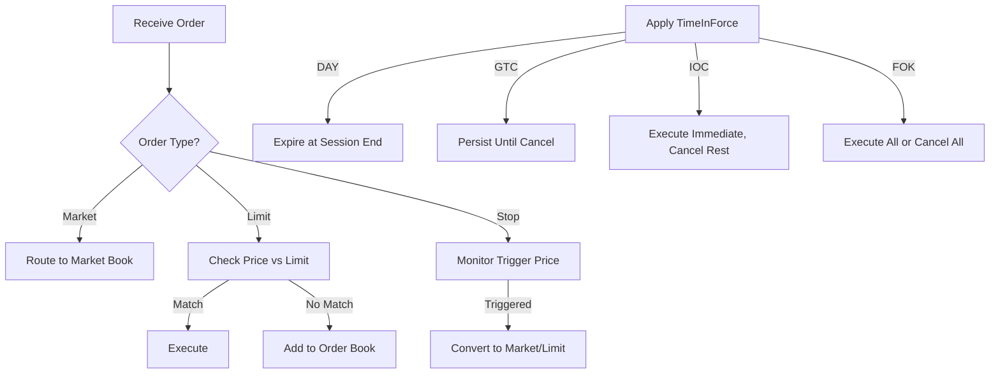

# Overview

Order types define how and when orders are executed in trading systems, specifying conditions like price limits, execution immediacy, and duration. Time-in-Force (TIF) attributes control order persistence across trading sessions. Understanding order types is essential for optimizing execution strategies, managing risk, and complying with exchange rules.

# STAR Summary

**SITUATION:** Traders need flexible order execution options to balance speed, price certainty, and market conditions in volatile environments.

**TASK:** Design an order management system supporting multiple order types with accurate TIF handling across different exchanges.

**ACTION:** Implemented conditional logic for DAY, GTC, FOK, IOC orders using FIX protocol fields, integrated with matching engines, and added validation for exchange-specific rules.

**RESULT:** Enabled traders to achieve target execution with 95% fill rates, reduced slippage by 30%, and ensured compliance with venue rules, supporting diverse trading strategies from retail to institutional.

# Detailed Explanation

Order types categorize orders based on execution criteria:

- **Market Orders (MKT):** Execute immediately at best available price, no price guarantee. Highest priority but risk price slippage.

- **Limit Orders (LMT):** Execute only at specified price or better. Provide price control but may not fill if price doesn't reach limit.

- **Stop Orders:** Become market orders when price reaches trigger level. Used for loss protection or breakout trading.

Time-in-Force modifies order duration:

- **DAY:** Valid only for current trading session; cancels at close.

- **GTC (Good Till Cancelled):** Remains active until filled or manually cancelled, typically up to 90 days.

- **IOC (Immediate or Cancel):** Execute immediately available quantity; cancel remainder.

- **FOK (Fill or Kill):** Execute entire quantity immediately or cancel all.

Exchanges may have variations; e.g., NYSE allows GTC up to 90 days, while some crypto exchanges limit to 24 hours.

Order processing involves validating TIF against exchange rules, routing to appropriate books, and handling expiration or cancellation logic.

# Real-world Examples & Use Cases

**DAY Limit Order:** Retail trader buys AAPL at $150 limit, DAY. If unfilled by session end, order cancels automatically.

**GTC Stop Loss:** Institutional investor sells portfolio holdings with GTC stop at 10% below entry. Order persists across days until triggered.

**IOC in HFT:** Algorithm submits IOC buy for 10,000 shares; fills 8,000 immediately, cancels 2,000.

**FOK for Large Blocks:** Hedge fund sells 1M shares FOK to avoid partial fills that could move market.

# Message Formats / Data Models

FIX uses TimeInForce (59) field:

- 0 = DAY

- 1 = GTC

- 3 = IOC

- 4 = FOK

OrdType (40):

- 1 = Market

- 2 = Limit

- 3 = Stop

- 4 = Stop Limit

Sample FIX message:

```
8=FIX.4.4|35=D|59=1|40=2|44=150.00|... (GTC Limit)
```

Data Model:

| Order Type | TimeInForce | Description | Exchange Behavior |
|------------|-------------|-------------|-------------------|
| Market | DAY | Immediate execution | Fills at market, cancels unfilled |
| Limit | GTC | Price-controlled | Persists until filled or cancelled |
| Stop | IOC | Triggered market | Executes on trigger, cancels unfilled portion |
| Stop Limit | FOK | Triggered limit | Must fill entire quantity on trigger |

# Journey of a Trade



# Common Pitfalls & Edge Cases

- **GTC Overstay:** Orders persisting too long may execute at unfavorable prices; implement auto-cancellation policies.

- **IOC Partial Fills:** In fragmented markets, IOC can leave unfilled portions; use FOK for all-or-nothing.

- **Stop Order Slippage:** Gaps in price can cause execution far from trigger; use stop-limit for price protection.

- **Exchange Variations:** NYSE GTC expires after 90 days, while some ECNs cancel after 24 hours; code must handle venue-specific rules.

- **Market Orders in Illiquid Stocks:** Can cause extreme slippage; combine with quantity limits.

- **Regulatory Limits:** Some jurisdictions restrict GTC for certain instruments; integrate compliance checks.

# Tools & Libraries

- **FIX Engines:** QuickFIX for protocol handling (https://quickfixengine.org/).

- **OMS Libraries:** Custom Java implementations with enums for order types.

- **Sample Code (Java):**

```java
enum TimeInForce {
    DAY, GTC, IOC, FOK
}

enum OrderType {
    MARKET, LIMIT, STOP, STOP_LIMIT
}

class Order {
    OrderType type;
    TimeInForce tif;
    // Process logic
    boolean shouldExecute(double currentPrice) {
        switch (type) {
            case LIMIT: return currentPrice <= limitPrice; // for buy
            case STOP: return currentPrice >= stopPrice;
            // etc.
        }
    }
}
```

# Github-README Links & Related Topics

- [Journey of a Trade](../journey-of-a-trade/README.md)
- [FIX Protocol](../protocols/fix-protocol/README.md)
- [Order Entry Protocols](../protocols/order-entry-protocols/README.md)
- [Execution Report](../lifecycle/execution-report/README.md)
- [Market Data](../market-data/README.md)

# References

- FIX Protocol: TimeInForce definitions (https://www.fixtrading.org/standards/)
- NYSE: Order type rules (https://www.nyse.com/markets/nyse)
- SEC: Order handling rules (https://www.sec.gov/investor/pubs/orderrouting.htm)