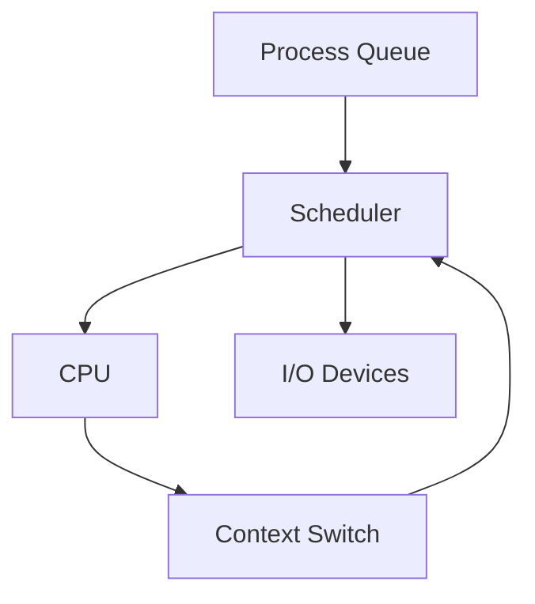
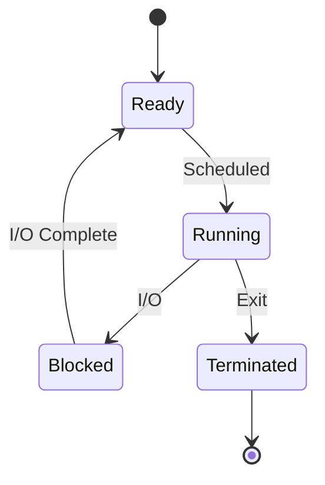

# Operating Systems Concepts

## Overview

Operating systems manage hardware resources and provide services for applications. Key concepts include processes, threads, memory management, and scheduling, essential for understanding concurrency, performance, and system design in interviews.

## STAR Summary

**Situation:** A server application had high CPU usage and slow response times.

**Task:** Optimize resource utilization for better performance.

**Action:** Analyzed process scheduling, switched to preemptive scheduling, and optimized thread pools to reduce context switches.

**Result:** CPU usage dropped by 30%, response times improved by 50%, and system handled more concurrent users.

## Interview Design Case

**Prompt:** Design a process scheduler for an operating system handling mixed workloads (CPU-bound and I/O-bound processes).

**High-Level Design (HLD):**



**Capacity Calculations:**
- Context switch time: 10μs.
- For 100 processes, switching every 10ms: overhead 1% CPU.
- Memory for PCBs: 1KB each, 100 processes: 100KB.

**Tradeoffs:**
- Preemptive vs Cooperative: Preemptive prevents starvation but increases overhead.
- Priority vs Fairness: Priority scheduling efficient but may starve low-priority.
- Multilevel queues: Complex but adaptive to workloads.

**STAR Case Study:** (See STAR Summary above for optimization example.)

## Detailed Explanation

### Processes and Threads

- **Process:** Independent execution unit with its own memory space.
- **Thread:** Lightweight process sharing memory; enables concurrency.

### Memory Management

- Virtual memory: Abstraction allowing larger address spaces.
- Paging: Divides memory into pages; demand paging loads on access.

### Scheduling

- Algorithms: FCFS, SJF, Round Robin, Priority.
- Preemptive vs non-preemptive.

### Concurrency Issues

- Race conditions, deadlocks (Coffman conditions), starvation.

## Real-world Examples & Use Cases

- Web servers: Multi-threaded handling of requests.
- Databases: Process isolation for security.

## Common Interview Questions

- What is the difference between a process and a thread?
- Explain virtual memory and paging.
- How do you prevent deadlocks?
- Describe CPU scheduling algorithms.

## Code Examples

### Java Thread Creation

```java
public class MyThread extends Thread {
    public void run() {
        System.out.println("Thread running");
    }
}

public class Main {
    public static void main(String[] args) {
        MyThread t = new MyThread();
        t.start();
    }
}
```

### Process Fork (in C, but concept)

```c
#include <unistd.h>
int main() {
    pid_t pid = fork();
    if (pid == 0) {
        // Child
    } else {
        // Parent
    }
}
```

## Data Models / Message Formats

Process Control Block (PCB):

| Field | Description |
|-------|-------------|
| PID | Process ID |
| State | Running, Ready, Blocked |
| PC | Program Counter |
| Registers | CPU registers |
| Memory | Virtual memory map |

## Journey / Sequence



## Common Pitfalls & Edge Cases

- Deadlocks: Avoid with resource ordering.
- Thrashing: Excessive paging; increase RAM.
- Priority Inversion: Lower priority holds resource needed by higher.

## Tools & Libraries

- ps, top: Process monitoring.
- strace: System call tracing.
- Valgrind: Memory debugging.

## Github-README Links & Related Topics

[[threads-executors-futures]], [[java-memory-model-and-concurrency]]

Related: [[concurrent-data-structures]], [[performance-tuning-and-profiling]]

## References

- "Operating System Concepts" by Silberschatz
- https://man7.org/linux/man-pages/
</content>
</xai:function_call name="write">
<parameter name="filePath">algorithms/algorithms-and-data-structures/README.md