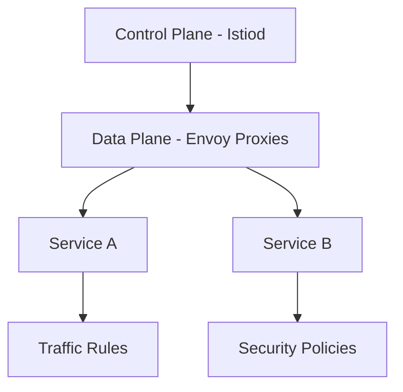

# Istio Service Mesh

## Overview

Istio is an open-source service mesh that provides a uniform way to connect, secure, and observe microservices. It manages traffic between services, enforces policies, and collects telemetry data without requiring changes to application code. Istio is commonly used with Kubernetes to enhance microservices architectures.

## Detailed Explanation

Istio consists of two main components: the data plane (Envoy proxies) and the control plane (Istiod). It provides features like traffic management, security, and observability.

### Key Features

- **Traffic Management**: Load balancing, routing, circuit breakers.
- **Security**: Mutual TLS, authentication, authorization.
- **Observability**: Metrics, logs, traces.
- **Policy Enforcement**: Rate limiting, fault injection.

### Architecture



## Real-world Examples & Use Cases

- **Microservices Communication**: Secure and observe inter-service traffic.
- **Canary Deployments**: Route traffic to new versions gradually.
- **A/B Testing**: Split traffic for testing features.
- **Multi-cloud Deployments**: Manage services across clouds.
- **Compliance**: Enforce security policies across the mesh.

## Code Examples

### Installing Istio

```bash
# Download Istio
curl -L https://istio.io/downloadIstio | sh -

# Add to PATH
export PATH=$PWD/istio-1.20.0/bin:$PATH

# Install Istio
istioctl install --set profile=demo -y
```

### Labeling Namespace for Injection

```bash
kubectl label namespace default istio-injection=enabled
```

### Deploying a Sample Application

```yaml
apiVersion: apps/v1
kind: Deployment
metadata:
  name: httpbin
spec:
  replicas: 1
  selector:
    matchLabels:
      app: httpbin
  template:
    metadata:
      labels:
        app: httpbin
    spec:
      containers:
      - name: httpbin
        image: docker.io/kennethreitz/httpbin
        ports:
        - containerPort: 80
---
apiVersion: v1
kind: Service
metadata:
  name: httpbin
spec:
  ports:
  - port: 8000
    targetPort: 80
    protocol: TCP
    name: http
  selector:
    app: httpbin
```

### Traffic Routing with VirtualService

```yaml
apiVersion: networking.istio.io/v1beta1
kind: VirtualService
metadata:
  name: httpbin
spec:
  http:
  - route:
    - destination:
        host: httpbin
```

### Mutual TLS Policy

```yaml
apiVersion: security.istio.io/v1beta1
kind: PeerAuthentication
metadata:
  name: default
  namespace: default
spec:
  mtls:
    mode: STRICT
```

### Rate Limiting

```yaml
apiVersion: config.istio.io/v1alpha2
kind: handler
metadata:
  name: quotahandler
spec:
  compiledAdapter: memquota
  params:
    quotas:
    - name: requestcount.instance.istio-system
      maxAmount: 5000
      validDuration: 1s
      overrides:
      - dimensions:
          destination: httpbin
        maxAmount: 100
        validDuration: 1s
```

## Common Pitfalls & Edge Cases

- **Performance Overhead**: Envoy proxies add latency; monitor impact.
- **Configuration Complexity**: Complex YAMLs can be error-prone.
- **Resource Consumption**: Proxies consume CPU and memory.
- **Version Compatibility**: Ensure Istio version matches Kubernetes.
- **Security Misconfigurations**: Incorrect policies can expose services.

## Tools & Libraries

- **Istio**: Core service mesh platform.
- **Kiali**: Observability console for Istio.
- **Jaeger**: Distributed tracing integrated with Istio.
- **Prometheus**: Metrics collection.

## References

- [Istio Documentation](https://istio.io/latest/docs/)
- [Istio Concepts](https://istio.io/latest/docs/concepts/)
- [Istio Traffic Management](https://istio.io/latest/docs/concepts/traffic-management/)
- [Service Mesh Patterns](https://www.oreilly.com/library/view/service-mesh-patterns/9781492085155/)

## Github-README Links & Related Topics

- [service-mesh-architecture](service-mesh-architecture/README.md)
- [kubernetes-basics](kubernetes-basics/README.md)
- [microservices-communication-patterns](microservices-communication-patterns/README.md)