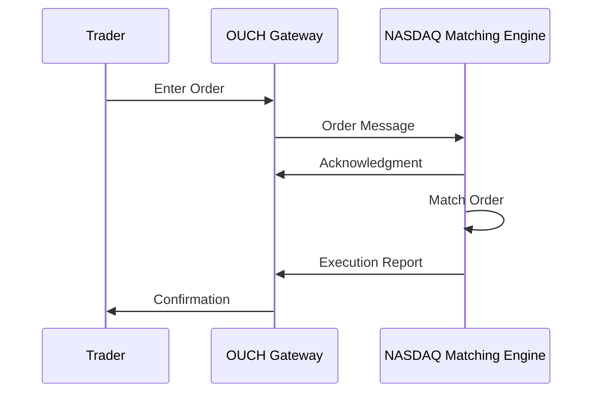

# Overview

OUCH is NASDAQ's binary protocol for electronic order entry, designed for high-performance submission, modification, and cancellation of orders. It provides low-latency connectivity for trading systems requiring rapid execution.

# STAR Summary

**SITUATION:** Traditional text-based protocols introduced latency in high-frequency trading environments.

**TASK:** Develop a binary protocol optimized for speed and efficiency in order entry.

**ACTION:** Created OUCH with compact binary messages and fixed field layouts for minimal parsing overhead.

**RESULT:** OUCH enables sub-millisecond order processing, supporting NASDAQ's high-volume electronic trading.

# Detailed Explanation

OUCH supports:
- **Order Entry:** Submit new orders with full parameters
- **Order Modification:** Change price, quantity, or attributes
- **Order Cancellation:** Remove pending orders
- **Order Status:** Receive confirmations and rejections

Key features:
- **Binary Format:** Fixed-size fields for fast parsing
- **Session Management:** Connection-oriented with sequence numbers
- **Order Tokens:** Unique identifiers for order tracking
- **Routing:** Support for different order types and destinations

Message types include Enter Order ('O'), Replace Order ('U'), Cancel Order ('X').

# Real-world Examples & Use Cases

OUCH is used by:
- **HFT Firms:** Co-located systems for minimal latency
- **Market Makers:** Rapid order management for liquidity
- **Algorithmic Traders:** Automated order entry strategies
- **Broker Systems:** Client order routing

Example: An HFT algorithm uses OUCH to enter orders within 10 microseconds of signal detection.

# Message Formats / Data Models

OUCH messages are binary with big-endian byte order.

## Enter Order ('O')

| Field | Size | Description |
|-------|------|-------------|
| Message Type | 1 byte | 'O' |
| Order Token | 14 bytes | Unique order ID |
| Side | 1 byte | 'B' or 'S' |
| Quantity | 4 bytes | Order quantity |
| Symbol | 8 bytes | Stock symbol |
| Price | 4 bytes | Price * 100 |
| Time-in-Force | 1 byte | '0'=Day |
| Firm | 4 bytes | Firm ID |
| Display | 1 byte | 'Y' or 'N' |
| Capacity | 1 byte | 'P'=Principal |
| ISO | 1 byte | 'Y' or 'N' |
| Min Qty | 4 bytes | Minimum quantity |
| Cross Type | 1 byte | Cross type |
| Customer Type | 1 byte | Customer type |

Sample hex: 4F [14-byte token] 42 00 00 03 E8 41 41 50 4C 20 20 20 20 00 00 96 00 30 [firm] 59 50 4E 00 00 00 00 00 00

## Cancel Order ('X')

| Field | Size | Description |
|-------|------|-------------|
| Message Type | 1 byte | 'X' |
| Order Token | 14 bytes | Order to cancel |
| Quantity | 4 bytes | Quantity to cancel |

# Journey of a Trade



# Common Pitfalls & Edge Cases

- **Token Management:** Ensure unique tokens; collisions cause rejections
- **Binary Encoding:** Precise field alignment required
- **Rate Limits:** NASDAQ enforces order frequency limits
- **Session Recovery:** Handle reconnections without duplicate orders
- **Order Routing:** Correct firm/routing codes for execution
- **Time Sensitivity:** Orders must arrive within market hours

# Tools & Libraries

- **OUCH SDK:** NASDAQ-provided C++ libraries
- **Protocol Parsers:** Custom decoders for monitoring
- **Testing Environments:** NASDAQ certification systems

Sample C++ code snippet:

```cpp
#include <ouch_messages.h>

// Create Enter Order message
EnterOrderMessage msg;
msg.type = 'O';
memcpy(msg.orderToken, "TOKEN12345678", 14);
msg.side = 'B';
msg.quantity = htonl(1000);
memcpy(msg.symbol, "AAPL    ", 8);
msg.price = htonl(15025);  // 150.25 * 100
msg.timeInForce = '0';
msg.display = 'N';
// Send via TCP socket
send(sock, &msg, sizeof(msg), 0);
```

# Github-README Links & Related Topics

[FIX Protocol](../fix-protocol/)

[ITCH Protocol](../itch-protocol/)

[Market Data (overview & dissemination)](../market-data/market-data-overview-dissemination/)

[Order Entry Protocols](../order-entry-protocols/)

[Execution Report](../compliance/execution-report/)

[Journey of a Trade](../lifecycle/journey-of-a-trade/)

# References

- [NASDAQ OUCH Specification](https://www.nasdaqtrader.com/content/technicalsupport/specifications/TradingProducts/OUCH4.2.pdf)
- [OUCH Protocol Overview](https://www.nasdaq.com/solutions/technology-innovation/trading-protocols)
- [Order Entry Best Practices](https://www.fixtrading.org/resources/recommended-practices/)