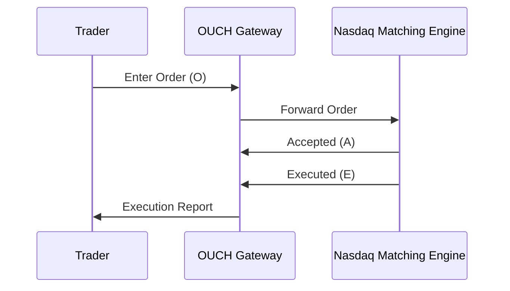

# OUCH Protocol

## Overview

The OUCH protocol is a binary order entry protocol developed by Nasdaq for submitting and managing orders on Nasdaq markets. OUCH stands for "Nasdaq OUCH" and is designed for high-speed, low-latency order routing. It is used by brokers and traders to send orders directly to Nasdaq's matching engines, supporting various order types and execution instructions.

OUCH uses a compact binary format to minimize message size and transmission time. It supports order entry, cancellation, and modification, with responses indicating acceptance, rejection, or execution. Unlike FIX, OUCH is Nasdaq-specific and optimized for their trading systems.

## STAR Summary

**S: Situation** - As electronic trading grew in the 1990s, Nasdaq needed a proprietary protocol for direct order entry that could handle high volumes with minimal latency.

**T: Task** - Develop a binary protocol for efficient order submission and management on Nasdaq exchanges.

**A: Action** - Nasdaq created OUCH, evolving it through versions to support more order types and features, integrating with their matching engine.

**R: Result** - OUCH enables direct market access with sub-millisecond latencies, used by institutional traders and HFT firms for optimal execution on Nasdaq.

## Detailed Explanation

OUCH operates over TCP connections, with each message being a fixed-length binary structure. Messages are sent from client to server, with acknowledgments and executions returned.

Key components:

- **Message Types**:
  - Enter Order (O): Submit a new order.
  - Cancel Order (C): Cancel an existing order.
  - Modify Order (M): Change order parameters.
  - Replace Order (U): Replace an order with a new one.

- **Order Types**: Market, Limit, Stop, with time-in-force options.

- **Responses**: Accepted (A), Rejected (J), Executed (E), Canceled (C), etc.

- **Sequence Numbers**: For ordering and gap detection.

OUCH supports Nasdaq-specific features like attribution for market makers and routing instructions.

## Real-world Examples & Use Cases

1. **Direct Market Access**: Institutional traders use OUCH for DMA to Nasdaq, bypassing intermediaries.

2. **High-Frequency Trading**: HFT algorithms send orders via OUCH for rapid execution.

3. **Order Management**: Brokers manage client orders using OUCH for modifications and cancellations.

## Message Formats / Data Models

Enter Order message structure:

- Type: 'O' (1 byte)
- Order Token: 14 bytes (unique ID)
- Buy/Sell: 1 byte
- Shares: 4 bytes
- Stock: 8 bytes
- Price: 4 bytes
- Time-in-Force: 1 byte
- etc.

Example: Enter limit buy order for 100 AAPL at $150.

## Journey of a Trade



## Common Pitfalls & Edge Cases

1. **Connection Management**: TCP disconnections require reconnection and order resubmission.

2. **Order Tokens**: Must be unique; duplicates cause rejections.

3. **Rate Limits**: High-frequency sending may hit throttling.

4. **Market Hours**: Orders outside trading hours are rejected.

## Tools & Libraries

- Nasdaq OUCH SDK: Official tools for integration.
- Open-source parsers in Python/C++.

Sample code:

```python
# Simplified OUCH Enter Order
message = b'O' + token + b'B' + shares.to_bytes(4, 'big') + symbol.encode() + price_bytes
```

## Github-README Links & Related Topics

[[FIX Protocol]]
[[ITCH Protocol]]
[[Market Data]]
[[Order Entry Protocols]]
[[Execution Report]]

## References

- [Nasdaq OUCH Specification](https://www.nasdaqtrader.com/Trader.aspx?id=OUCH)
- [OUCH Protocol Guide](https://www.nasdaqtrader.com/content/technicalsupport/specifications/dataproducts/Ouch4.2.pdf)