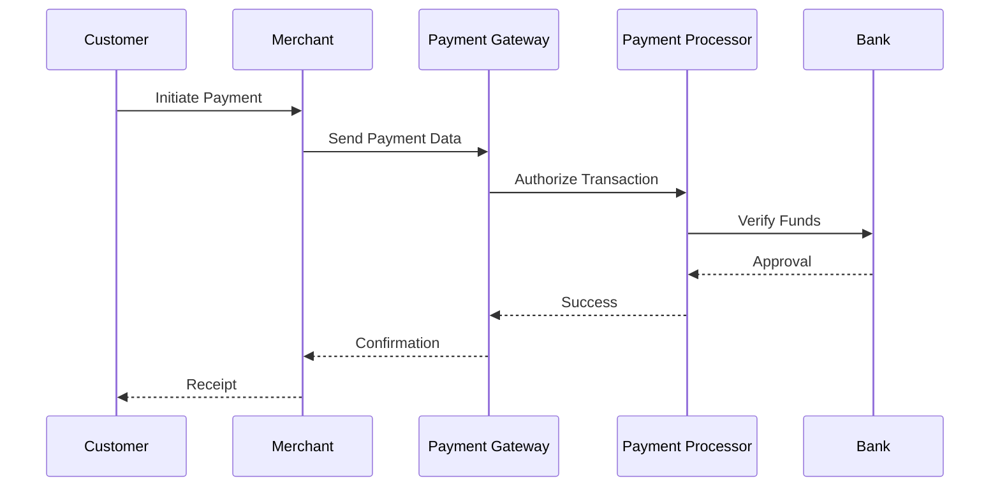

# Payment Systems

## Overview

Payment systems are the backbone of financial transactions in digital platforms, enabling secure, reliable, and scalable processing of payments between parties. They handle everything from credit card transactions to digital wallets, ensuring compliance with regulations and minimizing fraud.

## Detailed Explanation

### Architecture Components

- **Payment Gateway**: Acts as the intermediary, encrypting sensitive data and forwarding it to payment processors.
- **Payment Processor**: Manages transaction authorization, settlement, and communication with banks.
- **Banks and Financial Institutions**: Include acquiring banks (merchant's bank) and issuing banks (customer's bank).
- **Card Networks**: Organizations like Visa or Mastercard that route transactions.

### Transaction Lifecycle

1. **Initiation**: Customer provides payment details.
2. **Authorization**: Gateway sends request to processor, which checks with issuing bank.
3. **Capture**: Funds are held or transferred.
4. **Settlement**: Final transfer of funds occurs.
5. **Reconciliation**: Matching transactions for accounting.

### Challenges

- **Scalability**: Handling millions of transactions per second.
- **Security**: Protecting against breaches and fraud.
- **Compliance**: Adhering to standards like PCI DSS.

## Real-world Examples & Use Cases

- **E-commerce**: Platforms like Shopify integrate payment systems for seamless checkout.
- **Ride-sharing**: Uber processes payments for rides using integrated gateways.
- **Subscription Models**: Services like Spotify use recurring billing through payment systems.
- **Peer-to-peer**: Venmo allows users to send money securely.

## Code Examples

### Java: Basic Payment Validation

```java
import java.util.regex.Pattern;

public class PaymentValidator {
    private static final Pattern CARD_PATTERN = Pattern.compile("\\d{13,19}");

    public static boolean isValidCardNumber(String cardNumber) {
        return CARD_PATTERN.matcher(cardNumber).matches() && luhnCheck(cardNumber);
    }

    private static boolean luhnCheck(String cardNumber) {
        int sum = 0;
        boolean alternate = false;
        for (int i = cardNumber.length() - 1; i >= 0; i--) {
            int n = Integer.parseInt(cardNumber.substring(i, i + 1));
            if (alternate) {
                n *= 2;
                if (n > 9) n = (n % 10) + 1;
            }
            sum += n;
            alternate = !alternate;
        }
        return (sum % 10) == 0;
    }
}
```

### Mermaid Diagram: Payment Flow



## Common Pitfalls & Edge Cases

- **Fraud Detection**: False positives in fraud alerts.
- **Currency Fluctuations**: Handling multi-currency transactions.
- **Network Failures**: Ensuring idempotency in retries.
- **Regulatory Changes**: Adapting to new laws like GDPR or PSD2.

## Tools & Libraries

- Stripe SDK for Java
- PayPal Java SDK
- Braintree API

## References

- [PCI Security Standards](https://www.pcisecuritystandards.org/)
- [Stripe API Reference](https://stripe.com/docs/api)
- [Payment System Architecture](https://martinfowler.com/articles/payment-system.html)

## Github-README Links & Related Topics

- [User Authentication](user-authentication/README.md)
- [Distributed Transactions](system-design/distributed-transactions/README.md)
- [Security in Distributed Systems](system-design/security-in-distributed-systems/README.md)