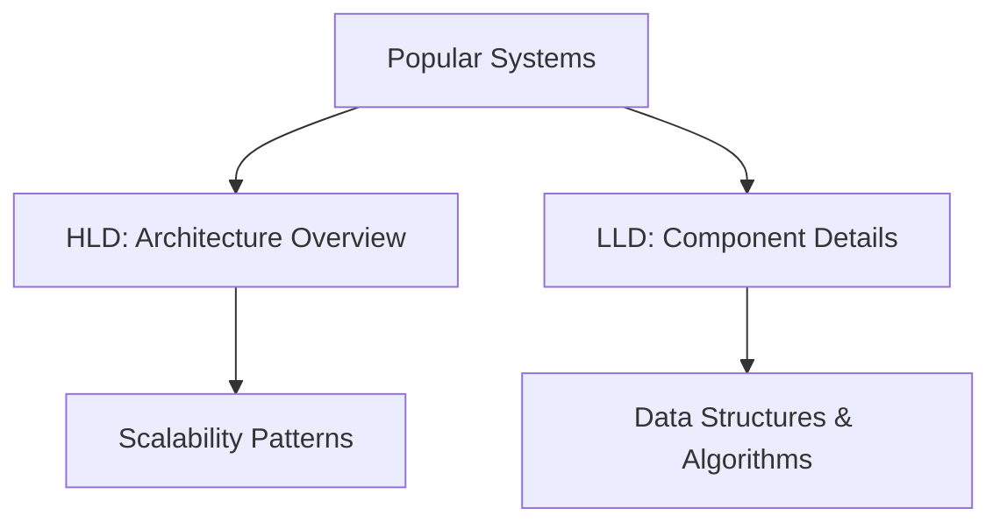
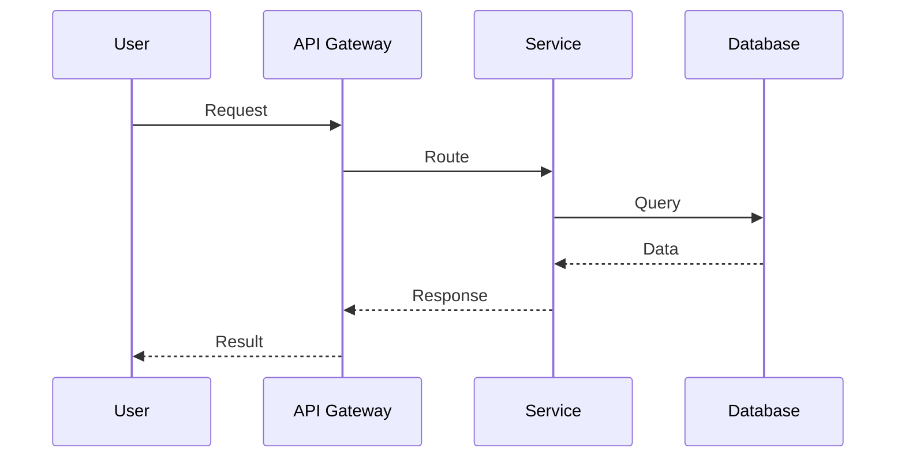

## Overview

Popular system designs encompass real-world architectures for large-scale applications, often discussed in technical interviews. This topic explores both High Level Design (HLD) for overall architecture and Low Level Design (LLD) for component details, using examples from major platforms like URL shorteners, video streaming, and social networks.

## Detailed Explanation

System designs are categorized into HLD, which outlines the system's structure, components, and interactions at a high level, and LLD, which delves into the implementation details of individual components, including classes, algorithms, and data flows.

Popular designs typically address scalability, reliability, and performance challenges. Below is a curated list of frequently encountered system designs, with brief HLD overviews and links to detailed READMEs.

### Popular System Designs

| System | HLD Overview | Key Challenges |
|--------|--------------|----------------|
| URL Shortener | API Gateway -> Service -> Database; handles encoding, redirection, analytics. | Collision avoidance, high availability. |
| Netflix Video Streaming | CDN -> API -> Microservices -> Storage; adaptive bitrate, recommendations. | Global distribution, low latency. |
| Twitter | Load Balancer -> API -> Timeline Service -> Database; fan-out on write. | High write throughput, real-time feeds. |
| Instagram | CDN -> API -> Feed Service -> Sharded DB; image processing pipeline. | Media storage, user engagement. |
| Facebook News Feed | Edge Servers -> Graph API -> Feed Ranking -> Cache/DB. | Personalized ranking, massive scale. |
| WhatsApp | Gateway -> Message Service -> Sharded DB; end-to-end encryption. | Real-time messaging, privacy. |
| YouTube | CDN -> API -> Video Processing -> Distributed Storage. | Video transcoding, global reach. |
| TikTok | Recommendation Engine -> API -> Video Service -> Cache. | Viral content discovery. |
| Discord | WebSocket Gateway -> API -> Sharded Services; voice/video routing. | Real-time communication. |
| Slack | API -> Message Bus -> Channels -> DB; integrations. | Team collaboration, integrations. |
| Zoom | Media Servers -> API -> Signaling; peer-to-peer/WebRTC. | Video conferencing, scalability. |
| Google Maps | Geospatial DB -> API -> Routing Service; real-time updates. | Location accuracy, traffic data. |
| Amazon E-commerce | Load Balancer -> Microservices -> Inventory/DB; recommendations. | Transaction volume, personalization. |
| LinkedIn | Graph DB -> API -> Network Service; job matching. | Professional networking. |
| Dropbox | Sync Service -> API -> Distributed FS; deduplication. | File storage, synchronization. |
| Spotify | CDN -> API -> Recommendation Engine -> Distributed Storage. | Music streaming, personalization. |
| Payment Systems | API Gateway -> Payment Processor -> Secure DB; PCI compliance. | Security, transactions. |
| IoT System Design | Edge Gateways -> API -> Analytics Service -> Time-series DB. | Sensor data, real-time processing. |
| Real-time Analytics | Stream Processor -> API -> Dashboard; event-driven. | Data pipelines, insights. |



## Real-world Examples & Use Cases

- **URL Shortener**: Used by bit.ly; HLD focuses on hash functions for shortening, LLD on collision resolution.
- **Video Streaming**: Netflix serves billions of hours; HLD includes CDNs for delivery, LLD on buffering algorithms.
- **Social Networks**: Twitter handles 500M tweets/day; HLD for timeline generation, LLD for ranking feeds.
- **Messaging Apps**: WhatsApp with 2B users; HLD for message routing, LLD for encryption protocols.
- **E-commerce**: Amazon processes millions of orders; HLD for inventory management, LLD for recommendation engines.

## Code Examples

### Simple URL Shortener (LLD Example)

```java
public class UrlShortener {
    private Map<String, String> urlMap = new HashMap<>();
    private Map<String, String> shortMap = new HashMap<>();
    private static final String BASE = "http://short.ly/";

    public String shorten(String longUrl) {
        if (shortMap.containsKey(longUrl)) {
            return shortMap.get(longUrl);
        }
        String shortUrl = BASE + generateHash(longUrl);
        urlMap.put(shortUrl, longUrl);
        shortMap.put(longUrl, shortUrl);
        return shortUrl;
    }

    public String expand(String shortUrl) {
        return urlMap.get(shortUrl);
    }

    private String generateHash(String url) {
        return Integer.toHexString(url.hashCode());
    }
}
```

### High-Level HLD Diagram (Conceptual)

```
User -> API Gateway -> Shortener Service -> Database
                      -> Redirect Service
```

## Journey / Sequence



## Data Models / Message Formats

(The table in Detailed Explanation serves as data models for various systems.)

## Common Pitfalls & Edge Cases

- **Over-engineering:** Designing complex systems for simple problems.
- **Ignoring Scalability:** Not planning for growth from day one.
- **Security Oversights:** Failing to incorporate authentication and encryption.
- **Data Consistency Issues:** Not handling distributed data properly.
- **Edge Cases:** Network partitions, high concurrency, data migration.

## Tools & Libraries

- **Frameworks:** Spring Boot (Java), Django (Python), Express.js (Node.js)
- **Databases:** PostgreSQL, MongoDB, Cassandra
- **Caching:** Redis, Memcached
- **Message Queues:** Apache Kafka, RabbitMQ
- **Cloud Platforms:** AWS, Google Cloud, Azure
- **Monitoring:** Prometheus, Grafana

## STAR Summary

**Situation:** In technical interviews, candidates frequently propose inadequate architectures for popular systems.

**Task:** As a senior engineer, I needed to guide candidates through proper HLD and LLD for systems like URL shorteners.

**Action:** I emphasized key components, scalability patterns, and trade-offs, using diagrams and code examples to illustrate points.

**Result:** Candidates improved their design skills, and the team hired engineers capable of building robust, scalable systems.

## References

- [System Design Primer](https://github.com/donnemartin/system-design-primer)
- [Grokking the System Design Interview](https://www.educative.io/courses/grokking-the-system-design-interview)
- [AWS Architecture Center](https://aws.amazon.com/architecture/)
- [Martin Kleppmann: Designing Data-Intensive Applications](https://dataintensive.net/)

## Github-README Links & Related Topics

- [URL Shortener System Design](url-shortener-system-design/)
- [Netflix Video Streaming Architecture](netflix-video-streaming-architecture/)
- [Twitter System Design](twitter-system-design/)
- [Instagram System Design](instagram-system-design/)
- [Facebook News Feed](facebook-news-feed/)
- [WhatsApp Messaging System](whatsapp-messaging-system/)
- [YouTube System Design](youtube-system-design/)
- [TikTok System Design](tiktok-system-design/)
- [Discord System Design](discord-system-design/)
- [Slack Messaging System](slack-messaging-system/)
- [Zoom Video Conferencing](zoom-video-conferencing/)
- [Google Maps System Design](google-maps-system-design/)
- [Amazon E-commerce Platform](amazon-e-commerce-platform/)
- [LinkedIn Social Network](linkedin-social-network/)
- [Dropbox File Storage](dropbox-file-storage/)
- [LLD HLD Basics](lld-hld-basics/)
- [System Design Basics](system-design-basics/)