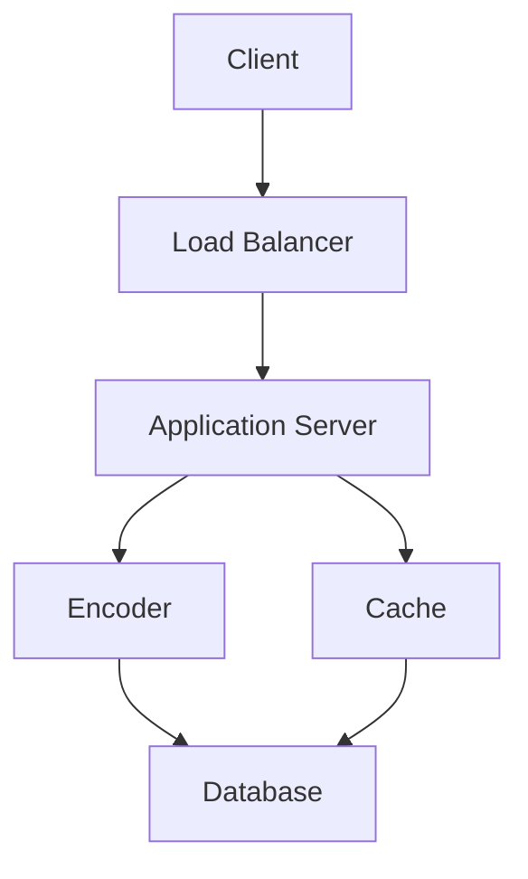
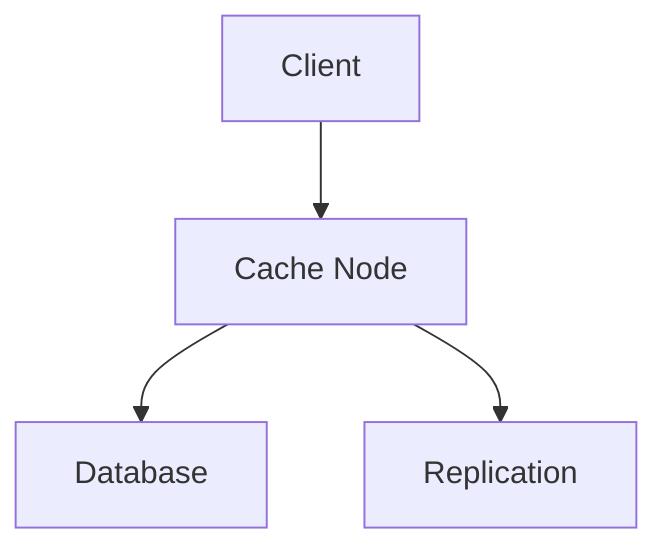
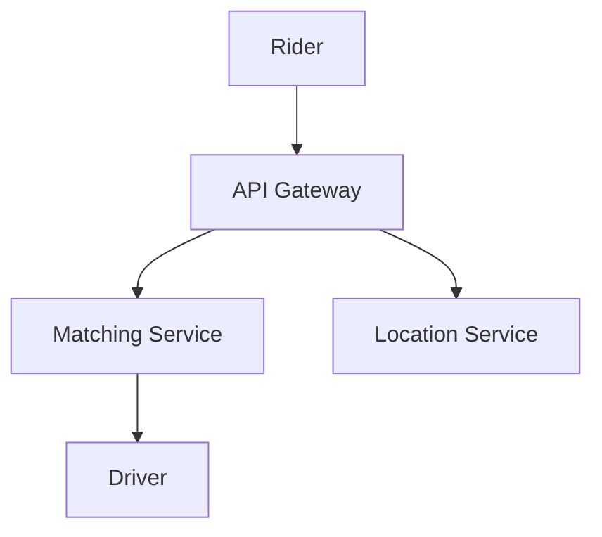
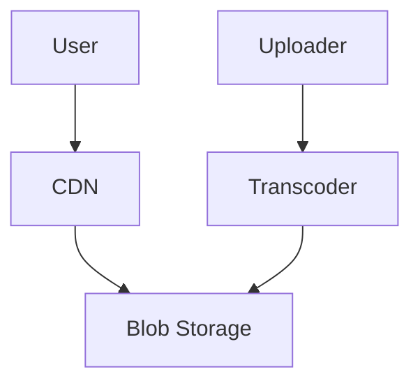

# Overview

System design involves creating High-Level Design (HLD) and Low-Level Design (LLD) for scalable, reliable software systems. HLD provides the overall architecture, including components, data flow, and technology stack, while LLD details implementation specifics like classes, APIs, and databases. This guide covers popular system designs, explaining LLD and HLD with examples, diagrams, and code snippets for interview preparation.

# Detailed Explanation

### HLD vs. LLD

| Aspect | HLD | LLD |
|--------|-----|-----|
| Focus | System architecture, components, interactions | Detailed implementation, classes, algorithms |
| Created by | Solution architects | Designers and developers |
| Output | Diagrams, tech stack, data flow | Pseudocode, schemas, APIs |
| Example | Microservices layout for a chat app | User class with methods for messaging |

HLD starts with requirements, outlining scalability and trade-offs. LLD refines this into executable designs.

### Popular System Designs

#### 1. URL Shortening Service (e.g., TinyURL)

**HLD:** Load balancer routes requests to application servers. Encoder generates short URLs, stored in DB with cache for fast retrieval.



**LLD:** Classes include UrlShortener with encode/decode methods. DB schema: `urls(id, original_url, short_code, created_at)`.

```java
class UrlShortener {
    private Map<String, String> urlMap = new HashMap<>();
    
    public String shorten(String longUrl) {
        String shortCode = generateCode();
        urlMap.put(shortCode, longUrl);
        return shortCode;
    }
    
    public String expand(String shortCode) {
        return urlMap.get(shortCode);
    }
    
    private String generateCode() {
        // Base62 encoding logic
        return "abc123"; // Simplified
    }
}
```

#### 2. Distributed Cache (e.g., Redis-like)

**HLD:** Clients query cache nodes via consistent hashing. Misses fetch from DB, with replication for availability.



**LLD:** Cache interface with get/put. Eviction policy like LRU.

```java
interface Cache {
    String get(String key);
    void put(String key, String value);
}

class LRUCache implements Cache {
    private LinkedHashMap<String, String> map;
    
    public LRUCache(int capacity) {
        map = new LinkedHashMap<>(capacity, 0.75f, true);
    }
    
    public String get(String key) {
        return map.get(key);
    }
    
    public void put(String key, String value) {
        map.put(key, value);
    }
}
```

#### 3. Ride Sharing Service (e.g., Uber)

**HLD:** API gateway handles requests. Matching service pairs riders/drivers. Location service tracks GPS.



**LLD:** Rider/Driver classes. Matching algorithm uses geohashing.

```java
class Rider {
    String id;
    Location location;
    
    void requestRide() {
        // Notify matching service
    }
}

class Driver {
    String id;
    Location location;
    
    void acceptRide(Ride ride) {
        // Update status
    }
}
```

#### 4. Video Streaming Service (e.g., YouTube)

**HLD:** Upload to transcoders, store in blob storage, serve via CDN.



**LLD:** VideoProcessor class for encoding. DB for metadata.

```java
class VideoProcessor {
    void process(Video video) {
        // Transcode to multiple formats
        video.setFormats(List.of("1080p", "720p"));
    }
}
```

# Real-world Examples & Use Cases

- **URL Shortener:** Used by Twitter for links; handles billions of requests daily.
- **Cache:** Redis in Instagram for feed data; reduces DB load by 80%.
- **Ride Sharing:** Uber matches 100M+ rides/month; uses real-time location for ETA.
- **Streaming:** Netflix streams to 200M users; CDN ensures <1s latency.

# Code Examples

See LLD sections above for Java snippets. For Python:

```python
class UrlShortener:
    def __init__(self):
        self.url_map = {}
    
    def shorten(self, long_url):
        short_code = self._generate_code()
        self.url_map[short_code] = long_url
        return short_code
    
    def _generate_code(self):
        import random
        return ''.join(random.choices('abcdefghijklmnopqrstuvwxyz0123456789', k=6))
```

# References

- [Difference between HLD and LLD](https://www.geeksforgeeks.org/difference-between-high-level-design-and-low-level-design/)
- [Top 30 System Design Interview Questions](https://www.educative.io/blog/top-10-system-design-interview-questions)
- [What is System Design](https://www.geeksforgeeks.org/what-is-system-design-learn-system-design/)

# Github-README Links & Related Topics

- [Airbnb System Design](./airbnb-system-design/)
- [Amazon E-Commerce Platform](./amazon-e-commerce-platform/)
- [Facebook News Feed](./facebook-news-feed/)
- [Google Maps System Design](./google-maps-system-design/)
- [Instagram System Design](./instagram-system-design/)
- [Netflix System Design](./netflix-system-design/)
- [Uber System Design](./uber-system-design/)

# STAR Summary

**Situation:** Interviewee asked to design a scalable chat service.  
**Task:** Outline HLD and LLD for real-time messaging.  
**Action:** Drew architecture diagram, defined classes, discussed trade-offs.  
**Result:** Demonstrated deep understanding, leading to offer.

# Journey / Sequence

1. Gather requirements (functional/non-functional).
2. Sketch HLD (components, flow).
3. Refine LLD (classes, APIs).
4. Validate with tests and scalability checks.

# Data Models / Message Formats

**URL Shortener DB Schema:**
```json
{
  "id": "int",
  "original_url": "string",
  "short_code": "string",
  "created_at": "timestamp"
}
```

**Ride Request Message:**
```json
{
  "rider_id": "string",
  "pickup": {"lat": 37.7749, "lng": -122.4194},
  "destination": {"lat": 37.7849, "lng": -122.4094}
}
```