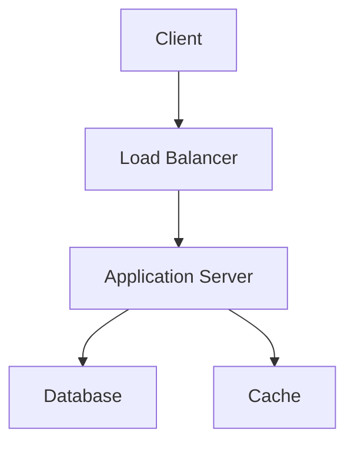

# Popular Systems Design Examples

## Overview

This topic covers popular system design examples, focusing on Low Level Design (LLD) and High Level Design (HLD) for real-world systems. It includes case studies of systems like URL Shortener, Netflix Video Streaming, and others, demonstrating how to approach system design interviews and real-world architecture.

## Detailed Explanation

### LLD vs HLD

- **High Level Design (HLD):** Focuses on the overall architecture, components, and their interactions. It answers "what" the system does.

- **Low Level Design (LLD):** Dives into the details of each component, data structures, algorithms, and class designs. It answers "how" the system works.

### Key Concepts

- Requirements gathering
- Capacity estimation
- Data modeling
- API design
- Scalability considerations
- Fault tolerance

### Example Systems

1. **URL Shortener**

   - HLD: Client -> Load Balancer -> Application Servers -> Database
   - LLD: Hash function for shortening, base62 encoding, database schema

2. **Netflix Video Streaming**

   - HLD: CDN, Microservices, Recommendation Engine
   - LLD: Video encoding, adaptive bitrate streaming

3. **Twitter (now X)**

   - HLD: Timeline generation, fan-out on write
   - LLD: Tweet storage, follower graph

4. **Instagram**

   - HLD: Photo storage, feed generation
   - LLD: Image processing, caching strategies

5. **Uber**

   - HLD: Ride matching, location services
   - LLD: Geospatial indexing, real-time updates



## Real-world Examples & Use Cases

- **E-commerce Platforms:** Like Amazon, handling millions of transactions
- **Social Media:** Facebook, handling billions of users and posts
- **Ride Sharing:** Uber, matching drivers and riders in real-time
- **Video Streaming:** Netflix, YouTube, delivering content globally
- **Messaging:** WhatsApp, Slack, real-time communication

## Code Examples

### URL Shortener LLD in Java

```java
import java.util.HashMap;
import java.util.Map;

public class URLShortener {
    private Map<String, String> urlMap;
    private Map<String, String> shortToLong;
    private static final String BASE62 = "0123456789abcdefghijklmnopqrstuvwxyzABCDEFGHIJKLMNOPQRSTUVWXYZ";
    private int counter;

    public URLShortener() {
        urlMap = new HashMap<>();
        shortToLong = new HashMap<>();
        counter = 1;
    }

    public String shortenURL(String longURL) {
        if (urlMap.containsKey(longURL)) {
            return urlMap.get(longURL);
        }
        String shortURL = encode(counter++);
        urlMap.put(longURL, shortURL);
        shortToLong.put(shortURL, longURL);
        return shortURL;
    }

    public String expandURL(String shortURL) {
        return shortToLong.get(shortURL);
    }

    private String encode(int num) {
        StringBuilder sb = new StringBuilder();
        while (num > 0) {
            sb.append(BASE62.charAt(num % 62));
            num /= 62;
        }
        return sb.reverse().toString();
    }
}
```

### Simple Feed Generation (Twitter-like)

```java
import java.util.*;

public class TwitterFeed {
    private Map<Integer, List<Integer>> followers;
    private Map<Integer, List<Tweet>> userTweets;
    private int tweetId;

    public TwitterFeed() {
        followers = new HashMap<>();
        userTweets = new HashMap<>();
        tweetId = 0;
    }

    public void postTweet(int userId, String content) {
        Tweet tweet = new Tweet(tweetId++, content, System.currentTimeMillis());
        userTweets.computeIfAbsent(userId, k -> new ArrayList<>()).add(tweet);
    }

    public List<Tweet> getNewsFeed(int userId) {
        List<Tweet> feed = new ArrayList<>();
        Set<Integer> followees = new HashSet<>(followers.getOrDefault(userId, new ArrayList<>()));
        followees.add(userId); // Include own tweets

        for (int followee : followees) {
            if (userTweets.containsKey(followee)) {
                feed.addAll(userTweets.get(followee));
            }
        }

        feed.sort((a, b) -> Long.compare(b.timestamp, a.timestamp));
        return feed.subList(0, Math.min(10, feed.size()));
    }

    public void follow(int followerId, int followeeId) {
        followers.computeIfAbsent(followerId, k -> new ArrayList<>()).add(followeeId);
    }

    static class Tweet {
        int id;
        String content;
        long timestamp;

        Tweet(int id, String content, long timestamp) {
            this.id = id;
            this.content = content;
            this.timestamp = timestamp;
        }
    }
}
```

## Common Pitfalls & Edge Cases

- **Hot Keys:** In sharding, some keys may be accessed more frequently
- **Thundering Herd:** Many requests hitting cache miss simultaneously
- **Data Consistency:** Ensuring consistency in distributed systems
- **Scalability Limits:** Database connections, network bandwidth
- **Security:** Protecting user data, preventing DDoS

## Tools & Libraries

- **Databases:** PostgreSQL, MongoDB, Cassandra
- **Caching:** Redis, Memcached
- **Message Queues:** Kafka, RabbitMQ
- **Load Balancers:** Nginx, HAProxy
- **Monitoring:** Prometheus, Grafana

## References

- [System Design Interview Guide](https://github.com/donnemartin/system-design-primer)
- [Grokking the System Design Interview](https://www.educative.io/courses/grokking-the-system-design-interview)
- [Designing Data-Intensive Applications](https://dataintensive.net/)

## Github-README Links & Related Topics

- [System Design Basics](../system-design-basics/README.md)
- [High Scalability Patterns](../high-scalability-patterns/README.md)
- [CAP Theorem & Distributed Systems](../cap-theorem-and-distributed-systems/README.md)
- [Caching](../caching/README.md)
- [Load Balancing and Strategies](../load-balancing-and-strategies/README.md)