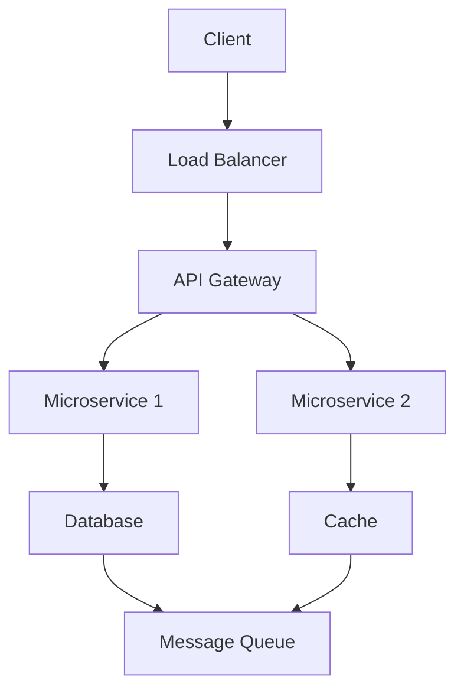

# Popular Systems Design LLD HLD

## Overview

This folder contains examples of popular system designs, focusing on both Low-Level Design (LLD) and High-Level Design (HLD). LLD emphasizes detailed component interactions, data structures, and algorithms for specific features, while HLD outlines the overall architecture, scalability, and system components. These examples are essential for interview preparation, covering real-world applications like URL shorteners, streaming platforms, and social media systems.

The folder structure organizes each system into subfolders (e.g., `url-shortener/`, `netflix/`) with HLD diagrams, LLD code snippets, and explanations.

## Detailed Explanation

### Low-Level Design (LLD)
LLD focuses on the micro-level implementation of system components. It includes class diagrams, database schemas, API endpoints, and algorithms for specific functionalities. For example, in a URL shortener, LLD covers hash generation, database storage, and redirection logic.

### High-Level Design (HLD)
HLD provides a macro view of the system, including architecture patterns, scalability strategies, and component interactions. It uses diagrams to show load balancers, databases, caches, and microservices.

| Aspect          | LLD                          | HLD                          |
|-----------------|------------------------------|------------------------------|
| Scope          | Component-level details     | System-wide architecture    |
| Focus          | Algorithms, data structures | Scalability, reliability     |
| Tools          | UML diagrams, code snippets | Mermaid diagrams, flowcharts |
| Example        | Hash function for IDs       | CDN for global distribution |

### Mermaid Diagram Example: Generic HLD


## Real-world Examples & Use Cases

### 1. URL Shortener (e.g., Bitly)
- **Use Case**: Converts long URLs to short aliases for sharing.
- **HLD**: Client requests shortening via API, stored in DB with cache for fast lookups. Includes rate limiting and analytics.
- **LLD**: Hash-based ID generation, REST API with endpoints like `/shorten` and `/redirect`.

### 2. Netflix (Streaming Platform)
- **Use Case**: Delivers personalized video content globally.
- **HLD**: Microservices for user management, content delivery via CDN, recommendation engine using ML.
- **LLD**: Video encoding pipelines, adaptive bitrate streaming algorithms.

### 3. Twitter (Social Media Feed)
- **Use Case**: Real-time posting and timeline aggregation.
- **HLD**: Fan-out on write for timelines, sharded databases, event-driven notifications.
- **LLD**: Tweet storage with indexing, follower graph algorithms.

### 4. Instagram (Photo Sharing)
- **Use Case**: Upload, share, and discover images/videos.
- **HLD**: Object storage for media, graph DB for relationships, CDN for delivery.
- **LLD**: Image processing pipelines, hashtag indexing.

### 5. Uber (Ride-Sharing)
- **Use Case**: Matches riders with drivers in real-time.
- **HLD**: Location-based services, real-time matching via queues, payment integration.
- **LLD**: Geospatial indexing, ETA calculation algorithms.

### 6. WhatsApp (Messaging)
- **Use Case**: End-to-end encrypted messaging.
- **HLD**: Serverless architecture for message routing, global data centers.
- **LLD**: Encryption protocols, message queuing with priorities.

### 7. YouTube (Video Platform)
- **Use Case**: Upload and stream user-generated videos.
- **HLD**: Distributed storage, transcoding services, recommendation algorithms.
- **LLD**: Video chunking, adaptive streaming protocols.

## Code Examples

### URL Shortener LLD (Java)
```java
import java.util.HashMap;
import java.util.Map;

public class URLShortener {
    private Map<String, String> urlMap = new HashMap<>();
    private Map<String, String> shortToLong = new HashMap<>();
    private static final String BASE_URL = "http://short.ly/";

    public String shortenURL(String longURL) {
        String shortURL = generateShortURL(longURL);
        urlMap.put(longURL, shortURL);
        shortToLong.put(shortURL, longURL);
        return BASE_URL + shortURL;
    }

    public String getLongURL(String shortURL) {
        return shortToLong.get(shortURL);
    }

    private String generateShortURL(String longURL) {
        return Integer.toHexString(longURL.hashCode()).substring(0, 6);
    }
}
```

### Netflix Recommendation LLD Snippet (Python)
```python
from sklearn.metrics.pairwise import cosine_similarity
import numpy as np

class RecommendationEngine:
    def __init__(self, user_item_matrix):
        self.matrix = user_item_matrix

    def recommend(self, user_id, top_n=5):
        similarities = cosine_similarity(self.matrix)
        similar_users = np.argsort(similarities[user_id])[::-1][1:top_n+1]
        recommendations = []
        for sim_user in similar_users:
            recommendations.extend(np.where(self.matrix[sim_user] > 0)[0])
        return list(set(recommendations))[:top_n]
```

## STAR Summary

- **Situation**: Preparing for system design interviews requiring LLD/HLD knowledge.
- **Task**: Design scalable systems with detailed components.
- **Action**: Study examples, implement LLD code, diagram HLD.
- **Result**: Improved problem-solving for real-world architectures.

## Journey / Sequence

1. Identify requirements (e.g., scalability needs).
2. Sketch HLD (components, data flow).
3. Dive into LLD (algorithms, schemas).
4. Validate with use cases and edge cases.
5. Iterate based on feedback.

## Data Models / Message Formats

### URL Shortener Data Model
```json
{
  "id": "abc123",
  "original_url": "https://example.com/long-url",
  "short_url": "http://short.ly/abc123",
  "created_at": "2023-01-01T00:00:00Z",
  "expires_at": null,
  "click_count": 42
}
```

### Twitter Message Format
```json
{
  "tweet_id": 123456,
  "user_id": 789,
  "content": "Hello world!",
  "timestamp": "2023-01-01T12:00:00Z",
  "likes": 10,
  "retweets": 5
}
```

## Common Pitfalls & Edge Cases

- **Scalability Overkill**: Over-engineering for small-scale systems.
- **Data Consistency**: Handling race conditions in distributed writes.
- **Edge Cases**: URL shortener collisions, Netflix buffering under low bandwidth, Twitter timeline pagination.

## Tools & Libraries

- **Diagramming**: Mermaid, Draw.io
- **Databases**: PostgreSQL (relational), MongoDB (NoSQL)
- **Caching**: Redis
- **Messaging**: Kafka, RabbitMQ
- **Frameworks**: Spring Boot (Java), Flask (Python)

## References

- [System Design Primer](https://github.com/donnemartin/system-design-primer) - Comprehensive guide on system design.
- [Grokking the System Design Interview](https://www.educative.io/courses/grokking-the-system-design-interview) - Detailed LLD/HLD examples.
- [High Scalability Blog](http://highscalability.com/) - Real-world architecture case studies.
- [Netflix Tech Blog](https://netflixtechblog.com/) - Insights into streaming architectures.
- [Uber Engineering Blog](https://eng.uber.com/) - Ride-sharing system designs.

## Github-README Links & Related Topics

- [System Design Interview](../system-design-interview/) - General interview strategies.
- [API Design Principles](../api-design-principles/) - Building scalable APIs.
- [Database Design Patterns](../database-design-patterns/) - Data modeling for systems.
- [Microservices Architecture](../microservices-architecture/) - Component-based designs.
- [Distributed Systems](../distributed-systems/) - Handling scale and consistency.