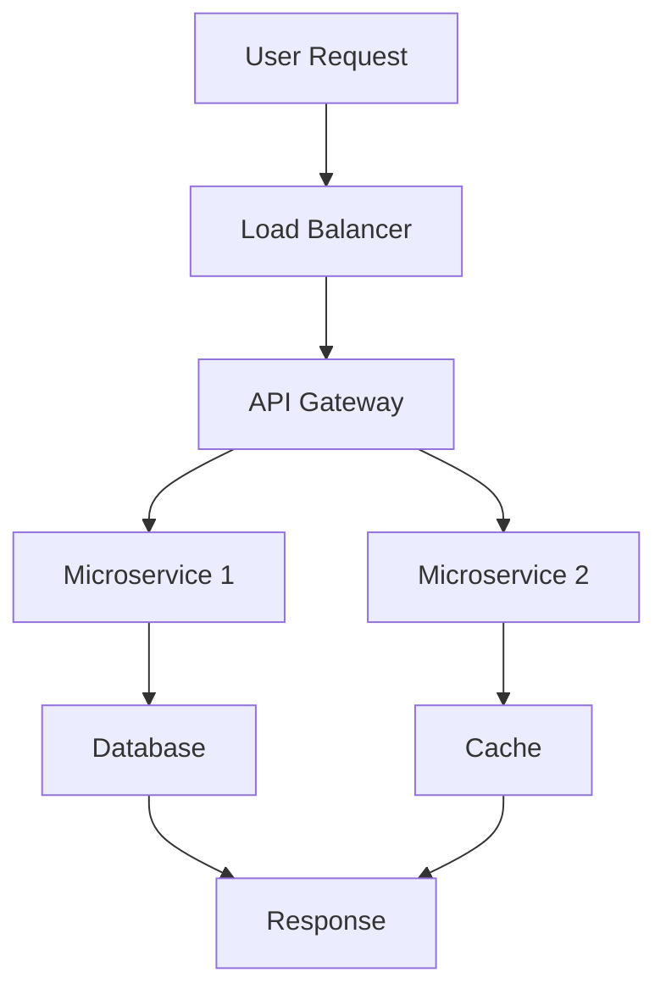

# Popular Systems Design

## Overview

This topic explores popular system design problems encountered in interviews and real-world applications. It covers both Low Level Design (LLD) for detailed component design and High Level Design (HLD) for overall architecture. Examples include URL Shortener, Netflix, Twitter, Instagram, Google Maps, and more.

## Detailed Explanation

### Low Level Design (LLD) vs High Level Design (HLD)

- **High Level Design (HLD):** Focuses on the overall system architecture, including major components, data flow, and interactions. It answers "what" the system does at a high level.
- **Low Level Design (LLD):** Dives into the details of individual components, such as classes, interfaces, algorithms, and data structures. It answers "how" the system implements features.

HLD is about scalability, reliability, and technology choices, while LLD is about code-level design and efficiency.

### Popular System Design Examples

| System | HLD Overview | LLD Focus |
|--------|--------------|-----------|
| URL Shortener | Load balancer, API server, DB, cache | Hashing algorithm, DB schema |
| Netflix | CDN, microservices, recommendation engine | Video encoding, user session management |
| Twitter | Timeline service, tweet storage, real-time feeds | Fan-out on write, caching strategies |
| Instagram | Image storage, feed generation, notifications | Photo upload pipeline, graph DB for follows |
| Google Maps | Geospatial indexing, routing algorithms, real-time traffic | Quadtree for locations, Dijkstra for paths |



## Real-world Examples & Use Cases

- **URL Shortener:** Services like Bitly or TinyURL handle millions of redirects daily, requiring high availability and low latency.
- **Netflix:** Streams to hundreds of millions of users, using adaptive bitrate streaming and global CDNs.
- **Twitter:** Manages billions of tweets with real-time delivery, using sharding and event-driven architecture.
- **Instagram:** Processes billions of photos, employing efficient storage and personalized feeds.
- **Google Maps:** Provides routing for billions of queries, integrating real-time data and AI for traffic predictions.

## Code Examples

### Simple URL Shortener LLD (Java)

```java
import java.util.HashMap;
import java.util.Map;

public class URLShortener {
    private Map<String, String> urlMap = new HashMap<>();
    private Map<String, String> shortToLong = new HashMap<>();
    private static final String BASE_URL = "http://short.ly/";

    public String shorten(String longUrl) {
        String shortUrl = BASE_URL + generateShortKey(longUrl);
        urlMap.put(longUrl, shortUrl);
        shortToLong.put(shortUrl, longUrl);
        return shortUrl;
    }

    public String expand(String shortUrl) {
        return shortToLong.get(shortUrl);
    }

    private String generateShortKey(String url) {
        return Integer.toHexString(url.hashCode()).substring(0, 6);
    }
}
```

### Basic Feed Service LLD (Python)

```python
class FeedService:
    def __init__(self):
        self.follows = {}  # user -> set of followed users
        self.posts = []    # list of (user, post) tuples

    def follow(self, follower, followee):
        if follower not in self.follows:
            self.follows[follower] = set()
        self.follows[follower].add(followee)

    def post(self, user, content):
        self.posts.append((user, content))

    def get_feed(self, user):
        feed = []
        if user in self.follows:
            for followed in self.follows[user]:
                feed.extend([post for u, post in self.posts if u == followed])
        return feed[-10:]  # Last 10 posts
```

## References

- [System Design Interview Guide](https://github.com/donnemartin/system-design-primer)
- [Grokking the System Design Interview](https://www.educative.io/courses/grokking-the-system-design-interview)
- [Real-world System Designs](https://www.youtube.com/playlist?list=PLMCXHnjXnTnvo6alSjVkgxV-VH6EPyvoX)

## Github-README Links & Related Topics

- [System Design Basics](../system-design-basics/)
- [High Scalability Patterns](../high-scalability-patterns/)
- [CAP Theorem & Distributed Systems](../cap-theorem-and-distributed-systems/)
- [URL Shortener Design](../url-shortener-system-design/)  <!-- Assuming subfolder -->
- [Netflix System Design](../netflix-system-design/)