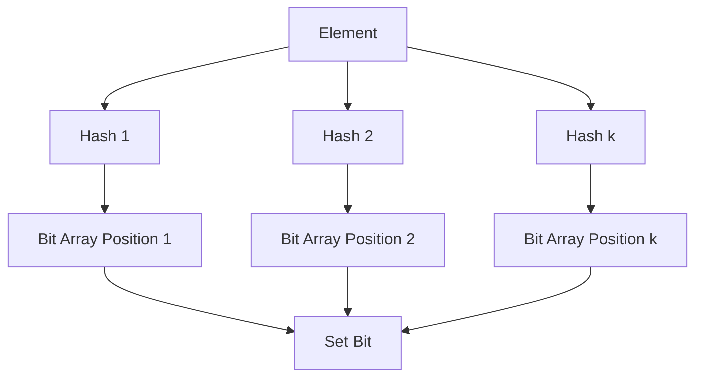
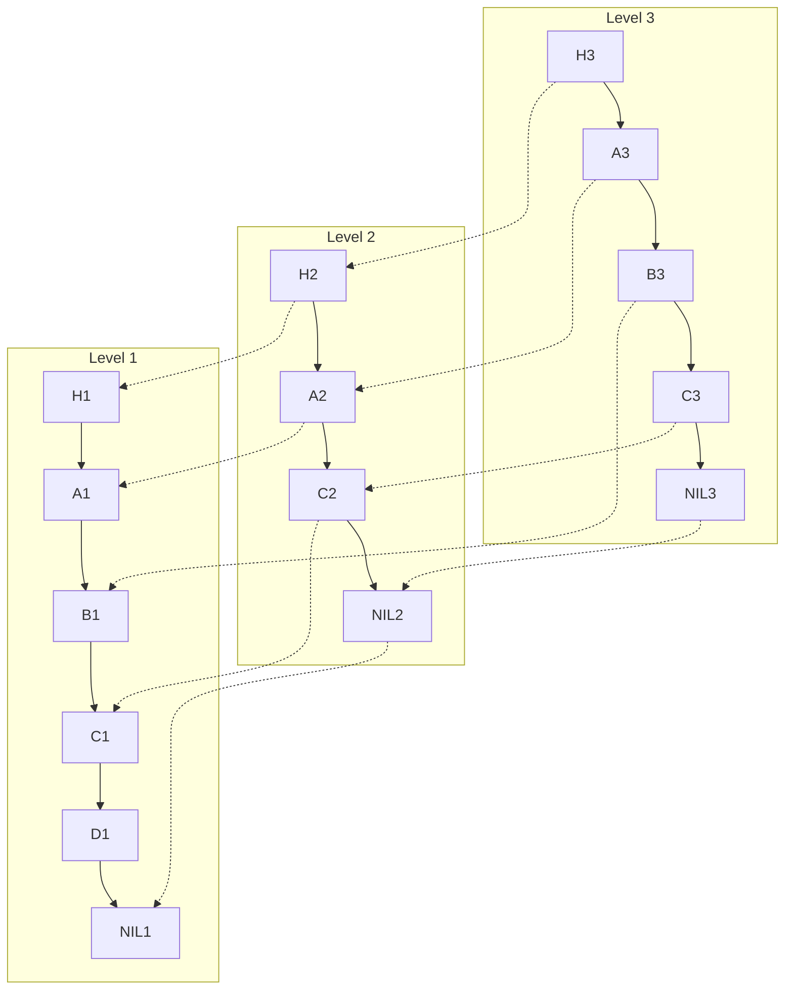

# Probabilistic Algorithms

## Overview

Probabilistic algorithms leverage randomness to achieve efficient solutions, often trading exactness for space and time efficiency. This topic focuses on Bloom filters and skip lists, two key probabilistic data structures designed for space efficiency. Bloom filters provide fast, space-efficient set membership testing with a small probability of false positives, while skip lists offer logarithmic-time operations for ordered data with reduced space overhead compared to balanced trees.

## Detailed Explanation

### Bloom Filters

A Bloom filter is a space-efficient probabilistic data structure for testing set membership. It uses a bit array and multiple hash functions to represent a set. Elements are added by hashing them with k functions and setting corresponding bits. Membership queries check if all hashed bits are set, allowing false positives but no false negatives.

Key properties:
- Space: ~9.6 bits per element for 1% false positive rate
- Time: O(k) for add/query operations
- False positives possible, but controllable via hash count and bit array size



### Skip Lists

A skip list is a probabilistic data structure for ordered lists, using multiple layers of linked lists. Each element appears in the bottom layer and probabilistically in higher layers, enabling fast search, insert, and delete operations with expected O(log n) time.

Key properties:
- Space: O(n) average, O(n log n) worst-case
- Time: O(log n) expected for search/insert/delete
- Probabilistic balancing via coin flips during insertion



| Feature | Bloom Filter | Skip List |
|---------|--------------|-----------|
| Primary Use | Set membership | Ordered list operations |
| Space Efficiency | High (~10 bits/element) | Moderate (O(n)) |
| False Positives | Yes | No |
| Operations | Add, Query | Search, Insert, Delete |
| Time Complexity | O(k) | O(log n) expected |

## Real-world Examples & Use Cases

- **Bloom Filters**:
  - Web caching: Akamai uses Bloom filters to avoid storing "one-hit-wonders" in disk caches, reducing disk writes by nearly half.
  - Databases: Bigtable, HBase, Cassandra, and PostgreSQL use Bloom filters to skip disk lookups for non-existent rows.
  - Malware detection: Chrome previously used Bloom filters for URL checking.
  - Cryptocurrency: Bitcoin used Bloom filters for wallet synchronization (later replaced due to privacy issues).

- **Skip Lists**:
  - Concurrent data structures: Java's ConcurrentSkipListSet and ConcurrentSkipListMap for thread-safe ordered collections.
  - Databases: Redis uses skip lists for ordered sets.
  - CPU scheduling: Linux kernel's MuQSS scheduler employs skip lists.
  - Distributed systems: RocksDB uses skip lists for its MemTable.

## Code Examples

### Bloom Filter Implementation (Python)

```python
import hashlib

class BloomFilter:
    def __init__(self, size, hash_count):
        self.size = size
        self.hash_count = hash_count
        self.bit_array = [0] * size

    def _hashes(self, item):
        hashes = []
        for i in range(self.hash_count):
            hash_obj = hashlib.md5((str(item) + str(i)).encode())
            hashes.append(int(hash_obj.hexdigest(), 16) % self.size)
        return hashes

    def add(self, item):
        for hash_val in self._hashes(item):
            self.bit_array[hash_val] = 1

    def check(self, item):
        return all(self.bit_array[hash_val] for hash_val in self._hashes(item))

# Usage
bf = BloomFilter(1000, 3)
bf.add("apple")
print(bf.check("apple"))  # True
print(bf.check("banana"))  # False (likely)
```

### Skip List Implementation (Python)

```python
import random

class Node:
    def __init__(self, value, level):
        self.value = value
        self.forward = [None] * (level + 1)

class SkipList:
    def __init__(self, max_level=16, p=0.5):
        self.max_level = max_level
        self.p = p
        self.header = Node(-float('inf'), max_level)
        self.level = 0

    def random_level(self):
        level = 0
        while random.random() < self.p and level < self.max_level:
            level += 1
        return level

    def insert(self, value):
        update = [None] * (self.max_level + 1)
        current = self.header
        for i in range(self.level, -1, -1):
            while current.forward[i] and current.forward[i].value < value:
                current = current.forward[i]
            update[i] = current

        current = current.forward[0]
        if current is None or current.value != value:
            new_level = self.random_level()
            if new_level > self.level:
                for i in range(self.level + 1, new_level + 1):
                    update[i] = self.header
                self.level = new_level

            new_node = Node(value, new_level)
            for i in range(new_level + 1):
                new_node.forward[i] = update[i].forward[i]
                update[i].forward[i] = new_node

    def search(self, value):
        current = self.header
        for i in range(self.level, -1, -1):
            while current.forward[i] and current.forward[i].value < value:
                current = current.forward[i]
        current = current.forward[0]
        return current and current.value == value

# Usage
sl = SkipList()
sl.insert(3)
sl.insert(1)
sl.insert(7)
print(sl.search(1))  # True
print(sl.search(5))  # False
```

## Common Pitfalls & Edge Cases

- **Bloom Filters**:
  - No deletion support (use counting variants for deletions).
  - False positives increase with more elements; resize or use multiple filters.
  - Hash function collisions can degrade performance.

- **Skip Lists**:
  - Worst-case O(n) time possible (rare, but exists).
  - Memory overhead from multiple pointers per node.
  - Concurrent access requires careful synchronization.

## Tools & Libraries

- **Bloom Filters**: Guava (Java), BloomPy (Python), bloomd (server).
- **Skip Lists**: Java's ConcurrentSkipListMap, Redis (built-in), skiplist (C library).

## References

- Bloom, Burton H. "Space/Time Trade-offs in Hash Coding with Allowable Errors." *Communications of the ACM*, 1970. [https://dl.acm.org/doi/10.1145/362686.362692](https://dl.acm.org/doi/10.1145/362686.362692)
- Pugh, William. "Skip lists: A probabilistic alternative to balanced trees." *Communications of the ACM*, 1990. [https://dl.acm.org/doi/10.1145/78973.78977](https://dl.acm.org/doi/10.1145/78973.78977)
- Wikipedia: Bloom filter. [https://en.wikipedia.org/wiki/Bloom_filter](https://en.wikipedia.org/wiki/Bloom_filter)
- Wikipedia: Skip list. [https://en.wikipedia.org/wiki/Skip_list](https://en.wikipedia.org/wiki/Skip_list)

## Github-README Links & Related Topics

- [Hash Tables](../hash-tables/README.md)
- [Trees](../graphs-trees-heaps-and-tries/README.md)
- [Distributed Systems](../system-design/distributed-transactions/README.md)